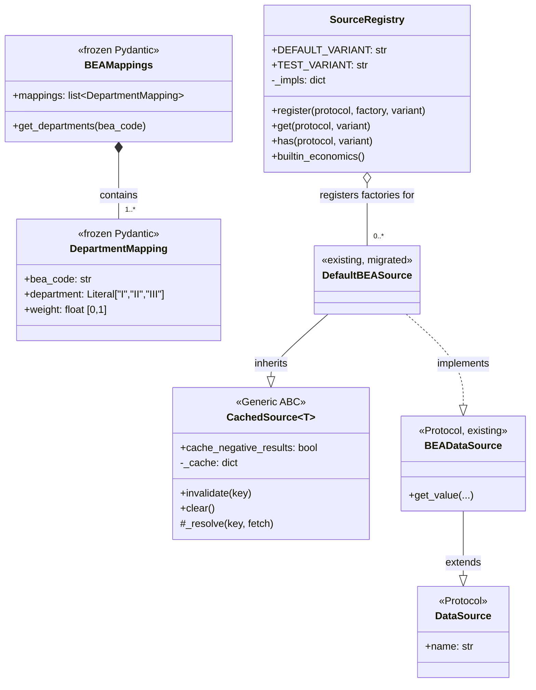

# Phase 1 Data Model: ADR Bundle 1

**Status**: Complete
**Date**: 2026-05-08
**Branch**: `058-adr-bundle-1-pre-spec-057`

This document defines the new types introduced by Bundle 1. Every type is a frozen Pydantic model (per Constitution III.7 / project memory) or a typed Python `Protocol` / `Generic` class. No mechanics are introduced — these are pure-data shapes for the new architectural primitives.

---

## 1. `BEAMappings` and `DepartmentMapping` (FR-009 / US4)

### Module: `src/babylon/economics/tensor_hierarchy/mappings/_models.py`

#### `DepartmentMapping`

Represents one row of the BEA-NAICS-to-Marxian-Department mapping table.

```python
from typing import Literal

from pydantic import BaseModel, ConfigDict, Field


class DepartmentMapping(BaseModel):
    """One BEA NAICS code mapped to one Marxian Department with a fractional weight.

    A single BEA code may map to multiple Departments (each with a partial weight)
    when an industry's output crosses Marxian categories — e.g., construction
    contributes to Department I (means of production: industrial buildings) and
    Department II (consumption goods: residential housing). The weights for any
    given bea_code MUST sum to 1.0 across all DepartmentMapping entries (validated
    at the BEAMappings level, not here).
    """

    model_config = ConfigDict(frozen=True)

    bea_code: str = Field(min_length=1, description="BEA NAICS code (industry identifier)")
    department: Literal["I", "II", "III"] = Field(
        description="Marxian Department: I=means of production, II=consumption goods, III=reproduction"
    )
    weight: float = Field(
        ge=0.0,
        le=1.0,
        description="Fractional contribution of this BEA code to this Department",
    )
```

**Identity & uniqueness**: `(bea_code, department)` is the natural key. No two `DepartmentMapping` entries with the same `(bea_code, department)` may co-exist in a `BEAMappings`. Enforced by `BEAMappings.__post_init__` (validator below).

**Lifecycle**: Immutable from construction (frozen). Constructed once at module import time by `_models.py`'s sibling `__init__.py` loader; never mutated.

#### `BEAMappings`

Wraps the full mapping table.

```python
from collections.abc import Mapping
from typing import Self

from pydantic import BaseModel, ConfigDict, model_validator


class BEAMappings(BaseModel):
    """Frozen, validated container for the full BEA-to-Department mapping table.

    Loaded once at import time from `bea_to_department.toml` per Spec 058 / FR-009.
    Replaces the runtime-reparse-per-call pattern in `economics/department_mapper.py`.
    """

    model_config = ConfigDict(frozen=True)

    mappings: list[DepartmentMapping] = Field(min_length=1)

    @model_validator(mode="after")
    def _check_invariants(self) -> Self:
        """Per-bea_code weight sum + uniqueness checks."""
        # 1. (bea_code, department) uniqueness
        seen: set[tuple[str, str]] = set()
        for m in self.mappings:
            key = (m.bea_code, m.department)
            if key in seen:
                raise ValueError(f"Duplicate (bea_code, department) entry: {key}")
            seen.add(key)

        # 2. Per-bea_code weight sum must equal 1.0 (within float tolerance)
        weights_by_code: dict[str, float] = {}
        for m in self.mappings:
            weights_by_code[m.bea_code] = weights_by_code.get(m.bea_code, 0.0) + m.weight
        for code, total in weights_by_code.items():
            if abs(total - 1.0) > 1e-9:
                raise ValueError(
                    f"BEA code {code!r} weights sum to {total!r}, expected 1.0 (within 1e-9)"
                )

        return self

    def get_departments(self, bea_code: str) -> Mapping[str, float]:
        """Return {department: weight} for one BEA code. Raises KeyError if unknown."""
        result = {m.department: m.weight for m in self.mappings if m.bea_code == bea_code}
        if not result:
            raise KeyError(f"No mapping for BEA code {bea_code!r}")
        return result
```

**Identity & uniqueness**: There is exactly one `BEAMappings` instance per process — the module-level `BEA_TO_DEPARTMENT` constant in `mappings/__init__.py`. Singleton-by-convention, not enforced.

**Lifecycle**: Constructed once at module import time. If construction raises (`ValidationError` for malformed TOML; `FileNotFoundError` for missing TOML), the import fails fast — exactly the loud-failure semantics specified in the spec's Edge Cases.

**Validation rules** (from Pydantic schema):
- `bea_code`: non-empty string
- `department`: one of `"I"`, `"II"`, `"III"` (the three Marxian Departments per Constitution I.5)
- `weight`: `[0.0, 1.0]` inclusive
- `mappings`: at least 1 entry
- Per-bea_code: weight sum == 1.0 (within 1e-9 tolerance, model-level validator)
- Per-bea_code: department uniqueness (model-level validator)

---

## 2. `DataSource` (Protocol marker) (FR-004 / US1)

### Module: `src/babylon/core/protocol_kit.py`

```python
from typing import Protocol, runtime_checkable


@runtime_checkable
class DataSource(Protocol):
    """Marker protocol: every source has a name for SourceRegistry lookup.

    All source Protocols in `src/babylon/economics/*/data_sources.py` and
    `src/babylon/infrastructure/*/data_sources.py` SHOULD inherit from this
    marker so that SourceRegistry can identify them via `isinstance(impl, DataSource)`.

    The `name` attribute is used purely for error messages and registry diagnostics;
    it is NOT used as a registry key (the Protocol type itself is the key).
    """

    name: str
```

**Properties**: pure structural Protocol; runtime-checkable. No methods, only the `name: str` attribute.

**Relationships**: Every `Default*` class in `economics/` and `infrastructure/` will conform to a domain-specific Protocol that *itself* inherits from `DataSource`. Existing Protocols (`BEADataSource`, `QCEWDataSource`, etc.) get `DataSource` added to their bases as part of US1's commit 4.

---

## 3. `CachedSource[T]` (Generic ABC) (FR-004, FR-005 / US1)

### Module: `src/babylon/core/protocol_kit.py`

```python
from collections.abc import Callable, Hashable
from typing import Generic, TypeVar

from babylon.economics.tensor import NoDataSentinel  # falsy sentinel, already exists

T = TypeVar("T")


class CachedSource(Generic[T]):
    """LRU-cached, NoDataSentinel-aware base for Default* data sources.

    Subclasses implement `_fetch(*args, **kwargs) -> T | None` and call
    `self._resolve(key, lambda: self._fetch(...))` to get cached values.

    Per Spec 058 Clarifications 2026-05-08 (Q4): NoDataSentinel results are
    cached by default. Subclasses whose missing-data semantics are *transient*
    (e.g., DPD lifecycle, MELT recomputation) opt out by setting:

        cache_negative_results: bool = False

    on the subclass body.
    """

    # Class-level config — overridden per subclass when needed
    cache_negative_results: bool = True
    """Whether to memoize NoDataSentinel results. True = cache misses; False = re-fetch on every miss."""

    def __init__(self, *, max_entries: int = 1024) -> None:
        self._cache: dict[Hashable, T | NoDataSentinel] = {}
        self._max_entries = max_entries

    def _resolve(
        self,
        key: Hashable,
        fetch: Callable[[], T | None],
    ) -> T | NoDataSentinel:
        """LRU-cached resolution with NoDataSentinel handling.

        Cache hit → returns the cached value (real or NoDataSentinel).
        Cache miss → calls fetch(); wraps None in NoDataSentinel; stores per
            `cache_negative_results` policy; evicts oldest entry if cache is full.
        """
        if key in self._cache:
            return self._cache[key]

        value = fetch()
        result: T | NoDataSentinel
        if value is None:
            result = NoDataSentinel(reason=f"no data for {key}")
            if not self.cache_negative_results:
                # Don't cache; return without storing
                return result
        else:
            result = value

        # FIFO eviction (cheap; LRU semantics not required for our data shape)
        if len(self._cache) >= self._max_entries:
            self._cache.pop(next(iter(self._cache)))
        self._cache[key] = result
        return result

    def invalidate(self, key: Hashable) -> None:
        """Drop one cache entry. Used by tests to swap mock return values mid-test."""
        self._cache.pop(key, None)

    def clear(self) -> None:
        """Drop the entire cache. Used by SourceRegistry on variant='test' substitution."""
        self._cache.clear()
```

**Identity**: each subclass has its own `_cache` dict (instance-level state). Multiple instances of the same subclass have independent caches.

**Lifecycle**:
- Constructed when `SourceRegistry.get(ProtocolType)` calls the registered factory (typically once per session, but tests may construct multiple)
- Cache populated on demand via `_resolve`
- Invalidated entry-by-entry via `invalidate(key)` or wholesale via `clear()`
- Garbage-collected when no longer referenced (no explicit destructor needed)

**Validation rules**:
- `max_entries`: positive integer (no Pydantic validation; this is not a BaseModel — it's a Generic ABC; runtime check optional)
- `key`: must be `Hashable` (enforced by Python's dict semantics; runtime `TypeError` if violated)

**State transitions** (for one cache entry):
- `absent` → `_resolve` called with new key → `present (real)` or `present (NoDataSentinel)` based on `_fetch` result and `cache_negative_results` policy
- `present` → `invalidate(key)` → `absent`
- `present` → `clear()` → `absent`

---

## 4. `SourceRegistry` (concrete class) (FR-004, FR-006 / US1)

### Module: `src/babylon/core/protocol_kit.py`

```python
from collections.abc import Callable
from typing import overload


class SourceRegistry:
    """Type-keyed registry for Protocol implementations.

    Replaces the four `create_*_services()` functions in `economics/factory.py`.
    Lookup by Protocol type + (optional) variant name.

    Per Spec 058 / FR-006: the existing `create_*_services()` function names are
    kept as thin shims that delegate to `SourceRegistry.builtin_economics()`.
    """

    DEFAULT_VARIANT = "default"
    TEST_VARIANT = "test"

    def __init__(self) -> None:
        self._impls: dict[tuple[type, str], Callable[[], object]] = {}

    def register(
        self,
        protocol: type,
        factory: Callable[[], object],
        *,
        variant: str = DEFAULT_VARIANT,
    ) -> None:
        """Register a factory for a Protocol type.

        Re-registration with the same (protocol, variant) silently replaces.
        The replaced factory's previously-constructed instances are NOT invalidated;
        callers that already hold a reference continue to use the old instance.
        Tests that need a clean slate should construct a fresh SourceRegistry instead
        of replacing entries in a shared one.
        """
        self._impls[(protocol, variant)] = factory

    def get(self, protocol: type, *, variant: str = DEFAULT_VARIANT) -> object:
        """Look up and construct an implementation.

        Raises:
            LookupError: if no factory is registered for (protocol, variant).
        """
        try:
            return self._impls[(protocol, variant)]()
        except KeyError as exc:
            raise LookupError(
                f"No {variant!r} implementation registered for {protocol.__name__}"
            ) from exc

    def has(self, protocol: type, *, variant: str = DEFAULT_VARIANT) -> bool:
        """Check whether a factory is registered without constructing it."""
        return (protocol, variant) in self._impls

    def builtin_economics(self) -> "SourceRegistry":
        """Register all 10 (or more — see ADR-002 follow-up rollout) Default* implementations.

        Returns self to enable fluent chaining: `SourceRegistry().builtin_economics()`.

        At Bundle 1 commit-6 time, this method registers exactly the 10 melt/ + gamma/
        Default* classes that have migrated to CachedSource[T]. The remaining 51
        Default* classes continue to be wired by their original `create_*_services()`
        shim until ADR-002's "Steps 5+" follow-up bundle migrates them.
        """
        # Imports kept inside the method to avoid import-cycle risk
        from babylon.economics.melt.adapters import (  # noqa: I001 — local import for cycle safety
            DefaultBEASource,
            DefaultCPISource,
            DefaultMELTCalculator,
            DefaultQCEWSource,
            # ... etc — 6 melt/ Default* classes total
        )
        from babylon.economics.melt.data_sources import (
            BEADataSource,
            CPIDataSource,
            MELTCalculator,
            QCEWDataSource,
            # ... etc — corresponding Protocols
        )
        # ... gamma/ imports likewise

        self.register(BEADataSource, DefaultBEASource)
        self.register(CPIDataSource, DefaultCPISource)
        self.register(MELTCalculator, DefaultMELTCalculator)
        self.register(QCEWDataSource, DefaultQCEWSource)
        # ... etc — one register call per (Protocol, Default) pair

        return self
```

**Identity**: typically one `SourceRegistry` instance per process (the "default" registry, constructed by `economics/factory.py`'s shim or by callers directly). Tests may construct fresh instances.

**Lifecycle**:
- Constructed empty (`__init__`)
- Populated by `builtin_economics()` (production) or by per-test `register(...)` calls (tests)
- Long-lived; the `_impls` dict is mutated by `register` only

**Validation rules**:
- `protocol` must be a Python class (not enforced; runtime `TypeError` if used as dict key fails — won't happen in practice)
- `factory` must be `Callable[[], object]` (enforced by type hint; mypy catches violations)
- `variant`: convention is `"default"` for production and `"test"` for test substitution; arbitrary strings allowed (e.g., `"benchmarking"`)

**Relationships**:
- `SourceRegistry` *contains* factory `Callable`s
- Each factory *constructs* an instance that conforms to the registered Protocol
- `Default*` instances *inherit from* `CachedSource[T]` (post-FR-005 migration)
- `economics/factory.py`'s shims *delegate to* `SourceRegistry.builtin_economics()`

---

## 5. Loader: module-level `BEA_TO_DEPARTMENT`

### Module: `src/babylon/economics/tensor_hierarchy/mappings/__init__.py`

```python
"""Typed BEA-to-Department mapping, loaded once at import time.

Per Spec 058 FR-009: replaces the per-call TOML reparse pattern in
`economics/department_mapper.py`. If the TOML is missing or malformed,
import fails fast with a clear traceback — louder and more diagnostic
than today's runtime failure.
"""

from __future__ import annotations

import tomllib
from pathlib import Path
from typing import Final

from babylon.economics.tensor_hierarchy.mappings._models import BEAMappings, DepartmentMapping

__all__ = ["BEAMappings", "BEA_TO_DEPARTMENT", "DepartmentMapping"]

_TOML_PATH: Final[Path] = Path(__file__).parent / "bea_to_department.toml"

BEA_TO_DEPARTMENT: Final[BEAMappings] = BEAMappings.model_validate(
    tomllib.loads(_TOML_PATH.read_text())
)
"""The singleton, validated, frozen mapping. Construct once; consume many."""
```

**Failure modes** (all *intentionally* fail at import time, not runtime):
- TOML file missing → `FileNotFoundError` at `_TOML_PATH.read_text()`
- TOML syntactically invalid → `tomllib.TOMLDecodeError` at `tomllib.loads(...)`
- Schema mismatch (missing `mappings` key) → `pydantic.ValidationError` at `BEAMappings.model_validate(...)`
- Per-row constraint violation (weight out of range, unknown department) → `pydantic.ValidationError`
- Per-bea_code weight sum != 1.0 → `pydantic.ValidationError` from `_check_invariants`
- Duplicate `(bea_code, department)` → `pydantic.ValidationError` from `_check_invariants`

---

## 6. `_compute_membership_overlap` (FR-003 / US5)

### Module: `src/babylon/ooda/_helpers.py`

Not a new *type* per se; just a *single canonical implementation* of the helper currently duplicated between `action_costs.py:85` and `action_effects.py:249`.

```python
"""Shared helpers for OODA action evaluation.

Per Spec 058 / FR-003: this module hosts the single canonical implementation
of helpers used by both `action_costs.py` and `action_effects.py`. Going forward,
any helper that needs to be shared between OODA action modules MUST live here.
"""

from __future__ import annotations

# Type imports as needed by the existing function signatures —
# not duplicated here; planner mechanically extracts the function and its
# imports from the action_costs.py / action_effects.py duplicate.

__all__ = ["_compute_membership_overlap"]


def _compute_membership_overlap(...) -> ...:
    """Verbatim extraction from action_effects.py:249 (the longer of the two
    duplicates per the file-analyzer's `duplication` tag)."""
    ...
```

**Note**: the leading underscore is preserved (private to the `ooda/` package). The `__all__` export is intentional: `__all__` controls `from X import *` *and* signals to mypy/lint tools which names are package-public, even when leading-underscore. Explicit `__all__` here makes the canonicalness of the implementation discoverable.

---

## Type relationships (Mermaid)



---

## Summary

Six new types introduced; zero new mechanics; zero changes to the simulation's mathematical core.

| Type | Module | Kind | Lifecycle |
|------|--------|------|-----------|
| `DepartmentMapping` | `economics/tensor_hierarchy/mappings/_models.py` | Frozen Pydantic BaseModel | Immutable; one per BEA-code/department pair |
| `BEAMappings` | `economics/tensor_hierarchy/mappings/_models.py` | Frozen Pydantic BaseModel + model validator | Immutable; one process-wide singleton |
| `DataSource` | `core/protocol_kit.py` | Runtime-checkable Protocol | Marker; no instances of `DataSource` itself |
| `CachedSource[T]` | `core/protocol_kit.py` | Generic ABC mixin | Per-subclass instance lifecycle (typically session-scoped) |
| `SourceRegistry` | `core/protocol_kit.py` | Concrete class | Typically one process-wide; tests may construct multiple |
| `BEA_TO_DEPARTMENT` (constant) | `economics/tensor_hierarchy/mappings/__init__.py` | Module-level `Final[BEAMappings]` | Constructed at import time; immutable thereafter |

`_compute_membership_overlap` is canonicalized to `ooda/_helpers.py` but is not a "type" — it's a function move.
