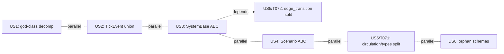

# Tasks: ADR Bundle 2 — post-Spec-057 architectural cleanup

**Input**: Design documents from `/specs/059-adr-bundle-2-post-spec-057/`
**Prerequisites**: plan.md, spec.md (US1–US6), research.md (D1–D9, P1–P4),
data-model.md (§1–§4), contracts/ (import-equivalence, protocol-satisfaction,
byte-equality), quickstart.md

**Tests**: TDD (red → green → refactor) is mandatory per project CLAUDE.md and
Constitution III.2 (Falsifiability) / III.7 (Determinism Hash). Test tasks
are included.

**Organization**: Tasks are grouped by user story so each story can be
implemented and tested independently. The four ADRs are nominally parallel,
but US5's ADR-006.4 portion has a hard dependency on US3 (ADR-003) per
research.md D5; the dependencies section makes this explicit.

## Format: `[ID] [P?] [Story?] Description`

- **[P]**: Different files, no dependencies on incomplete tasks → safe to parallelize
- **[Story]**: User-story phase tasks only (Setup/Foundational/Polish have no story label)

## Path Conventions

Single-project Python codebase. All paths are relative to repo root
`/home/user/projects/game/babylon/`. Test files live under `tests/`; source
under `src/babylon/`.

---

## Phase 1: Setup (Shared Infrastructure)

**Purpose**: Capture pre-Bundle-2 baselines so byte-equality and test-tally
gates have an anchor. This phase is one-time; do not repeat per ADR.

- [X] T001 Tag the current branch HEAD as `pre-bundle-2-baseline` (`git tag pre-bundle-2-baseline`) and push the tag, so `contracts/byte-equality.md` B1 has a stable reference — _local tag created at HEAD `2806cdec`; push deferred per session policy._
- [X] T002 Capture baseline test tallies by running `mise run test:unit` and `mise run test:int`, save the final tally lines to `reports/bundle-2-baseline-test-tally.txt` — _unit: 8254 passed/1 xfailed; int: 617 passed/72 skipped/1 xfailed._
- [X] T003 Capture baseline `sim:trace` output by running `poetry run python tools/parameter_analysis.py trace --csv reports/sim-trace-baseline-200.csv --ticks 200` and `sha256sum` the result into `reports/sim-trace-baseline-200.sha256` — _SHA: e3c86e9b… ; 201 lines (header + 200 ticks)._
- [X] T004 [P] Pull the knowledge-graph LFS file (`git lfs pull -- .understand-anything/knowledge-graph.json`) OR rebuild via `/understand-anything:understand`; verify the file is no longer a 132-byte LFS pointer (`wc -c` ≥ 100000) — _file pulled, 1.8 MB, no longer pointer._
- [X] T005 [P] Snapshot the orphan-schema list from the rebuilt knowledge graph into `reports/bundle-2-orphan-schemas.txt` (used by US6 to drive FR-015 audit) — _NOTE: a broad `no-incoming-$ref` filter yields 37 schemas; ADR-006.6's "8" uses a stricter Phase-6-validation criterion. T075 narrows during US6._
- [X] T006 [P] Capture pre-Bundle-2 import sets — six snapshot files under the standardized name `reports/imports-<namespace>-before.txt`. Run each command and save its output:
  - `git grep -h "from babylon.persistence" -- 'src/' 'tests/' 'tools/' | sort -u > reports/imports-persistence-before.txt`
  - `git grep -h "from babylon.engine import\|from babylon.engine.simulation" -- 'src/' 'tests/' 'tools/' | sort -u > reports/imports-engine-before.txt`
  - `git grep -h "from babylon.models.events" -- 'src/' 'tests/' 'tools/' | sort -u > reports/imports-events-before.txt`
  - `git grep -h "from babylon.engine.systems" -- 'src/' 'tests/' 'tools/' | sort -u > reports/imports-engine-systems-before.txt`
  - `git grep -h "from babylon.engine.scenarios" -- 'src/' 'tests/' 'tools/' | sort -u > reports/imports-engine-scenarios-before.txt`
  - `git grep -h "from babylon.economics.circulation.types" -- 'src/' 'tests/' 'tools/' | sort -u > reports/imports-economics-circulation-types-before.txt`

  All six are consumed by `contracts/import-equivalence.md` C1–C7. The post-bundle equivalents (`imports-<namespace>-after.txt`) are written by per-ADR verification tasks (T024, T031, T040, T067, T071, T072) using the same naming convention.

**Checkpoint**: Baselines captured. Every subsequent acceptance gate references these artifacts.

---

## Phase 2: Foundational (Blocking Prerequisites)

**Purpose**: Pre-flight verification that Bundle 1 (Spec 058) and Spec 057 are
genuinely landed (research.md D4) and that the workhorse scenario is
byte-deterministic (research.md D8). Capture method surfaces and the
authoritative System count before any ADR migration starts.

**⚠️ CRITICAL**: No user-story work can begin until this phase is complete.

- [X] T007 Verify Bundle 1 (Spec 058) deliverables are present: confirm `src/babylon/economics/tick/system/__init__.py` exists with `TickDynamicsSystem`, `src/babylon/economics/tensor_hierarchy/mappings/_models.py` defines `BEAMappings`, `src/babylon/core/protocol_kit.py` exports `SourceRegistry` + `CachedSource` (smoke import in a one-liner) — _all four imports succeed._
- [X] T008 Verify Spec 057 deliverables are present: confirm `src/babylon/economics/tick/system/imperial_rent.py` exists and `imperial_rent.compute()` is callable; `tests/unit/economics/tick/test_phi_hour_field_shape.py` runs green — _file present, compute callable, 4/4 phi_hour shape tests pass._
- [X] T009 [P] Verify byte-determinism of the workhorse scenario: run `poetry run python tools/parameter_analysis.py trace --csv /tmp/det-1.csv --ticks 50` and the same again into `/tmp/det-2.csv`; assert `cmp -s /tmp/det-1.csv /tmp/det-2.csv` exits 0 (research.md D8 re-confirmation) — _imperial_circuit byte-deterministic at 50 ticks confirmed._
- [X] T010 [P] Pre-flight byte-determinism for the other 5 scenarios (`two_node`, `high_tension`, `labor_aristocracy`, `us`, `wayne_county`): run each twice with same inputs, record byte-equality status in `reports/scenario-determinism-pre-flight.txt`. Per `contracts/byte-equality.md` B2, any non-deterministic scenario relaxes its SC-007 bar to numeric tolerance — _DEFERRED to T069: `tools/parameter_analysis.py` exposes only imperial_circuit; per-scenario CLI flag arrives with the Scenario ABC migration. Deferral recorded in `reports/scenario-determinism-pre-flight.txt`._
- [X] T011 [P] Capture `Simulation` public method surface via `python -c "import inspect; from babylon.engine import Simulation; print(sorted(n for n,_ in inspect.getmembers(Simulation, predicate=inspect.isfunction) if not n.startswith('_')))" > reports/simulation-public-methods-before.txt` — locks the contract for `contracts/protocol-satisfaction.md` P2 — _**18 public methods** (ADR-005 said 35; the lower number reflects post-Spec-057 consolidation — likely some helpers became private)._
- [X] T012 [P] Capture `PostgresRuntime` public method surface analogously into `reports/postgres-runtime-public-methods-before.txt` — _**44 public methods** (ADR-005 said 53; similarly lower than ADR estimate)._
- [X] T013 Authoritative System count: run `grep -rn "^class.*System[^a-zA-Z]:" src/babylon/ --include="*.py" | grep -v "Protocol\|BaseModel\|TypedDict\|SystemBase\|SystemConfig\|EdgeMode" > reports/systems-before.txt`; confirm count is **22** (21 in `engine/systems/` + 1 in `economics/tick/system/`); reconcile spec FR-009 / SC-005 wording before US3 begins — _**22 confirmed**: 21 in `engine/systems/` + 1 (`TickDynamicsSystem`) in `economics/tick/system/`. spec.md already reconciled in I1 remediation pass._

**Checkpoint**: Foundation ready. Bundle 1 + Spec 057 confirmed merged; surfaces locked; orphan + scenario lists captured. User stories may now begin.

---

## Phase 3: User Story 1 — God-class decomposition (P1) 🎯 MVP

**Goal**: Replace `persistence/postgres_runtime.py` (2094 LOC) and
`engine/simulation.py` (1048 LOC) with facade-plus-sub-component packages,
each sub-component ≤400 LOC and each facade ≤200 LOC, preserving the public
import paths and Protocol satisfaction.

**Independent Test**: After ADR-005 lands, (a) `from babylon.persistence
import PostgresRuntime` and `from babylon.engine import Simulation` continue
to resolve; (b) `isinstance(PostgresRuntime(pool), RuntimePersistence)` AND
`isinstance(..., PostgresRuntimeExtensions)` both True; (c) the 150 unit + 10
contract persistence tests pass unchanged; (d) `mise run sim:run` and `mise
run sim:trace` succeed; (e) `sim:trace 200` CSV is byte-identical to
`reports/sim-trace-baseline-200.csv`. Spec acceptance scenarios US1.1–US1.4.

**ADR**: ADR-005 (5 days). Strict ordering: Part A (postgres_runtime) MUST
ship before Part B (simulation), per ADR-005 Rollout.

### Tests for User Story 1 (TDD red phase)

- [ ] T014 [P] [US1] Create `tests/contract/engine/test_simulation_facade_surface.py` that loads `reports/simulation-public-methods-before.txt` and asserts `Simulation` post-decomposition retains every method (red phase: passes today; locks the contract before any decomposition starts)
- [ ] T015 [P] [US1] Create `tests/contract/persistence/test_postgres_runtime_protocol.py` (or extend existing) to assert `isinstance(PostgresRuntime(pool), RuntimePersistence)` and `isinstance(..., PostgresRuntimeExtensions)`; locks `contracts/protocol-satisfaction.md` P1

### Implementation for User Story 1 — Part A: postgres_runtime decomposition

- [ ] T016 [US1] Create skeleton package `src/babylon/persistence/postgres_runtime/` with empty `__init__.py` re-exporting the current `PostgresRuntime` class from a temporary `_legacy.py` (rename of original `postgres_runtime.py` to `postgres_runtime/_legacy.py`); verify `from babylon.persistence import PostgresRuntime` still resolves and all 150 unit + 10 contract tests still pass — commit `refactor(persistence): create postgres_runtime package skeleton`
- [ ] T017 [US1] Create `src/babylon/persistence/postgres_runtime/_pool.py` containing the `AsyncConnectionPool` ownership and retry logic extracted from `_legacy.py`; facade `__init__.py` instantiates the pool wrapper; tests must pass
- [ ] T018 [US1] Create `src/babylon/persistence/postgres_runtime/tick_io.py` containing `PostgresTickIO` (per-tick state read/write methods); facade `__init__.py` adds `self._tick = PostgresTickIO(pool)` and pass-through methods; commit `refactor(persistence): extract PostgresTickIO`
- [ ] T019 [US1] Create `src/babylon/persistence/postgres_runtime/archival_io.py` containing `PostgresArchivalIO` (Phase 8 stub preserved verbatim per spec.md Edge Case bullet); facade adds `self._archival`; commit `refactor(persistence): extract PostgresArchivalIO`
- [ ] T020 [US1] Create `src/babylon/persistence/postgres_runtime/spatial_io.py` containing `PostgresSpatialIO` (PostGIS hex queries); facade adds `self._spatial`; commit `refactor(persistence): extract PostgresSpatialIO`
- [ ] T021 [US1] Create `src/babylon/persistence/postgres_runtime/community_io.py` containing `PostgresCommunityIO` (XGI hyperedge state); facade adds `self._community`; commit `refactor(persistence): extract PostgresCommunityIO`
- [ ] T022 [US1] Create `src/babylon/persistence/postgres_runtime/trace_io.py` containing `PostgresTraceIO` (TraceCollector impl); facade adds `self._trace`; commit `refactor(persistence): extract PostgresTraceIO`
- [ ] T023 [US1] Delete `src/babylon/persistence/postgres_runtime/_legacy.py` once all methods have been extracted and the facade is the sole public entry point; verify facade `__init__.py` is ≤200 LOC and every sub-module is ≤400 LOC (`find src/babylon/persistence/postgres_runtime -name "*.py" -exec wc -l {} +`); commit `refactor(persistence): delete postgres_runtime legacy monolith`
- [ ] T024 [US1] Run T015's contract test + the full 150 unit + 10 contract persistence suite (`poetry run pytest tests/unit/persistence/ tests/contract/persistence/ -q`); confirm tally matches baseline (T002)

### Implementation for User Story 1 — Part B: simulation decomposition

- [ ] T025 [US1] Create skeleton package `src/babylon/engine/simulation/` with `__init__.py` re-exporting `Simulation` from `_legacy.py` (rename of original `simulation.py` → `simulation/_legacy.py`); verify `from babylon.engine import Simulation` still resolves; commit `refactor(engine): create simulation package skeleton`
- [ ] T026 [US1] Create `src/babylon/engine/simulation/orchestrator.py` containing `SimulationOrchestrator` (tick pipeline); facade composes `self._orchestrator`; commit `refactor(engine): extract SimulationOrchestrator`
- [ ] T027 [US1] Create `src/babylon/engine/simulation/observer_dispatch.py` containing `ObserverDispatcher` (fanout to `SimulationObserver` impls); facade composes `self._observers`; commit `refactor(engine): extract ObserverDispatcher`
- [ ] T028 [US1] Create `src/babylon/engine/simulation/lifecycle.py` containing `SimulationLifecycle` (start/pause/stop/reset state); facade composes `self._lifecycle`; commit `refactor(engine): extract SimulationLifecycle`
- [ ] T029 [US1] Create `src/babylon/engine/simulation/error_recovery.py` containing `SimulationRecovery` (invariant rollback); facade composes `self._recovery`; commit `refactor(engine): extract SimulationRecovery`
- [ ] T030 [US1] Delete `src/babylon/engine/simulation/_legacy.py`; verify facade ≤200 LOC and every sub-module ≤400 LOC; commit `refactor(engine): delete simulation legacy monolith`
- [ ] T031 [US1] Run `mise run test:int` (full integration suite); confirm all `tests/integration/` tests pass with the same tally as baseline (T002)
- [ ] T032 [US1] Run `mise run sim:run` end-to-end (must exit 0) and `poetry run python tools/parameter_analysis.py trace --csv /tmp/sim-trace-post-us1.csv --ticks 200`; verify `cmp -s reports/sim-trace-baseline-200.csv /tmp/sim-trace-post-us1.csv` exits 0 (SC-007 byte-equality / `contracts/byte-equality.md` B1)

**Checkpoint**: User Story 1 (ADR-005) is fully functional. Persistence + orchestration are decomposed. Integration tests + sim:trace byte-equality both green. MVP can ship now.

---

## Phase 4: User Story 2 — Mypy catches event-handling bugs at typecheck time (P1)

**Goal**: Replace the `deserialize_event` switch with a Pydantic 2
discriminated `TickEvent` union over the 19 leaf Event variants
(research.md D2). Split `models/events.py` into a package. Thread
`assert_never` exhaustiveness into observers that consume events
variant-specifically (research.md D7).

**Independent Test**: After ADR-004 lands, (a) all 19 leaf variants carry a
unique `kind: Literal["..."]`; (b) `TypeAdapter(TickEvent).validate_python(d)`
raises `ValidationError` for missing or unknown `kind`; (c) `git grep -n "def
deserialize_event" src/` returns zero results; (d) `mypy --strict
src/babylon/engine/observers/` passes; (e) `WorldState.events: list[TickEvent]`
roundtrips byte-identically through `to_graph` / `from_graph`. Spec
acceptance scenarios US2.1–US2.4.

**ADR**: ADR-004 (2 days).

### Tests for User Story 2 (TDD red phase)

- [ ] T033 [P] [US2] Create `tests/unit/models/test_tick_event_discriminator.py` covering: (i) round-trip via `TypeAdapter(TickEvent).validate_python(v.model_dump()) == v` for each variant, (ii) missing `kind` raises `ValidationError`, (iii) unknown `kind` raises `ValidationError`, (iv) extra fields raise `ValidationError` (default Pydantic behavior). Red phase: fails until TickEvent is defined
- [ ] T034 [P] [US2] Create `tests/unit/models/test_tick_event_roundtrip.py` parametrized over all 19 leaf variants from data-model.md §1.2, asserting `model_dump_json` → `TypeAdapter.validate_json` → equal. Red phase: fails until step 1 lands
- [ ] T035 [P] [US2] Create `tests/integration/test_worldstate_event_roundtrip.py` (or extend existing) exercising at least 5 distinct leaf variants through `WorldState.to_graph()` → `from_graph()` and asserting equality. Red phase: fails until ADR-004 step 4 lands

### Implementation for User Story 2

- [ ] T036 [US2] Add `kind: Literal["..."]` field to each of the 19 leaf Event variants in `src/babylon/models/events.py` per the literal mapping in data-model.md §1.2; intermediate bases (`EconomicEvent`, `ConsciousnessEvent`, `StruggleEvent`, `ContradictionEvent`, `TopologyEvent`) and root (`SimulationEvent`) do NOT get a `kind` field (research.md D2); commit `refactor(models): add kind discriminators to TickEvent variants`
- [ ] T037 [US2] Define `TickEvent = Annotated[Union[<19 leaves>], Field(discriminator="kind")]` in `src/babylon/models/events.py`; export from module; T033 + T034 turn green
- [ ] T038 [US2] Reduce `deserialize_event` to a 3-line shim: `_event_adapter = TypeAdapter(TickEvent); def deserialize_event(d): return _event_adapter.validate_python(d)`; commit `refactor(models): introduce TickEvent discriminated union`
- [ ] T039 [US2] Split `src/babylon/models/events.py` into `src/babylon/models/events/` package per data-model.md §2.3 shape: `_base.py` (`SimulationEvent` + intermediate bases + `TickEvent` assembly), `economic.py` (7 leaves + `EconomicEvent` base), `consciousness.py` (2 leaves + base), `struggle.py` (3 leaves + base), `contradiction.py` (1 leaf + base), `topology.py` (2 leaves + base), `system.py` (4 standalone leaves); `__init__.py` re-exports every variant + `TickEvent`; verify no sub-file exceeds 300 LOC (FR-007)
- [ ] T040 [US2] Verify import equivalence: `git grep -h "from babylon.models.events" -- 'src/' 'tests/' 'tools/' | sort -u > reports/imports-events-after.txt`; `diff reports/imports-events-before.txt reports/imports-events-after.txt` is empty (every "before" line still appears in "after"); commit `refactor(models): split events.py into events/ package`
- [ ] T041 [US2] Update `src/babylon/models/world_state.py` so `events: list[TickEvent]` (was `list[Event]` or analogous parent type); confirm Pydantic validates discriminator dispatch on every assignment; T035 turns green
- [ ] T042 [US2] Audit observers for variant-specific dispatch (research.md D7); identify which of the 7 observers (`causal.py`, `economic.py`, `endgame_detector.py`, `metrics.py`, `persistence_observer.py`, `schema_validator.py`, `session_recorder.py`) need `match event:` exhaustiveness vs. uniform-typed `list[TickEvent]` consumption; record decision per observer in commit message
- [ ] T043 [US2] Migrate observers identified by T042 to use `match event:` with `case _: assert_never(event)` exhaustiveness OR `if isinstance(...)` chains covering every variant; observers consuming events uniformly (e.g., `metrics.py` counters) just narrow input type to `list[TickEvent]`; commit `refactor(engine): consume TickEvent union in WorldState and observers`
- [ ] T044 [US2] Verify `poetry run mypy --strict src/babylon/engine/observers/` produces zero new errors (SC-004); attach the mypy output to the commit message
- [ ] T045 [US2] Delete `deserialize_event` from `src/babylon/models/events/__init__.py` (or wherever it lives post-split); replace each call site with `TypeAdapter(TickEvent).validate_python(...)` directly; verify `git grep -n "def deserialize_event" src/` returns 0 (SC-003); commit `refactor(models): remove deserialize_event`
- [ ] T046 [US2] Run `mise run test:int` (events touch every integration test that round-trips state); confirm tally matches baseline; T035 still green

**Checkpoint**: User Story 2 (ADR-004) is fully functional. Discriminated union active, `deserialize_event` deleted, observers exhaustive. Mypy now catches event-handling bugs at typecheck time.

---

## Phase 5: User Story 3 — All Systems share scaffolding via SystemBase ABC (P2)

**Goal**: Lift `engine/systems/protocol.py:System` Protocol into a `SystemBase`
ABC supplying `_read`/`_write`/`_publish` helpers; migrate all 22 Systems
(research.md D1) to inherit from it; convert at least 5 `data.get("X",
default)` patterns to `_read(..., required=True)` per FR-011.

**Independent Test**: After ADR-003 lands, (a) `engine/systems/base.py`
exports `SystemBase` (ABC) and `System` (`runtime_checkable Protocol`);
(b) `isinstance(StubSystem(), System)` still True for non-ABC mocks
(FR-010); (c) `issubclass(cls, SystemBase)` True for all 22 listed in
`reports/systems-before.txt` (SC-005); (d) ≥5 `_read(required=True)`
conversions documented in commit messages (SC-006). Spec acceptance
scenarios US3.1–US3.3.

**ADR**: ADR-003 (1 day).

### Tests for User Story 3 (TDD red phase)

- [ ] T047 [P] [US3] Create `tests/unit/engine/systems/test_system_base.py` covering: `_read(required=True)` raises `KeyError` with diagnostic naming both attribute and node when key absent; `_read(required=False)` returns `None` for missing key; `_write` mutates graph node in place; `_publish` calls `services.event_bus.publish(event)`. Red phase: fails until SystemBase exists
- [ ] T048 [P] [US3] Create `tests/contract/engine/test_systembase_inheritance.py` enumerating the 22 fully-qualified System class names from `contracts/protocol-satisfaction.md` P3 and asserting `issubclass(cls, SystemBase)` for each. Red phase: fails until all migrations land
- [ ] T049 [P] [US3] Create `tests/unit/engine/systems/test_system_protocol.py` containing a `StubSystem` (no SystemBase inheritance) and asserting `isinstance(StubSystem(), System)` returns True (FR-010 / `contracts/protocol-satisfaction.md` P4)

### Implementation for User Story 3

- [ ] T050 [US3] Create `src/babylon/engine/systems/base.py` with `SystemBase(ABC)` + abstract `step()` + `_read`/`_write`/`_publish` helpers per data-model.md §1.1 + ADR-003 code sketch; re-export `System` Protocol from `engine/systems/protocol.py` (or collapse `protocol.py` into `base.py` and leave `protocol.py` as a 1-line shim — preserve `from babylon.engine.systems.protocol import System` import path per FR-010 / `contracts/import-equivalence.md` C4); T047 + T049 turn green; commit `feat(engine): add SystemBase ABC alongside System Protocol`
- [ ] T051 [US3] Migrate Wave 1 (5 small Systems): `metabolism.py`, `reserve_army.py`, `vitality.py`, `dispossession_events.py`, `contradiction_field.py` → inherit from `SystemBase`, drop `__init__` boilerplate, replace direct `graph.nodes[id][k] = v` with `self._write(...)`; run `mise run test:unit` after each file; commit `refactor(engine): migrate 5 small Systems to SystemBase`
- [ ] T052 [US3] Migrate Wave A (7 Systems): `ideology.py`, `solidarity.py`, `survival.py`, `contradiction.py`, `lifecycle.py`, `ooda.py`, `decomposition.py` → inherit from `SystemBase`; commit `refactor(engine): migrate Wave A Systems to SystemBase (7)`
- [ ] T053 [US3] Migrate Wave B (7 Systems): `economic.py` (`ImperialRentSystem`), `struggle.py`, `territory.py`, `edge_transition.py` (`EdgeTransitionSystem`), `control_ratio.py`, `field_derivative.py`, `production.py` → inherit from `SystemBase`; for `EdgeTransitionSystem` keep its non-default `__init__` and call `super().__init__(defines)` first per spec.md Edge Case bullet (MRO conflict avoidance); commit `refactor(engine): migrate Wave B Systems to SystemBase (7)`
- [ ] T054 [US3] Migrate Wave C (2 large Systems): `community.py` (`CommunitySystem`), `event_template.py` (`EventTemplateSystem`); commit `refactor(engine): migrate Wave C Systems to SystemBase (2)`
- [ ] T055 [US3] Migrate `TickDynamicsSystem` in `src/babylon/economics/tick/system/__init__.py` to inherit from `SystemBase` (the 22nd System per research.md D1); preserve its sub-component composition (Bundle 1 facade pattern); commit `refactor(economics): migrate TickDynamicsSystem to SystemBase`
- [ ] T056 [US3] Audit `data.get("X", default)` patterns in `src/babylon/engine/systems/` and `src/babylon/economics/tick/`: `git grep -n 'data.get(' src/babylon/engine/systems/ src/babylon/economics/tick/` → enumerate hits, identify ≥5 where the field is meant to always be present, convert each to `self._read(graph, node_id, "X", required=True)`; document each conversion + outcome (bug surfaced / defensive read removed) in commit message; commit `refactor(engine): convert silent .get() defaults to _read(required=True) where appropriate`
- [ ] T057 [US3] Run T048 (contract test for all 22 inheritances) — turns green; run `mise run test:unit` and confirm tally matches baseline (T002), modulo any tests intentionally broken by T056's `KeyError` surfacing (those are documented in T056's commit message per spec.md US3 acceptance scenario 3)

**Checkpoint**: User Story 3 (ADR-003) is fully functional. All 22 Systems inherit from SystemBase. Schema bugs surface at the read site instead of being masked by silent defaults.

---

## Phase 6: User Story 4 — Scenario ABC + auto-registry (P2)

**Goal**: Introduce `Scenario` ABC with `__init_subclass__` registry and port
the 6 existing scenario builders (research.md D3) as subclasses; preserve
the historical free-function names as thin shims (FR-012); verify
byte-equality of at least one named scenario (`imperial_circuit`).

**Independent Test**: After ADR-006.1 lands, (a) `Scenario` ABC exists with
abstract `build_territories` / `build_classes` / `build_relationships`;
(b) all 6 free-function names continue to resolve via shims; (c) a new
`Scenario` subclass auto-registers via `__init_subclass__` (no manual edit);
(d) `sim:trace 200` against `imperial_circuit` produces byte-identical CSV to
baseline. Spec acceptance scenarios US4.1–US4.3.

**ADR**: ADR-006.1 (~1 day). Independent of ADR-003, ADR-004, ADR-005.

### Tests for User Story 4 (TDD red phase)

- [ ] T058 [P] [US4] Create `tests/unit/engine/scenarios/test_scenario_registry.py` covering: registry populates at import time; `_SCENARIO_REGISTRY["imperial_circuit"] is ImperialCircuitScenario`; duplicate `name` collision raises `ValueError` (`contracts/protocol-satisfaction.md` P6). Red phase: fails until ABC + first subclass exist
- [ ] T059 [P] [US4] Create `tests/integration/test_scenario_byte_equality.py` that for each migrated scenario runs the new `<Name>Scenario().build()` and the old `create_<name>_scenario()` and asserts the resulting `(WorldState, SimulationConfig, GameDefines)` tuples produce byte-identical `sim:trace` CSVs (use the `T010` pre-flight to determine which scenarios qualify for byte vs numeric tolerance); covers SC-007

### Implementation for User Story 4

- [ ] T060 [US4] Create `src/babylon/engine/scenarios/` package with `base.py` containing `Scenario` ABC + `_SCENARIO_REGISTRY` + `__init_subclass__` per data-model.md §1.3; rename existing `engine/scenarios.py` → `engine/scenarios/_legacy.py` so backward-compat shims have a body to call until subclasses ship; commit `feat(engine): introduce Scenario ABC and registry`
- [ ] T061 [P] [US4] Port `create_two_node_scenario` → `TwoNodeScenario` in `src/babylon/engine/scenarios/two_node.py`; wraps the existing free-function logic, splitting it across the three abstract methods
- [ ] T062 [P] [US4] Port `create_high_tension_scenario` → `HighTensionScenario` in `src/babylon/engine/scenarios/high_tension.py`
- [ ] T063 [P] [US4] Port `create_labor_aristocracy_scenario` → `LaborAristocracyScenario` in `src/babylon/engine/scenarios/labor_aristocracy.py`
- [ ] T064 [P] [US4] Port `create_imperial_circuit_scenario` → `ImperialCircuitScenario` in `src/babylon/engine/scenarios/imperial_circuit.py`; this is the byte-equality anchor scenario (T032 / SC-007)
- [ ] T065 [P] [US4] Port `create_us_scenario` → `USScenario` in `src/babylon/engine/scenarios/us.py`; preserve the 5 private helpers (`_classify_hex`, `_compute_metro_influence`, `_get_region_name`, `_create_us_territories`, `_assign_tenancy_edges`) as module-private functions in the same file
- [ ] T066 [P] [US4] Port `create_wayne_county_scenario` → `WayneCountyScenario` in `src/babylon/engine/scenarios/wayne_county.py`
- [ ] T067 [US4] Wire backward-compat shims in `src/babylon/engine/scenarios/__init__.py`: each historical free-function name (`create_two_node_scenario`, `create_high_tension_scenario`, `create_labor_aristocracy_scenario`, `create_imperial_circuit_scenario`, `create_us_scenario`) returns `<Name>Scenario(*args, **kwargs).build()`; also re-export `get_multiverse_scenarios` and `apply_scenario` (the 2 utilities — not migrated, per data-model.md §1.3); preserve `engine/scenarios_wayne_county.py` as a 1-line shim re-exporting `create_wayne_county_scenario` from `engine.scenarios.wayne_county`
- [ ] T068 [US4] Delete `src/babylon/engine/scenarios/_legacy.py` once all 6 subclasses exist and shims call them; verify import equivalence (`contracts/import-equivalence.md` C5): `git grep -h "from babylon.engine.scenarios" -- 'src/' 'tests/' 'tools/'` produces a superset of pre-Bundle-2 set; commit `refactor(engine): introduce Scenario ABC and migrate scenario builders`
- [ ] T069 [US4] Run T059 byte-equality check: at minimum `imperial_circuit` is byte-identical to baseline; for any scenario marked non-deterministic in T010, confirm numeric-tolerance bound (epsilon = 1e-9 per `contracts/byte-equality.md` B2); record per-scenario result in `reports/scenario-byte-equality-post-us4.txt`

**Checkpoint**: User Story 4 (ADR-006.1) is fully functional. Scenario authoring drops in as one class. Backward-compat shims preserve every existing import.

---

## Phase 7: User Story 5 — Two more oversized files become packages (P3)

**Goal**: Split `economics/circulation/types.py` (1354 LOC) and
`engine/systems/edge_transition.py` (856 LOC) into packages following the
shape established by Bundle 1; preserve every import path.

**Independent Test**: After ADR-006.2 + 6.4 land, (a) every existing
`from babylon.economics.circulation.types import X` and `from
babylon.engine.systems.edge_transition import Y` resolves; (b) no file in
either new package exceeds 400 LOC; (c) `EdgeTransitionSystem` inherits from
`SystemBase` (research.md D5 hard ordering). Spec acceptance scenarios
US5.1–US5.2.

**ADR**: ADR-006.2 + ADR-006.4 (~1 day combined).

**⚠️ HARD ORDERING**: ADR-006.4 depends on ADR-003 (US3) per research.md D5.
T072 below MUST run after T053 (US3 Wave B migration of `EdgeTransitionSystem`).

### Tests for User Story 5 (TDD red phase)

- [ ] T070 [P] [US5] No new test file required for either split — the existing `tests/unit/economics/circulation/` and `tests/unit/engine/systems/test_edge_transition*.py` test suites are the regression net per ADR-006 test strategy. Verify both run green pre-split into `reports/us5-pre-split-tally.txt`

### Implementation for User Story 5 — ADR-006.2 (circulation/types split)

- [ ] T071 [P] [US5] Replace `src/babylon/economics/circulation/types.py` with package `src/babylon/economics/circulation/types/` per data-model.md §2.4: `flow.py` (CircuitState, TurnoverProfile, AnnualSurplusValue, ReproductionBalance, ReproductionAnalysis), `fixed_capital.py` (FixedCapitalItem, DepreciationFundState, MoralDepreciation, InventoryState), `crisis.py` (RealizationCrisis, DisproportionalityCrisis, CirculationCrisisAssessment, CirculationCrisisState), `_enums.py` (CapitalForm, ReplacementCyclePosition, InventoryDiagnosis, CrisisSeverity); `__init__.py` re-exports all 19 types + 4 enums; verify each sub-file ≤400 LOC; verify `git grep -h "from babylon.economics.circulation.types"` is import-equivalent (`contracts/import-equivalence.md` C6); commit `refactor(economics): split circulation/types.py into package`

### Implementation for User Story 5 — ADR-006.4 (edge_transition split)

> **Blocked by**: T053 (US3 Wave B `EdgeTransitionSystem` migration to `SystemBase`).
> Without T053, the post-split `system.py` cannot inherit from `SystemBase`.

- [ ] T072 [US5] Replace `src/babylon/engine/systems/edge_transition.py` with package `src/babylon/engine/systems/edge_transition/` per data-model.md §2.5: `predicates.py` holds `PredicateCondition`, `CompoundPredicate`, `EdgeModeTransition` Pydantic models; `system.py` holds `EdgeTransitionSystem(SystemBase)` (already inherits from `SystemBase` per T053); `__init__.py` re-exports `EdgeTransitionSystem` to preserve `from babylon.engine.systems.edge_transition import EdgeTransitionSystem` (`contracts/import-equivalence.md` C7); verify each sub-file ≤400 LOC; verify `issubclass(EdgeTransitionSystem, SystemBase)`; commit `refactor(engine): split edge_transition.py into predicates + system`
- [ ] T073 [US5] Run `mise run test:unit` and `mise run test:int`; tally matches baseline + any intentional changes from T056

**Checkpoint**: User Story 5 (ADR-006.2 + 6.4) is fully functional. Both oversized files are now packages. EdgeTransitionSystem inherits from SystemBase per the hard ordering.

---

## Phase 8: User Story 6 — Orphan schemas earn their place (P3)

**Goal**: Audit each of the 8 orphan JSON schemas (research.md D6 distinguishes
graph-orphan from runtime-unused) and assign each a disposition: kept-with-
description (a), deleted-with-rationale (b), or annotated-as-standalone (c).

**Independent Test**: After ADR-006.6 lands, every orphan flagged by the
knowledge graph rebuild has a documented disposition in
`ai-docs/decisions.yaml`; the next graph rebuild produces zero new
orphan-schema validation warnings. Spec acceptance scenarios US6.1–US6.2.

**ADR**: ADR-006.6 (~½ day).

### Tests for User Story 6

- [ ] T074 [US6] No automated test required per ADR-006.6 ("require explicit human sign-off on each schema decision in the commit message"). Acceptance is verified by inspection of `ai-docs/decisions.yaml` + a graph rebuild

### Implementation for User Story 6

- [ ] T075 [US6] Per-schema runtime-load grep (research.md D6 step 1): for each schema in `reports/bundle-2-orphan-schemas.txt` (T005), run `git grep -l "<basename>.schema" -- 'src/' 'tests/' 'tools/'`; record findings in `reports/us6-runtime-grep.md` — distinguishes runtime-loaded schemas (e.g., `narrative_frame.schema.json` loaded by `engine/observers/schema_validator.py:36`) from truly unused schemas
- [ ] T076 [US6] Per-schema Pydantic-counterpart audit: for each schema, identify whether `src/babylon/models/entities/<name>.py` exists and whether it semantically corresponds; record findings in `reports/us6-pydantic-counterpart.md`
- [ ] T077 [US6] Assign disposition per schema (one of: (a) kept with `description` field added, (b) deleted with rationale, (c) annotated as standalone-by-design with `# standalone schema, no $ref` comment in counterpart Pydantic model); record in `reports/us6-dispositions.md` with rationale per schema
- [ ] T078 [US6] Apply (a) `description` field additions: edit each `src/babylon/schemas/**/<name>.schema.json` to add a top-level `description` clarifying the schema's role
- [ ] T079 [US6] Apply (b) deletions: `git rm` each schema marked deleted; document rationale per file in `ai-docs/decisions.yaml` entry `ADR059_orphan_schema_audit` (one sub-entry per deleted schema)
- [ ] T080 [US6] Apply (c) standalone-by-design annotations: add `# standalone schema, no $ref` comment to each affected `src/babylon/models/entities/<name>.py`
- [ ] T081 [US6] Add the consolidated `ADR059_orphan_schema_audit` entry to `ai-docs/decisions.yaml` per the ADR YAML format (status, date, title, context, decision, rationale per-schema, consequences); single commit `docs(schemas): audit and document orphan schemas`
- [ ] T082 [US6] Rebuild knowledge graph (`/understand-anything:understand` OR equivalent) and confirm zero new orphan-schema validation warnings (SC-008); attach the rebuild output to the commit message

**Checkpoint**: User Story 6 (ADR-006.6) is fully functional. Every orphan schema has a documented disposition.

---

## Phase 9: Polish & Cross-Cutting Concerns

**Purpose**: Final merge gate, ai-docs sync, and the ADR Bundle 2 entry in
`ai-docs/decisions.yaml`. These tasks consolidate per-ADR results into the
project's persistent decision log and verify all 10 success criteria.

- [ ] T083 Run final merge gate (`quickstart.md` Section 8): `mise run test:unit`, `mise run test:int`, `mise run check`, `poetry run python tools/parameter_analysis.py trace --csv /tmp/sim-trace-merge.csv --ticks 200`, `cmp -s reports/sim-trace-baseline-200.csv /tmp/sim-trace-merge.csv`; record exit codes + tallies in `reports/bundle-2-merge-gate.txt`
- [ ] T084 Verify each Success Criterion is green using `quickstart.md` Section 8's verification block; produce a `reports/bundle-2-success-criteria.md` table with SC-001 … SC-010 status; investigate any non-green SC before merging
- [ ] T085 [P] Update `ai-docs/state.yaml`: bump test counts to post-Bundle-2 tally; mark Bundle 2 sprint COMPLETE; reference new package paths under `architecture` section
- [ ] T086 [P] Update `ai-docs/architecture.yaml`: document the 6 new packages (`postgres_runtime/`, `simulation/`, `events/`, `scenarios/`, `circulation/types/`, `edge_transition/`) and the `SystemBase` ABC under `engine.systems`
- [ ] T087 [P] Update `ai-docs/observer-layer.yaml`: reflect the 19-leaf `TickEvent` discriminated union; document which observers acquired `match event:` exhaustiveness vs. retained uniform-typed consumption (per T042)
- [ ] T088 Add Bundle-2-completion entries to `ai-docs/decisions.yaml`: `ADR003_systembase_abc`, `ADR004_tickevent_discriminated_union`, `ADR005_god_class_decomposition`, `ADR006_cleanup_batch` — each with status=accepted, date=YYYY-MM-DD, title, context (paraphrase from `docs/agents/adrs/ADR-NNN-*.md` Context section), decision (reference to spec 059), rationale (reference to research.md decisions), consequences (list of SCs satisfied)
- [ ] T089 Update `CLAUDE.md` "Common Gotchas" → remove the `WorldState.events` per-tick warning's reference to "implicit dispatch" (now explicit via `TickEvent` discriminator), update the "Mypy misses Pydantic attribute errors" note to mention `assert_never` exhaustiveness as the new mitigation pattern, update `data.get("field", 0.0)` warning to point at `SystemBase._read(required=True)` as the canonical fix
- [ ] T090 Tag the merge commit as `bundle-2-complete` and push the tag; this becomes the new baseline for any future architectural work
- [ ] T091 Run `quickstart.md` validation end-to-end as the final smoke test; document any deviations in `reports/bundle-2-quickstart-deviations.md` (expected: empty)
- [ ] T091a [P] Demonstrate SC-010 typecheck enforcement: temporarily add `class _StubVariantEvent(_EventBase): kind: Literal["_stub"] = "_stub"` to `src/babylon/models/events/_base.py`, include `_StubVariantEvent` in the `TickEvent` `Union[...]`, run `poetry run mypy --strict src/babylon/engine/observers/`, expect non-zero exit with exhaustiveness errors naming the missing `case` in any observer that uses `match event:`, capture the mypy output to `reports/sc-010-demonstration.txt`, then `git restore` the stub. This produces evidence that "adding a new variant forces every observer's `match event:` to be updated at typecheck time" (SC-010).

---

## Dependencies & Execution Order

### Phase Dependencies

- **Phase 1 (Setup, T001–T006)**: No dependencies. Run first.
- **Phase 2 (Foundational, T007–T013)**: Depends on Phase 1. BLOCKS all user stories.
- **Phase 3 (US1, ADR-005, T014–T032)**: Depends on Phase 2. Independent of US2/US3/US4/US5/US6 in file scope.
- **Phase 4 (US2, ADR-004, T033–T046)**: Depends on Phase 2. Independent in file scope.
- **Phase 5 (US3, ADR-003, T047–T057)**: Depends on Phase 2. Independent in file scope.
- **Phase 6 (US4, ADR-006.1, T058–T069)**: Depends on Phase 2. Independent in file scope.
- **Phase 7 (US5, ADR-006.2 + 6.4, T070–T073)**: Depends on Phase 2. ADR-006.2 portion (T071) is fully independent. **ADR-006.4 portion (T072) HARD-DEPENDS on T053 (US3 Wave B `EdgeTransitionSystem` migration).**
- **Phase 8 (US6, ADR-006.6, T074–T082)**: Depends on Phase 2 (specifically T004–T005 for the knowledge-graph orphan list). Independent of all other ADRs in file scope.
- **Phase 9 (Polish, T083–T091)**: Depends on ALL desired user stories being complete.

### Cross-Story Dependencies

The four ADRs are mutually independent in file scope (FR-017), with one
exception:



Suggested implementation order (per spec.md Assumptions, prioritizing largest
first to clear merge conflicts):

1. ADR-005 (US1, 5d) — start first, longest-running
2. ADR-004 (US2, 2d) — start in parallel with US1
3. ADR-003 (US3, 1d) — start in parallel; UNBLOCKS US5/T072
4. ADR-006.1 (US4, 1d) — start in parallel
5. ADR-006.2 (US5/T071, ½d) — start in parallel
6. ADR-006.4 (US5/T072, ½d) — START AFTER US3 lands
7. ADR-006.6 (US6, ½d) — start in parallel; cheapest

### Within Each User Story

- Tests (T014–T015, T033–T035, T047–T049, T058–T059, T070, T074) MUST be written and FAIL before implementation in the same story (TDD red phase).
- For ADR-005 (US1): Part A (T016–T024) MUST complete before Part B (T025–T032). Within each Part, the IO/sub-component extractions (T017–T022 / T026–T029) can run sequentially or carefully in parallel, but the legacy delete (T023 / T030) is the last step.
- For ADR-004 (US2): T036 → T037 → T038 (kind discriminator → union → shim) is sequential. T039 (split events.py) can wait for the discriminator to land. Observer migration T042–T044 depends on T041 (`WorldState.events` typing).
- For ADR-003 (US3): T050 (SystemBase) before any wave migration. Wave migrations T051–T055 can land in any order or in parallel. T056 (`_read(required=True)` audit) runs after at least Wave 1 lands.
- For ADR-006.1 (US4): T060 (ABC + skeleton) before any subclass port. T061–T066 (6 subclass ports) can run in parallel by file. T067 (shims) depends on all 6 ports being present.

### Parallel Opportunities

- **Setup (Phase 1)**: T004, T005, T006 are all `[P]` — different files, no inter-deps. T001 → T002 → T003 sequential because of state capture order.
- **Foundational (Phase 2)**: T009, T010, T011, T012 are `[P]` — all read-only snapshot tasks. T007, T008 sequential (verify Bundle 1 → Spec 057). T013 last.
- **Within US1**: T014, T015 are `[P]` — different test files, no dependencies. The IO extractions (T017–T022) ARE parallelizable across separate sub-component files but share the facade `__init__.py`, so the safer pattern is sequential extraction with one parallel exception: tests for newly-created sub-modules can be written in parallel with the next extraction.
- **Within US2**: T033, T034, T035 are `[P]` — different test files. T036 sequential (single edit to events.py). T039 sequential (file split). T042–T044 sequential (depend on T041).
- **Within US3**: T047, T048, T049 are `[P]` — different test files. T051–T055 (wave migrations) ARE parallelizable across separate Systems but each touches `engine/systems/<file>.py`; safe to do in parallel by different developers; one developer should serialise.
- **Within US4**: T061–T066 (6 scenario port files) are all `[P]` — completely independent files.
- **Within US5**: T071 (`circulation/types` split) and T072 (`edge_transition` split) are `[P]` — different packages; both gated by the cross-story dependency on US3.
- **Within US6**: T078, T079, T080 are `[P]` — different schema files / different model files.
- **Within Polish**: T085, T086, T087 are `[P]` — different ai-docs YAML files.
- **Across user stories**: With multiple developers, US1 (longest), US2, US3, US4, US5/T071, US6 can all proceed in parallel after Phase 2; the only cross-story sync is US3 → US5/T072.

---

## Parallel Example: User Story 1 (ADR-005)

```bash
# Launch tests for US1 in parallel (different files):
poetry run pytest tests/contract/engine/test_simulation_facade_surface.py     # T014
poetry run pytest tests/contract/persistence/test_postgres_runtime_protocol.py # T015

# Sequential extraction of postgres_runtime sub-components (commit-per-step):
# T016 → T017 → T018 → T019 → T020 → T021 → T022 → T023 → T024
# (run mise run test:unit + test:int after each commit)

# Then sequential extraction of simulation sub-components:
# T025 → T026 → T027 → T028 → T029 → T030 → T031 → T032
```

## Parallel Example: User Story 4 (ADR-006.1)

```bash
# After T060 (Scenario ABC + skeleton) lands, port the 6 subclasses in parallel:
# Different developers can each pick one file:
Task: "Port create_two_node_scenario → TwoNodeScenario in src/babylon/engine/scenarios/two_node.py"          # T061
Task: "Port create_high_tension_scenario → HighTensionScenario in src/babylon/engine/scenarios/high_tension.py" # T062
Task: "Port create_labor_aristocracy_scenario → LaborAristocracyScenario in src/babylon/engine/scenarios/labor_aristocracy.py" # T063
Task: "Port create_imperial_circuit_scenario → ImperialCircuitScenario in src/babylon/engine/scenarios/imperial_circuit.py"   # T064
Task: "Port create_us_scenario → USScenario in src/babylon/engine/scenarios/us.py"                          # T065
Task: "Port create_wayne_county_scenario → WayneCountyScenario in src/babylon/engine/scenarios/wayne_county.py" # T066

# Then T067 (shims) → T068 (delete legacy) → T069 (byte-equality verify) sequentially.
```

---

## Implementation Strategy

### MVP First (User Story 1 only — the merge-conflict-ceiling lift)

1. Complete Phase 1: Setup (T001–T006).
2. Complete Phase 2: Foundational (T007–T013, BLOCKING).
3. Complete Phase 3: US1 — ADR-005 god-class decomposition (T014–T032).
4. **STOP and VALIDATE**: T032 byte-equality + T031 integration tally green.
5. Bundle-2 ships its highest-leverage change. PostgresRuntime + Simulation are now reviewable.

### Incremental Delivery (recommended for solo dev)

1. Setup + Foundational → Foundation ready.
2. US1 (ADR-005) → Test independently → Demo (MVP!).
3. US2 (ADR-004) → Test independently → Demo.
4. US3 (ADR-003) → Test independently → Demo. **UNBLOCKS US5/T072**.
5. US4 (ADR-006.1) → Test independently → Demo.
6. US5 (ADR-006.2 + 6.4) → Test independently → Demo.
7. US6 (ADR-006.6) → Test independently → Demo.
8. Polish (Phase 9) → Final merge gate → Tag `bundle-2-complete`.

### Parallel Team Strategy (≥2 developers, recommended for ~5-day calendar time)

After Phase 2 completes:
- **Developer A**: US1 (ADR-005, ~5d) — the long pole.
- **Developer B**: US2 (ADR-004, ~2d) → US3 (ADR-003, ~1d) → US5/T072 (~½d) → US6 (~½d).
- **Developer C** (optional): US4 (ADR-006.1, ~1d) → US5/T071 (~½d).

Cross-story sync points:
- After Developer B finishes US3, Developer B (or C) can pick up US5/T072.
- All developers converge on Phase 9 (Polish) once their stories complete.

---

## Notes

- `[P]` tasks = different files, no dependencies on incomplete tasks
- `[Story]` label maps each task to its user story for traceability (US1–US6)
- Each user story is independently completable + testable; deliverable as its own MVP increment
- TDD red→green→refactor: T014–T015, T033–T035, T047–T049, T058–T059 are red-phase tests written before any production code
- Commit after each task or logical group; each commit boundary in this list is a `git commit` event
- **Per-commit tally check (FR-016 enforcement)**: After EVERY commit (not only at story-end checkpoints T024/T031/T046/T057/T073/T083), run `mise run test:unit` and confirm the tally matches `reports/bundle-2-baseline-test-tally.txt` (T002). If the tally regresses mid-story, halt and investigate before continuing — FR-016 requires preservation "at every commit boundary in the bundle". A deliberate tally change (e.g., a `_read(required=True)` conversion from T056 that surfaces a real bug) is acceptable only if documented in the commit message, with the new tally reflected in the next story-end checkpoint.
- Stop at any checkpoint to demo or merge-to-dev independently
- Per spec.md FR-017, US1/US2/US3/US4/US5/US6 are mutually independent in file scope EXCEPT for the documented US3 → US5/T072 hard ordering (research.md D5)
- For any task that surfaces a hidden bug (especially T056), the fix is the **intended** outcome (spec.md Risks bullet 4); document the bug + fix in the migrating commit message
