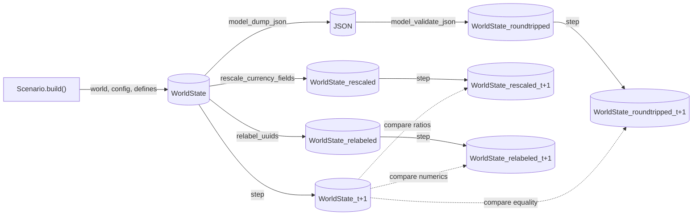

# Phase 1 Data Model: Marx Value-Form Invariants

**Spec**: [spec.md](spec.md) | **Plan**: [plan.md](plan.md) | **Research**: [research.md](research.md)
**Date**: 2026-05-11

This document formalizes the seven test-only entities from the spec's
"Key Entities" section and the one optional production-side entity
(`H3SplitterRule`). All test-only entities live under
`tests/_helpers/invariants/`; the one production entity lives under
`src/babylon/config/h3_splitter.py`.

No production data model is modified.

---

## Production-Side (optional, FR-011 exception)

### H3SplitterRule

**Location**: `src/babylon/config/h3_splitter.py` (new file, ~50 LOC).

**Purpose**: Single source of truth for the engine's H3 disaggregation
convention. Permitted by the FR-011 exception because the codebase
currently has no named splitter rule despite using equal-weight splitting
as a de facto convention (see R1 of `research.md`).

**Type**: `StrEnum` plus a helper function.

```python
from enum import StrEnum
from typing import Final

class H3SplitterRule(StrEnum):
    """Canonical H3 disaggregation rules."""
    UNIFORM = "uniform"
    # Future: AREA_WEIGHTED, POPULATION_WEIGHTED, EMPLOYMENT_WEIGHTED

DEFAULT_SPLITTER: Final[H3SplitterRule] = H3SplitterRule.UNIFORM

def split_uniformly(parent_value: float, n_children: int) -> list[float]:
    """Split parent quantity equally among n children.

    For an H3 cell at resolution R, the typical n_children is 7 (one
    finer resolution). split_uniformly conserves total: sum(result) ==
    parent_value within float epsilon.

    Args:
        parent_value: The quantity to split.
        n_children: The number of children (positive integer).

    Returns:
        A list of n_children floats each equal to parent_value /
        n_children.

    Raises:
        ValueError: If n_children < 1.
    """
    if n_children < 1:
        raise ValueError("n_children must be >= 1")
    return [parent_value / n_children] * n_children
```

**Invariants**:
- `sum(split_uniformly(v, n)) == v` exactly (no float drift for the
  reduction; per-element drift only).
- `H3SplitterRule.UNIFORM` is the only declared rule at landing time.
- Future rules MUST preserve the conservation invariant.

**Consumers**: `tests/_helpers/invariants/h3_round_trip.py` reads
`DEFAULT_SPLITTER` and dispatches.

---

## Test-Side Entities

All test-side entities are simple dataclasses or pure functions. They are
not Pydantic models because they do not persist across runs — they
exist only for the lifetime of a test.

### MonetaryRescaling

**Location**: `tests/_helpers/invariants/monetary_rescaling.py`.

**Purpose**: Implements US1 / FR-001 / FR-002. Takes a `WorldState`
and a positive scalar `k`, returns a new `WorldState` with all
`Currency`-typed fields multiplied by `k` and all `LaborHours`-typed
fields unchanged.

**Signature**:
```python
def rescale_currency_fields(world: WorldState, k: float) -> WorldState:
    """Return a new WorldState with monetary fields scaled by k.

    Preserves all labor-time fields, all enum fields, all ID fields,
    and all structural relationships. Idempotent on labor-time fields.
    Pure. Reversible by rescaling with 1/k.

    Args:
        world: The state to rescale.
        k: Positive scaling factor. Tolerated range [1e-9, 1e9].

    Returns:
        A new WorldState (frozen Pydantic model) with currency fields
        scaled.

    Raises:
        ValueError: If k <= 0.
        TypeError: If world is not a WorldState.
    """
```

**Field-by-field rule**:

| Field Category | Type | Scaling |
|---|---|---|
| Constant capital (organization, hex aggregate) | `Currency` | × k |
| Variable capital (organization, hex aggregate) | `Currency` | × k |
| Surplus value (computed) | derived from c, v | follows |
| MELT τ | `Currency` per `LaborHours` | × k |
| Prices of production | `Currency` | × k |
| Wages | `Currency` | × k |
| Imperial rent Φ | `Currency` | × k |
| Constant capital in labor-hours | `LaborHours` | unchanged |
| Variable capital in labor-hours | `LaborHours` | unchanged |
| Surplus value in labor-hours | `LaborHours` | unchanged |
| Tick counter, IDs, edge modes, enums | various | unchanged |

**Invariants**:
- Pure: `rescale(rescale(w, k), 1/k) == w` within 1e-15 relative.
- Composability: `rescale(rescale(w, k1), k2) == rescale(w, k1*k2)`.
- Identity: `rescale(w, 1.0) == w`.

---

### ConsistencyReport

**Location**: `tests/_helpers/invariants/melt_consistency.py`.

**Purpose**: Diagnostic returned by the US2 / FR-003 MELT consistency
check. Carries actionable failure information per FR-010.

**Signature**:
```python
from dataclasses import dataclass

@dataclass(frozen=True)
class EntityViolation:
    entity_id: str
    field_name: str  # one of: "c", "v", "s", "total_value"
    labor_hours: float
    money_currency: float
    expected_money: float       # labor_hours × τ
    relative_error: float
    absolute_error_currency: float

@dataclass(frozen=True)
class ConsistencyReport:
    n_entities_checked: int
    n_skipped_no_data: int
    n_skipped_degenerate: int
    max_relative_error: float
    worst_entity: EntityViolation | None
    violations: list[EntityViolation]  # All entities exceeding tolerance.

    def passed(self, tolerance: float = 1e-9) -> bool:
        return self.max_relative_error <= tolerance
```

**Invariants**:
- `n_entities_checked + n_skipped_no_data + n_skipped_degenerate ==
  total_productive_entities`.
- `worst_entity is None` iff `len(violations) == 0`.

---

### TransformationModeFlag

**Location**: `tests/_helpers/invariants/transformation_mode.py`.

**Purpose**: Single-source-of-truth probe for FR-021. Consumed by
US3-redistribution-arm, US4, US5, US7-c.

**Signature**:
```python
from enum import StrEnum

class TransformationMode(StrEnum):
    PROPORTIONAL_PRICES = "proportional"
    REDISTRIBUTION_ACTIVE = "redistribution"

def probe_transformation_mode(world: WorldState) -> TransformationMode:
    """Probe the world's TransformationDialectic weight.

    Per src/babylon/engine/dialectics/transformation.py:54-55:
      weight < 0 → values dominate prices (low equalization)
      weight > 0 → prices of production fully equalized

    Returns:
        REDISTRIBUTION_ACTIVE if weight > 0, else PROPORTIONAL_PRICES.

    Raises:
        KeyError: If world.dialectics has no "transformation" entry.
    """

def skip_unless_active(world: WorldState, spec_ref: str = "spec-060") -> None:
    """pytest-style skip if not in redistribution mode.

    Args:
        world: The state to probe.
        spec_ref: Reference embedded in skip reason (FR-008, FR-010).
    """
    if probe_transformation_mode(world) != TransformationMode.REDISTRIBUTION_ACTIVE:
        import pytest
        pytest.skip(
            f"Transformation engine in proportional-prices mode "
            f"(weight ≤ 0). Test gated by {spec_ref} FR-008."
        )
```

**Invariants**:
- Pure: probe takes a snapshot; safe to call multiple times.
- Deterministic: same world → same mode.

---

### MetamorphicPair (optional sugar)

**Location**: `tests/_helpers/invariants/metamorphic.py`.

**Purpose**: Optional convenience wrapper holding the two world states
that a metamorphic test compares. Not load-bearing — author choice. US1
typically uses `MonetaryRescaling` directly; US4 builds its pair inline
(variable_capital × 1.10); US5 uses `halve_snlt_in_sector`. The
dataclass is available when a test author wants the explicit pair-
labelling for diagnostics, but no contract mandates its use.

**Signature**:
```python
@dataclass(frozen=True)
class MetamorphicPair:
    baseline: WorldState
    perturbed: WorldState
    perturbation_name: str       # human-readable label
    perturbation_params: dict[str, object]   # k, sector, etc.

    @property
    def tick(self) -> int:
        assert self.baseline.tick == self.perturbed.tick
        return self.baseline.tick
```

**Invariants**:
- `baseline.tick == perturbed.tick` (paired runs at same tick).
- `baseline ≠ perturbed` (perturbation is non-identity).

---

### UUIDRelabeler

**Location**: `tests/_helpers/invariants/uuid_relabeler.py`.

**Purpose**: Implements US6(a) / FR-013. See `research.md` R5 for the
full inventory of ID-typed fields.

**Signature**:
```python
def relabel_uuids(
    world: WorldState,
    alias_fn: Callable[[int, str], str] | None = None,
) -> tuple[WorldState, dict[str, str]]:
    """Return a world with every ID relabeled, plus the mapping used.

    Args:
        world: Source state.
        alias_fn: (index, original_id) → new_id. Defaults to a
            deterministic f"alias_{i:06d}" function.

    Returns:
        (relabeled_world, {original_id: alias}). The mapping is
        bijective. relabeled_world is structurally identical to world
        except for IDs.

    Raises:
        ValueError: If the supplied alias_fn produces collisions.
    """
```

**Algorithm**:
1. Collect canonical IDs from `world.entities`, `world.territories`,
   `world.organizations`, `world.key_figures`, `world.institutions`,
   `world.industries`, `world.state_finances`,
   `world.contradiction_frames`.
2. Sort the union for determinism.
3. Build `mapping = {orig: alias_fn(i, orig) for i, orig in
   enumerate(sorted_ids)}`.
4. Dump the world via `model_dump()`, rewrite every key/value that
   appears in the mapping (recursive walk through nested dicts and
   lists).
5. Reconstitute via `WorldState.model_validate(dumped_and_rewritten)`.
6. Return the new world plus the mapping.

**Invariants**:
- Bijection: each `orig` maps to a unique `alias`, and the inverse is
  unambiguous.
- ID-only change: for every non-`_id`-suffixed numeric field, the
  values are identical (within float precision).

---

### H3SplitterRule (test-side)

Already declared as a production-side enum above. Test-side helper:

**Location**: `tests/_helpers/invariants/h3_round_trip.py`.

**Signature**:
```python
def rollup_then_disaggregate(
    hex_values: dict[str, float],   # {h3_index_at_R: value}
    parent_resolution: int,
    splitter: H3SplitterRule = H3SplitterRule.UNIFORM,
) -> tuple[dict[str, float], dict[str, float]]:
    """Roll up to parent_resolution, then disaggregate back to original R.

    Args:
        hex_values: per-child values at child resolution R.
        parent_resolution: R - 1 (the rolled-up resolution).
        splitter: disaggregation rule (only UNIFORM at landing).

    Returns:
        (round_tripped_per_child, parent_totals). round_tripped_per_child
        equals hex_values if R-children-per-parent group is complete and
        the splitter is uniform; parent_totals is the intermediate.
    """
```

**Invariants** (FR-016):
- Σ children in any parent group exactly == parent total (1e-15).
- Per-child round-trip recovery: within 1e-9 relative (allows for
  uniform-split float drift if siblings have unequal originals).

---

### ProfitRateVarianceTrace

**Location**: `tests/_helpers/invariants/variance_trace.py`.

**Purpose**: Implements US7(c) / FR-019.

**Signature**:
```python
@dataclass(frozen=True)
class VarianceObservation:
    tick: int
    sector_rates: dict[str, float]   # sector_id → profit rate
    variance: float                  # sample variance across sectors

@dataclass(frozen=True)
class ProfitRateVarianceTrace:
    observations: list[VarianceObservation]

    def variance_window(self, start: int, end: int) -> float:
        """Mean variance over ticks [start, end)."""

    def variance_early(self, window: int = 10) -> float:
        return self.variance_window(0, window)

    def variance_late(self, window: int = 10) -> float:
        n = len(self.observations)
        return self.variance_window(n - window, n)

    def has_equalized(self) -> bool:
        return self.variance_late() < self.variance_early()
```

**Invariants** (FR-019):
- `len(observations) >= 50` for a US7(c) test to be valid.
- Each observation references a tick `t`; `observations` is ordered
  by `t`.
- `has_equalized() == True` is the success condition under
  REDISTRIBUTION_ACTIVE mode.

---

## Field-Type Cross-Reference

For monetary rescaling (US1), the test must know which fields are
`Currency` vs `LaborHours`. This is determined at runtime from
Pydantic field annotations.

**Currency-typed fields** (representative; full list inferred from
`pydantic.fields.FieldInfo.annotation`):

- `Organization.constant_capital: Currency`
  (`src/babylon/models/entities/organization.py:306`)
- `Organization.variable_capital: Currency`
  (`src/babylon/models/entities/organization.py:310`)
- `HexEconomicState.constant_capital: float` (the substrate carries it
  as `float` aggregating `Currency`; see
  `src/babylon/economics/substrate/hex_graph_bridge.py:80`)
- `HexEconomicState.variable_capital: float` (`hex_graph_bridge.py:81`)
- `GlobalEconomy.melt: Currency` (per Axiom B3, see
  `src/babylon/economics/melt/melt_calculator.py:7`)

**LaborHours-typed fields**:

- `DepartmentRow.c: LaborHours`
  (`src/babylon/economics/tensor.py:162`)
- `DepartmentRow.v: LaborHours` (`tensor.py:163`)
- `DepartmentRow.s: LaborHours` (`tensor.py:164`)
- `ValueTensor4x3.excluded_wages: LaborHours` (`tensor.py:273`)

**Rule**: the rescaler walks Pydantic model fields, inspects the
annotation, and scales iff the annotation is `Currency` or a subtype
thereof. `LaborHours` is left alone.

**Implementation note**: `Currency` is defined as a constrained-float
type in `src/babylon/models/types.py`. The walker uses
`get_type_hints(model)` plus annotation introspection; no string-name
matching.

---

## Entity Lifecycle Diagram



Each pair compared via the assertions in the corresponding FR.

---

## Summary

- 1 optional production-side entity (`H3SplitterRule`) under FR-011
  exception.
- 7 test-only entities under `tests/_helpers/invariants/`.
- No new database tables, no new persistence formats.
- No new third-party dependencies beyond Hypothesis (already present).
- All entities are pure dataclasses or pure functions; no state held.
- All Pydantic-typed boundary crossings use existing `Currency`,
  `LaborHours`, and `WorldState` types.
