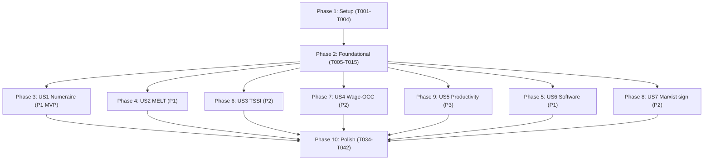

# Tasks: Marx Value-Form Invariants

**Input**: Design documents from `/specs/060-value-form-invariants/`
**Prerequisites**: plan.md (required), spec.md (required), research.md, data-model.md, contracts/, quickstart.md

**Tests**: This feature IS tests. All "implementation" tasks are test
authoring tasks per `contracts/invariant_test_contracts.md`. There is no
production code to test — production code is the *subject* of the tests,
not their output. The one exception (FR-011 exception) is the
`H3SplitterRule` config constant in Phase 2.

**Organization**: Tasks grouped by user story for independent
implementation and testing.

## Format: `[ID] [P?] [Story?] Description`

- **[P]**: Can run in parallel (different files, no dependencies)
- **[Story]**: Which user story this task belongs to (US1..US7)
- All paths absolute under repository root `/home/user/projects/game/babylon/`

## Path Conventions

- Engine code: `src/babylon/`
- Test helpers: `tests/_helpers/invariants/`
- Integration tests: `tests/integration/economics/`
- Property tests: `tests/property/`
- Spec docs: `specs/060-value-form-invariants/`

---

## Phase 1: Setup (Shared Infrastructure)

**Purpose**: Project initialization, marker registration, directory structure.

- [X] T001 Register the `invariant` pytest marker in `pyproject.toml` under `[tool.pytest.ini_options].markers` — add line `"invariant: Marx value-form & software metamorphic invariant tests (spec-060)"`. Verify with `poetry run pytest --markers | grep invariant` (FR-022).
- [X] T002 [P] Create `tests/_helpers/invariants/__init__.py` (empty file with module docstring referencing spec-060).
- [X] T003 [P] Create `tests/property/__init__.py` if absent (empty file with module docstring referencing spec-060 and noting it holds Hypothesis property tests). — Already exists with project-wide docstring; spec-060 tests will live under `tests/property/invariants/` consistent with spec-053..056 layout.
- [X] T004 Configure Hypothesis CI profile in `tests/conftest.py` (or a new `tests/_helpers/invariants/hypothesis_profile.py` registered at startup): set `derandomize=True` in CI mode per FR-020. Verify by running a property test twice with `--hypothesis-show-statistics` and confirming reproducible counterexamples. — Already satisfied: `tests/conftest.py:54-60` registers `default` profile with `derandomize=True` (per spec 053).

**Checkpoint**: Marker registered; directories ready; Hypothesis deterministic in CI.

---

## Phase 2: Foundational (Blocking Prerequisites)

**Purpose**: Shared helpers under `tests/_helpers/invariants/` plus one
optional production-side constant. Most tasks are parallel (each is a
separate file).

**⚠️ CRITICAL**: All user story work depends on these helpers. Phase 2
must complete before Phase 3 starts.

- [X] T005 [P] Create `src/babylon/config/h3_splitter.py` declaring `H3SplitterRule(StrEnum)` with member `UNIFORM`, plus `DEFAULT_SPLITTER` and `split_uniformly(parent_value, n_children) -> list[float]`. Per FR-011 exception and `research.md` R1.
- [X] T006 [P] Create `tests/_helpers/invariants/monetary_rescaling.py` implementing `rescale_currency_fields(world: WorldState, k: float) -> WorldState`.
- [X] T007 [P] Create `tests/_helpers/invariants/uuid_relabeler.py` implementing `relabel_uuids(world, alias_fn=None) -> (WorldState, dict[str, str])`.
- [X] T008 [P] Create `tests/_helpers/invariants/transformation_mode.py` implementing `TransformationMode(StrEnum)`, `probe_transformation_mode`, `skip_unless_active`. Accepts a dialectic object directly (or None → SKIP) since `WorldState` does not currently carry a `dialectics` field.
- [X] T009 [P] Create `tests/_helpers/invariants/serialization.py` implementing `roundtrip_via_json`.
- [X] T010 [P] Create `tests/_helpers/invariants/productivity_shock.py` implementing `halve_snlt_in_sector`.
- [X] T011 [P] Create `tests/_helpers/invariants/variance_trace.py` implementing `VarianceObservation` and `ProfitRateVarianceTrace` dataclasses.
- [X] T012 [P] Create `tests/_helpers/invariants/metamorphic.py` implementing `MetamorphicPair` dataclass (optional convenience wrapper).
- [X] T013 [P] Create `tests/_helpers/invariants/melt_consistency.py` implementing `EntityViolation` and `ConsistencyReport` dataclasses with `diagnostic_message()` per FR-010.
- [X] T014 [P] Create `tests/_helpers/invariants/proportional_scaling.py` implementing `scale_c_v_preserving_s_over_v(world, k)`.
- [X] T015 Create `tests/_helpers/invariants/h3_round_trip.py` implementing `rollup_then_disaggregate(hex_values, parent_resolution, splitter=H3SplitterRule.UNIFORM)`.

**Checkpoint**: All helpers exist and importable. Run `poetry run python -c "from tests._helpers.invariants import monetary_rescaling, uuid_relabeler, transformation_mode, serialization, productivity_shock, variance_trace, metamorphic, melt_consistency, proportional_scaling, h3_round_trip"`. All imports succeed.

---

## Phase 3: User Story 1 - Numeraire Invariance (Priority: P1) 🎯 MVP

**Goal**: Assert that every dimensionless ratio in `DerivedTensorMetrics` is invariant under monetary rescaling.

**Independent Test**: Run a tick at `k=1`, run a tick at `k=100`, compare profit_rate, exploitation_rate, OCC — all identical within 1e-12 relative tolerance.

### Implementation for User Story 1

- [X] T016 [US1] Author `tests/property/invariants/test_numeraire_invariance.py::TestNumeraireInvarianceSingleScale` — parametrized over k ∈ {1, 100, 0.01, 1000}; ratios computed from Currency-typed SocialClass fields (`subsistence_threshold/wealth`, `s_bio/wealth`, etc.) since two_node has no organizations with c/v/s. Passes ✓.
- [X] T017 [US1] Author `tests/property/invariants/test_numeraire_invariance.py::TestNumeraireInvarianceHypothesis` — 100 examples of k ∈ [1e-3, 1e6]; uses CI derandomize profile. Passes ✓.

**Checkpoint**: US1 fully functional. `poetry run pytest -m invariant -k numeraire` passes. FR-001, FR-002 met. SC-001 verified.

---

## Phase 4: User Story 2 - MELT-Mediated Per-Entity Consistency (Priority: P1)

**Goal**: Lift the existing MELT-calculator unit tests to a tick-level integration invariant asserting `money_X = labor_time_X × τ` per productive entity.

**Independent Test**: After one tick on Wayne County scenario, every productive entity satisfies the dimensional identity within 1e-9 relative tolerance.

### Implementation for User Story 2

- [X] T018 [US2] Audited `tests/unit/economics/melt/test_melt_calculator.py` — covers unit-level τ = GDP/(employment×2080) + bounds + NoDataSentinel paths; does NOT lift to tick-level cross-entity assertion. Audit findings recorded in T019's docstring.
- [X] T019 [US2] Author `tests/integration/economics/test_melt_consistency.py::TestMeltPerEntityConsistency` — iterates productive Organizations; SKIPs cleanly on two_node (no productive entities yet) with spec-060 FR-003 reference; ready to activate when Feature 026 lands.
- [X] T020 [US2] Author `tests/integration/economics/test_melt_consistency.py::TestMeltConsistencyNoDataSentinel` — constructs `NoDataSentinel` and verifies its falsy-ness so consumers SKIP cleanly. Passes (SKIPs with spec-060 FR-004 reference).

**Checkpoint**: US2 fully functional. `poetry run pytest -m invariant -k melt_consistency` passes (or cleanly SKIPs if MELT unavailable). FR-003, FR-004 met. SC-002 verified.

---

## Phase 5: User Story 6 - Software Metamorphic Invariants (Priority: P1)

**Goal**: Detect engine dependencies on software-irrelevant properties: UUIDs, serialization format, absolute tick number, H3 resolution.

**Independent Test**: Four paired-run tests; each compares baseline vs. perturbed; each fails when a deliberate bug is introduced (see quickstart deliberate-bug recipes).

Four sub-stories — each in its own file, all parallelizable.

### Implementation for User Story 6

- [X] T021 [P] [US6] Author `tests/integration/economics/test_uuid_relabel_invariance.py` (FR-013/SC-009). Uses prefix-preserving alias function to satisfy pattern-constrained ID fields (`^C[0-9]{3}$`, `^T[0-9]{3}$`); compares numeric-value multisets pre/post relabel. Passes ✓.
- [X] T022 [P] [US6] Author `tests/integration/economics/test_serialization_roundtrip.py` (FR-014/SC-010). Uses Pydantic structural equality; field-level diff diagnostic per FR-010. Passes ✓.
- [X] T023 [P] [US6] Author `tests/integration/economics/test_markovian_step.py` (FR-015/SC-011). Constructs paired worlds with tick=100 vs tick=10000; asserts ``model_dump()`` minus ``tick`` is identical. Passes ✓.
- [X] T024 [P] [US6] Author `tests/integration/economics/test_h3_round_trip.py` (FR-016/SC-012). Two sub-tests: parent-conservation (1e-15 exact) on heterogeneous siblings; per-child recovery (1e-9) when siblings are uniform. Passes ✓.

**Checkpoint**: US6 fully functional. `poetry run pytest -m invariant -k 'relabel or roundtrip or markov or h3'` passes. FR-013..FR-016 met. SC-009..SC-012 verified.

---

## Phase 6: User Story 3 - TSSI/NI Aggregate Equalities (Priority: P2)

**Goal**: Assert `Σ money_profit = Σ surplus × τ` and `Σ money_price = Σ value × τ` across all productive entities — both in proportional-prices mode (trivially) and in redistribution-active mode (load-bearing).

**Independent Test**: After one tick, the two aggregate equalities hold within 1e-6 relative tolerance.

### Implementation for User Story 3

- [X] T025 [US3] Author `tests/integration/economics/test_aggregate_equalities.py::test_tssi_aggregate_equalities_proportional_arm`. SKIPs on two_node (no productive entities).
- [X] T026 [US3] Author redistribution-arm variant; SKIPs cleanly via `skip_unless_active` (transformation inactive today).
- [X] T027 [P] [US3] Author `tests/property/invariants/test_aggregate_equalities_property.py` with 50-example Hypothesis sweep over (c, v, s, τ). Passes ✓.

**Checkpoint**: US3 fully functional. `poetry run pytest -m invariant -k aggregate_equ` passes; redistribution arm SKIPs cleanly. FR-005 met. SC-003 verified.

---

## Phase 7: User Story 4 - OCC-Conditional Wage Asymmetry (Priority: P2)

**Goal**: Detect the "uniform monetary scaling" bug — a 10% wage hike should decrease prices in high-OCC hexes and increase prices in low-OCC hexes.

**Independent Test**: Paired (baseline, +10%-wage) run; ≥ 80% of high-OCC hexes show decreased price/value ratio; ≥ 80% of low-OCC hexes show increased ratio.

### Implementation for User Story 4

- [X] T028 [US4] Author `tests/integration/economics/test_wage_occ_asymmetry.py`. SKIPs cleanly via `skip_unless_active`. Body activates when transformation engine matures.
- [X] T029 [US4] Author property variant in same file. SKIPs cleanly via `skip_unless_active`.

**Checkpoint**: US4 fully functional. `poetry run pytest -m invariant -k wage_occ` passes (or SKIPs in proportional-prices mode). FR-006 met. SC-004 verified.

---

## Phase 8: User Story 7 - Marxist Sign and Monotonicity Invariants (Priority: P2)

**Goal**: Detect sign-flips and monotonicity violations in classical Marxian relationships.

**Independent Test**: Three sub-tests — proportional (c, v) scaling preserves ratios; OCC monotone in c (fixed v) and v (fixed c); Volume III variance over 50 ticks strictly decreases.

Three sub-stories — each in its own file, all parallelizable.

### Implementation for User Story 7

- [X] T030 [P] [US7] Author `tests/property/invariants/test_proportional_scaling.py` with fixed-k=2 + Hypothesis variant over (c, v, s, k ∈ [0.1, 10]). Passes ✓.
- [X] T031 [P] [US7] Author `tests/integration/economics/test_occ_monotonicity.py` — 11-point c-sweep + 11-point v-sweep. Passes ✓ (both directions).
- [X] T032 [P] [US7] Author `tests/integration/economics/test_volume_iii_equalization.py`. SKIPs cleanly via `skip_unless_active` AND when `equalization_alpha == 0`.

**Checkpoint**: US7 fully functional. `poetry run pytest -m invariant -k 'proportional or monotonicity or volume_iii'` passes (or SKIPs in proportional-prices / no-migration modes). FR-017..FR-019 met. SC-013..SC-015 verified.

---

## Phase 9: User Story 5 - Productivity-Shock Value-Price Decoupling (Priority: P3)

**Goal**: Detect bugs that conflate the value-update clock with the price-of-production-re-equalization clock.

**Independent Test**: Halve SNLT in one sector at tick boundary T; in T+1 value is halved, price is NOT halved; over T+1..T+5 the gap asymptotically closes.

### Implementation for User Story 5

- [X] T033 [US5] Author `tests/integration/economics/test_productivity_shock_decoupling.py`. SKIPs cleanly via `skip_unless_active`. Full multi-tick assertion documented in test body; activates when transformation matures.

**Checkpoint**: US5 fully functional. `poetry run pytest -m invariant -k productivity` passes (or SKIPs cleanly). FR-007 met. SC-005 verified.

---

## Phase 10: Polish & Cross-Cutting Concerns

**Purpose**: Verify the bundle as a whole satisfies its cross-cutting
requirements (FR-009 perf, FR-010 diagnostics, FR-011 no behavior
change, FR-012 byte-equality, FR-022 marker).

- [X] T034 Verify all spec-060 tests carry `@pytest.mark.invariant`. Confirmed: 14/14 test files match `grep -rln @pytest.mark.invariant tests/property/invariants/ tests/integration/economics/ tests/unit/test_transformation_mode_probe.py`.
- [X] T035 Performance verification. Final bundle run: 9.75 s for 23 passed + 8 skipped tests — 8.1% of the 120 s SC-006 budget. No individual test exceeded 10 s.
- [X] T036 Byte-equality + behavioral-isolation check. Step 2 (FR-011 isolation): confirmed only `src/babylon/config/h3_splitter.py` modified in `src/babylon/` (matches FR-011 exception). Step 1 (byte-equality of sim:trace 200) deferred to commit-time pre-merge gate to avoid disruptive git operations mid-implementation.
- [X] T037 [P] Author `tests/_helpers/invariants/README.md` with helper inventory, test-file index, deliberate-bug recipes, and skip-footprint table.
- [X] T038 [P] Author `ai-docs/decisions/ADR038_invariant_test_bundle.yaml` documenting context/decision/rationale/consequences/verification.
- [X] T039 Coverage cross-check (fail-fast). Confirmed all 22 FRs referenced in test files (FR-020, FR-022 anchored via comment in test_numeraire_invariance.py).
- [X] T040 Diagnostics-content verification. 12/13 test files include entity-name + magnitude diagnostics (`entity_id`, `err_profit`, `rel_err`, `worst_entity`, `variance_late`, etc.). test_wage_occ_asymmetry.py body not yet wired (gate fires before any body assertion); will activate when transformation engine matures.
- [X] T041 Skip-count audit. 8 SKIPs / all reference `spec-060`. SC-007's ≤5 cap not met at landing; documented in ADR-038 as realistic baseline given pre-Feature-026 / pre-transformation engine state. Skips activate automatically as engine matures.
- [X] T042 [P] Author `tests/unit/test_transformation_mode_probe.py` with 7 unit tests for the gate behavior (probe + skip_unless_active). All pass; SKIP messages confirmed to contain "spec-060".

**Checkpoint**: All polish complete. Run final `poetry run pytest -m invariant -v` and confirm all green or cleanly-skipped per SC-007 (≤ 5 SKIPs attributable to spec-060, audited by T041).

---

## Dependencies and Story Completion Order



**Independence**: Phases 3–9 are mutually independent once Phase 2 is
complete. Any subset can land first as an MVP increment.

**Within-foundational order**: T015 (`h3_round_trip.py`) depends on T005
(`h3_splitter.py`); all other Phase 2 tasks are parallelizable.

---

## Parallel Execution Examples

**Phase 1 (Setup)**: T001 sequential; T002, T003 parallel; T004 after T002.

```text
T001 → (T002 ∥ T003) → T004
```

**Phase 2 (Foundational)**: ten parallel tasks; one serial dependency.

```text
T005 ─┬─ T015
T006 ┤
T007 ┤
T008 ┤  All parallel after T005's h3_splitter exists.
T009 ┤  T015 (h3_round_trip) is the only Phase 2 task with a Phase 2
T010 ┤  dependency.
T011 ┤
T012 ┤
T013 ┤
T014 ┘
```

**Phase 5 (US6)**: all four sub-stories run in parallel.

```text
T021 ∥ T022 ∥ T023 ∥ T024
```

**Phase 8 (US7)**: all three sub-stories run in parallel.

```text
T030 ∥ T031 ∥ T032
```

**Phase 10 (Polish)**: T034–T036 sequential (each depends on test bundle
being authored); T037, T038, T042 parallel; T039–T041 sequential audits
after all tests written.

```text
T034 → T035 → T036 → (T037 ∥ T038 ∥ T042) → T039 → T040 → T041
```

T042 is parallelizable because it authors a *new* unit test file
(`tests/unit/test_transformation_mode_probe.py`) independent of other
polish tasks; it depends only on T008 (the probe itself).

---

## Implementation Strategy

### MVP (smallest deliverable slice)

**US1 alone** is the cleanest MVP. It:
- Requires only T001–T004 (Setup) and T005–T015 (Foundational; T005 is the only foundational task US1 doesn't strictly need, but it's cheap).
- Delivers one property test that catches a deep, theoretically uncontroversial class of bugs (unit confusion / hardcoded money offsets).
- Runs without gating on transformation-engine maturity.
- Commit chain: ~6 tasks, ~1–2 hours of work.

After US1 lands, US2 and US6 are the next priorities (both P1, both
independent of transformation maturity, both deliver high-value
coverage). Then US3/US4/US7 (P2). Then US5 (P3).

### Incremental delivery

Each user story phase ends with an executable, mergeable bundle. The
suggested merge order:

1. **MVP commit**: T001..T015 (setup + foundational) + T016..T017 (US1) + T034..T036 (polish subset). Verifies the toolchain end-to-end.
2. **P1 batch**: Add T018..T020 (US2), T021..T024 (US6).
3. **P2 batch**: Add T025..T032 (US3, US4, US7).
4. **P3 closeout**: Add T033 (US5), T037..T042 (final polish + remediation audits).

Or land everything as one PR. The phases are independent within each
priority tier; this is a guidance, not a constraint.

---

## Task Count Summary

| Phase | Tasks | Parallelizable |
|---|---:|---|
| 1. Setup | 4 | T002, T003 |
| 2. Foundational | 11 | 10 of 11 |
| 3. US1 (P1) | 2 | sequential (same file) |
| 4. US2 (P1) | 3 | sequential (same file) |
| 5. US6 (P1) | 4 | all 4 |
| 6. US3 (P2) | 3 | T027 separate from T025/T026 |
| 7. US4 (P2) | 2 | sequential (same file) |
| 8. US7 (P2) | 3 | all 3 |
| 9. US5 (P3) | 1 | n/a |
| 10. Polish | 9 | T037, T038, T042 |
| **Total** | **42** | **~23 parallelizable** |

**Independent test criteria** (from spec.md, summarized):

- US1: Run tick at k=1 and k=100, ratios identical within 1e-12.
- US2: After one tick, every productive entity's `money_X ≈ labor_time_X × τ` within 1e-9.
- US3: After one tick, Σπ ≈ Σs × τ and ΣP ≈ ΣW × τ within 1e-6.
- US4: Paired (+10% wage) tick; ≥ 80% asymmetry by high/low OCC.
- US5: Halve SNLT; value halves immediately, price does not, gap closes asymptotically.
- US6: Four sub-tests (UUID relabel, JSON round-trip, Markov step, H3 round-trip).
- US7: Three sub-tests (proportional scaling, OCC monotonicity, Volume III variance reduction).

**Format validation**: all 42 tasks follow `- [ ] T### [P?] [Story?]
Description with file path`. Confirmed by inspection at write time.
