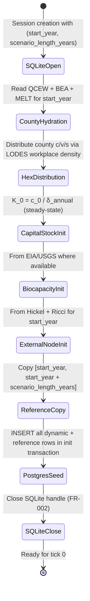

# Phase 1 Data Model: Cross-Scale Integration

**Feature**: 062-cross-scale-integration
**Date**: 2026-05-12
**Prerequisites**: `research.md` complete (Phase 0)

This document enumerates the Pydantic models, Postgres DDL, subsystem ownership registry, and state-transition narratives for every entity introduced or extended by spec 062.

---

## 1. Subsystem Ownership Registry (GATE-3 closure per Constitution II.11)

| Identifier | Kind | Owner subsystem | Declared cross-subsystem read interface |
|---|---|---|---|
| `immutable_reference_bea_io` | table | `persistence` | `ImmutableReferenceLookup[BEAInputOutput]` Python protocol |
| `immutable_reference_melt_tau` | table | `persistence` | `ImmutableReferenceLookup[MELT]` |
| `immutable_reference_basket_gamma` | table | `persistence` | `ImmutableReferenceLookup[BasketGamma]` |
| `immutable_reference_erdi` | table | `persistence` | `ImmutableReferenceLookup[ERDI]` |
| `immutable_reference_hickel_drain` | table | `persistence` | `ImmutableReferenceLookup[HickelDrain]` |
| `immutable_reference_ricci_unequal` | table | `persistence` | `ImmutableReferenceLookup[RicciUnequalExchange]` |
| `immutable_reference_faf_freight` | table | `persistence` | `ImmutableReferenceLookup[FAFFreight]` |
| `immutable_reference_qcew_employment` | table | `persistence` | `ImmutableReferenceLookup[QCEWEmployment]` |
| `immutable_reference_bea_reis_rent` | table | `persistence` | `ImmutableReferenceLookup[BEAReisRent]` |
| `immutable_reference_fred_rates` | table | `persistence` | `ImmutableReferenceLookup[FREDRates]` |
| `dynamic_hex_state` | table | `persistence` | NetworkX hydration via `PostgresRuntime.hydrate_state()` |
| `dynamic_external_node_state` | table | `persistence` | NetworkX hydration via `PostgresRuntime.hydrate_state()` |
| `boundary_flow_register` | table | `economics` | `BoundaryFlowRegister.query(tick, source, dest, …)` Python facade |
| `conservation_audit_log` | table | `persistence` | `ConservationAuditQuery.fetch(tick, scale, invariant, …)` Python facade |
| `v_county_value_aggregate` | view | `persistence` | View IS the interface (any subsystem may `SELECT`) |
| `v_state_value_aggregate` | view | `persistence` | View IS the interface |
| `v_national_value_aggregate` | view | `persistence` | View IS the interface |
| `v_global_phi_balance` | view | `economics` | View IS the interface |

---

## 2. Runtime Pydantic Models

All models use `model_config = ConfigDict(frozen=True)` per project standard. Constrained numeric types (`Probability`, `Currency`, `Coefficient`) come from `babylon.models.types`.

### 2.1 `DynamicHexState`

The primary per-hex per-tick state. Source of truth at hex resolution 7. **NEVER aggregated and stored at a coarser scale** (FR-018, FR-019).

```python
class DynamicHexState(BaseModel):
    model_config = ConfigDict(frozen=True)

    # Identity
    session_id: UUID
    tick: int = Field(ge=0)
    h3_index: str = Field(min_length=15, max_length=15)  # H3 res-7

    # Spatial mapping (immutable per hex; computed once at init)
    county_fips: str = Field(pattern=r"^\d{5}$")
    state_fips: str = Field(pattern=r"^\d{2}$")
    region_id: str  # Census region / MSA / CFS area

    # Value substance (Vol I primitives)
    c: Currency = Field(ge=0)  # constant capital
    v: Currency = Field(ge=0)  # variable capital
    s: Currency = Field(ge=0)  # surplus value

    # Capital stock (perpetual-inventory; FR-014/FR-015)
    K: Currency = Field(ge=0)

    # Substrate physical stocks (computed by Substrate system at pipeline pos 2.5)
    biocapacity_stock: float = Field(ge=0)
    energy_stock: float = Field(ge=0)
    raw_material_stock: float = Field(ge=0)

    # Surveillance / coupling (FCC broadband-derived)
    internet_access_pct: Probability
    surveillance_coupling: Coefficient
```

**Lifecycle**: created once per (`session_id`, `tick`, `h3_index`) via the per-tick transaction (FR-008a). Never updated after commit (immutable per-tick).

### 2.2 `ExternalNode`

A world-region external node (FR-036/FR-037/FR-038). Carries country-aggregate state but no internal hex structure.

```python
class ExternalNodeKind(str, Enum):
    INTERNATIONAL = "international"  # Canada, China, EU, etc.
    DOMESTIC_REST = "domestic_rest"  # Rest-of-USA single node

class ExternalNode(BaseModel):
    model_config = ConfigDict(frozen=True)

    session_id: UUID
    tick: int = Field(ge=0)
    node_id: str  # e.g., "canada", "china", "rest_of_usa"
    kind: ExternalNodeKind

    # Country-aggregate state
    phi_year_inflow: Currency = Field(ge=0)  # Hickel drain for current year
    bilateral_trade_value: Currency = Field(ge=0)  # Ricci/Comtrade $-volume
    bilateral_trade_tons: float = Field(ge=0)  # FAF tonnage
    erdi_ratio: Coefficient  # ERDI for unequal-exchange computation
```

**Lifecycle**: created at init from `immutable_reference_hickel_drain` + `immutable_reference_ricci_unequal` for `start_year`. Updated per tick by reading the year-scoped reference values via `ImmutableReferenceLookup`.

### 2.3 `BoundaryEdgeKind` + `BoundaryFlowRegisterRow`

The dyadic-flow record. R2 from Phase 0 sets the column shape.

```python
class BoundaryEdgeKind(str, Enum):
    TRADE_EDGE = "trade_edge"        # bidirectional, physical + value
    DRAIN_EDGE = "drain_edge"        # directional periphery → core, Φ
    COMMUTE_OUT = "commute_out"      # Vol II out-of-study-area
    COMMUTE_IN = "commute_in"        # Vol II into-study-area
    PHYSICAL_EXCHANGE = "physical_exchange"  # FAF / USGS minerals

class NodeKind(str, Enum):
    HEX = "hex"
    COUNTY = "county"
    STATE = "state"
    NATIONAL = "national"
    EXTERNAL = "external"

class BoundaryFlowRegisterRow(BaseModel):
    model_config = ConfigDict(frozen=True)

    session_id: UUID
    tick: int = Field(ge=0)
    source_node_id: str
    source_kind: NodeKind
    dest_node_id: str
    dest_kind: NodeKind
    flow_type: BoundaryEdgeKind
    magnitude: float  # signed (positive = source → dest, negative = reversal)
```

**Lifecycle**: append-only. Written by `BoundaryFlowRegister.record(...)` during economics-stage of the tick; committed inside the per-tick transaction (FR-008a).

### 2.4 `ConservationAuditRow`

Per-tick audit record. FR-045 + FR-046 + GATE-1 (determinism hash).

```python
class AuditSeverity(str, Enum):
    OK = "ok"
    WARN = "warn"
    ALARM = "alarm"

class ConservationAuditRow(BaseModel):
    model_config = ConfigDict(frozen=True)

    session_id: UUID
    tick: int = Field(ge=0)
    scale: str  # 'hex', 'county', 'state', 'national', 'global_phi'
    invariant_name: str  # e.g., 'hex_to_county_sum_c'
    computed_value: float
    expected_value: float
    residual: float
    severity: AuditSeverity
    determinism_hash: str = Field(min_length=64, max_length=64)  # GATE-1: SHA-256 hex
    created_at_utc: datetime
```

The `determinism_hash` is computed once per tick (not per row) from sorted SHA-256 of:
- `tick`
- canonical-JSON serialization of all `DynamicHexState` rows for this tick (sorted by `h3_index`)
- canonical-JSON serialization of the action list for this tick
- `session.rng_seed`

Every audit row for a given tick carries the same hash, providing GATE-1 (Constitution III.7) without bloating the schema.

**Lifecycle**: append-only. Constitution III.7 + FR-049 forbid modification.

### 2.5 `CoefficientLookupPolicy`

Per-reference-series policy controlling FR-011 / FR-012 / FR-013.

```python
class LookupPolicy(str, Enum):
    SLOWLY_VARYING = "slowly_varying"   # linear interpolation across 52 weeks
    EVENT_DISCRETE = "event_discrete"   # step-function at year-boundary tick

class CoefficientLookupPolicy(BaseModel):
    model_config = ConfigDict(frozen=True)

    series_id: str  # e.g., "bea_io_2010_2024", "hickel_drain", "melt_tau"
    policy: LookupPolicy
    canonical_reference: str  # "BEA Make-Use-Imports 2010-2024" etc.
```

Stored as `GameDefines.coefficient_lookup_policies: dict[str, CoefficientLookupPolicy]`. Documented per-series classification:

| Series ID | Policy | Justification |
|---|---|---|
| `bea_io_intermediate` | `slowly_varying` | Annual coefficients drift smoothly |
| `bea_io_imports` | `slowly_varying` | Same |
| `melt_tau` | `slowly_varying` | Aggregate price-of-labor-time changes slowly |
| `basket_gamma` | `slowly_varying` | Consumption basket visibility shifts gradually |
| `erdi_ratio` | `slowly_varying` | ERDI ratios reflect long-run productivity differentials |
| `hickel_drain` | `slowly_varying` | Annual aggregates; smooth weekly interpolation |
| `qcew_wages` | `slowly_varying` | Quarterly underlying, annualized; smooth |
| `bea_reis_rent` | `slowly_varying` | Rent series move slowly |
| `fred_fed_funds_rate` | `event_discrete` | FOMC announcements ARE discrete events |
| `regulatory_regime` | `event_discrete` | Regime changes are discrete |
| `datacenter_came_online` | `event_discrete` | Infrastructure additions are discrete |

### 2.6 `PerTickTransactionEnvelope`

Closure for FR-008a: the atomic unit of tick persistence.

```python
class PerTickTransactionEnvelope(BaseModel):
    model_config = ConfigDict(frozen=True)

    session_id: UUID
    tick: int = Field(ge=0)
    hex_state_rows: list[DynamicHexState]
    external_node_rows: list[ExternalNode]
    boundary_register_rows: list[BoundaryFlowRegisterRow]
    audit_log_rows: list[ConservationAuditRow]
    determinism_hash: str = Field(min_length=64, max_length=64)
```

`PostgresRuntime.persist_tick_atomic(envelope)` writes the entire envelope in one `with conn.transaction():` block. On exception, no rows are visible to any subsequent read.

---

## 3. Postgres DDL

Migrations live in `src/babylon/persistence/migrations/0010_*.sql` through `0015_*.sql`.

### 3.1 Migration 0010 — Immutable Reference Tables (one example; all follow same pattern)

```sql
-- 0010_immutable_reference_tables.sql
-- Owner: persistence subsystem (per II.11)
-- READ-ONLY after Phase A initialization; FR-005 forbids runtime writes.

CREATE TABLE IF NOT EXISTS immutable_reference_bea_io (
    session_id      UUID NOT NULL,
    year            SMALLINT NOT NULL CHECK (year BETWEEN 1900 AND 2100),
    matrix_kind     TEXT NOT NULL CHECK (matrix_kind IN ('intermediate', 'imports', 'make')),
    coefficients    JSONB NOT NULL,  -- I-O matrix as sparse JSON
    canonical_source TEXT NOT NULL,
    PRIMARY KEY (session_id, year, matrix_kind)
);
CREATE INDEX IF NOT EXISTS ix_bea_io_session_year ON immutable_reference_bea_io (session_id, year);

-- Same pattern for melt_tau, basket_gamma, erdi, hickel_drain, ricci_unequal,
-- faf_freight, qcew_employment, bea_reis_rent, fred_rates, etc.
-- All keyed on (session_id, year, [kind]) for per-session isolation.

REVOKE INSERT, UPDATE, DELETE ON immutable_reference_bea_io FROM PUBLIC;
-- Init phase writes via a dedicated migration-time role; runtime role has SELECT only.
```

### 3.2 Migration 0011 — Dynamic Hex State

```sql
-- 0011_dynamic_hex_state.sql
-- Owner: persistence subsystem
-- PRIMARY persistence target for c/v/s/K/biocapacity (FR-018).

CREATE TABLE IF NOT EXISTS dynamic_hex_state (
    session_id      UUID NOT NULL,
    tick            INTEGER NOT NULL CHECK (tick >= 0),
    h3_index        TEXT NOT NULL CHECK (length(h3_index) = 15),

    -- Spatial mapping (immutable per hex)
    county_fips     TEXT NOT NULL CHECK (county_fips ~ '^\d{5}$'),
    state_fips      TEXT NOT NULL CHECK (state_fips ~ '^\d{2}$'),
    region_id       TEXT NOT NULL,

    -- Value substance
    c               DOUBLE PRECISION NOT NULL CHECK (c >= 0),
    v               DOUBLE PRECISION NOT NULL CHECK (v >= 0),
    s               DOUBLE PRECISION NOT NULL CHECK (s >= 0),

    -- Capital stock
    k               DOUBLE PRECISION NOT NULL CHECK (k >= 0),

    -- Substrate stocks
    biocapacity_stock     DOUBLE PRECISION NOT NULL CHECK (biocapacity_stock >= 0),
    energy_stock          DOUBLE PRECISION NOT NULL CHECK (energy_stock >= 0),
    raw_material_stock    DOUBLE PRECISION NOT NULL CHECK (raw_material_stock >= 0),

    -- Surveillance
    internet_access_pct       DOUBLE PRECISION NOT NULL CHECK (internet_access_pct BETWEEN 0 AND 1),
    surveillance_coupling     DOUBLE PRECISION NOT NULL CHECK (surveillance_coupling BETWEEN 0 AND 1),

    PRIMARY KEY (session_id, tick, h3_index)
);
CREATE INDEX IF NOT EXISTS ix_hex_state_session_tick ON dynamic_hex_state (session_id, tick);
CREATE INDEX IF NOT EXISTS ix_hex_state_county ON dynamic_hex_state (session_id, tick, county_fips);
CREATE INDEX IF NOT EXISTS ix_hex_state_state ON dynamic_hex_state (session_id, tick, state_fips);
```

### 3.3 Migration 0012 — Dynamic External Node State

```sql
CREATE TABLE IF NOT EXISTS dynamic_external_node_state (
    session_id              UUID NOT NULL,
    tick                    INTEGER NOT NULL CHECK (tick >= 0),
    node_id                 TEXT NOT NULL,
    kind                    TEXT NOT NULL CHECK (kind IN ('international', 'domestic_rest')),
    phi_year_inflow         DOUBLE PRECISION NOT NULL CHECK (phi_year_inflow >= 0),
    bilateral_trade_value   DOUBLE PRECISION NOT NULL CHECK (bilateral_trade_value >= 0),
    bilateral_trade_tons    DOUBLE PRECISION NOT NULL CHECK (bilateral_trade_tons >= 0),
    erdi_ratio              DOUBLE PRECISION NOT NULL CHECK (erdi_ratio > 0),
    PRIMARY KEY (session_id, tick, node_id)
);
```

### 3.4 Migration 0013 — Boundary Flow Register

```sql
CREATE TABLE IF NOT EXISTS boundary_flow_register (
    session_id      UUID NOT NULL,
    tick            INTEGER NOT NULL CHECK (tick >= 0),
    source_node_id  TEXT NOT NULL,
    source_kind     TEXT NOT NULL CHECK (source_kind IN ('hex', 'county', 'state', 'national', 'external')),
    dest_node_id    TEXT NOT NULL,
    dest_kind       TEXT NOT NULL CHECK (dest_kind IN ('hex', 'county', 'state', 'national', 'external')),
    flow_type       TEXT NOT NULL CHECK (flow_type IN ('trade_edge', 'drain_edge', 'commute_out', 'commute_in', 'physical_exchange')),
    magnitude       DOUBLE PRECISION NOT NULL,
    PRIMARY KEY (session_id, tick, source_node_id, dest_node_id, flow_type)
);
CREATE INDEX IF NOT EXISTS ix_boundary_session_tick ON boundary_flow_register (session_id, tick);
CREATE INDEX IF NOT EXISTS ix_boundary_source ON boundary_flow_register (session_id, source_kind, source_node_id);
CREATE INDEX IF NOT EXISTS ix_boundary_dest ON boundary_flow_register (session_id, dest_kind, dest_node_id);
```

### 3.5 Migration 0014 — Conservation Audit Log

```sql
CREATE TABLE IF NOT EXISTS conservation_audit_log (
    session_id          UUID NOT NULL,
    tick                INTEGER NOT NULL CHECK (tick >= 0),
    scale               TEXT NOT NULL,  -- 'hex', 'county', 'state', 'national', 'global_phi'
    invariant_name      TEXT NOT NULL,
    computed_value      DOUBLE PRECISION NOT NULL,
    expected_value      DOUBLE PRECISION NOT NULL,
    residual            DOUBLE PRECISION NOT NULL,
    severity            TEXT NOT NULL CHECK (severity IN ('ok', 'warn', 'alarm')),
    determinism_hash    TEXT NOT NULL CHECK (length(determinism_hash) = 64),
    created_at_utc      TIMESTAMPTZ NOT NULL DEFAULT NOW(),
    PRIMARY KEY (session_id, tick, scale, invariant_name)
);
CREATE INDEX IF NOT EXISTS ix_audit_session_tick ON conservation_audit_log (session_id, tick);
CREATE INDEX IF NOT EXISTS ix_audit_severity ON conservation_audit_log (session_id, severity) WHERE severity != 'ok';

-- Constitution III.7 + FR-049: append-only enforcement
REVOKE UPDATE, DELETE ON conservation_audit_log FROM PUBLIC;
```

### 3.6 Migration 0015 — Aggregation Views

```sql
-- 0015_aggregation_views.sql
-- Constitution II.11: these views ARE the declared cross-subsystem read interface.

CREATE OR REPLACE VIEW v_county_value_aggregate AS
SELECT
    session_id,
    tick,
    county_fips,
    SUM(c) AS c_sum,
    SUM(v) AS v_sum,
    SUM(s) AS s_sum,
    SUM(k) AS k_sum,
    SUM(biocapacity_stock) AS biocapacity_sum,
    COUNT(*) AS hex_count
FROM dynamic_hex_state
GROUP BY session_id, tick, county_fips;

CREATE OR REPLACE VIEW v_state_value_aggregate AS
SELECT
    session_id,
    tick,
    state_fips,
    SUM(c_sum) AS c_sum,
    SUM(v_sum) AS v_sum,
    SUM(s_sum) AS s_sum,
    SUM(k_sum) AS k_sum,
    SUM(biocapacity_sum) AS biocapacity_sum,
    SUM(hex_count) AS hex_count
FROM v_county_value_aggregate
JOIN dynamic_hex_state USING (session_id, tick, county_fips)
GROUP BY session_id, tick, state_fips;
-- NB: The JOIN-and-regroup pattern preserves the hex resolution 7 source-of-truth
-- principle (FR-019). The alternative SUM(c) FROM dynamic_hex_state GROUP BY state_fips
-- bypasses the per-county aggregate level; both forms produce identical results, but
-- this form makes the hierarchical aggregation chain explicit.

CREATE OR REPLACE VIEW v_national_value_aggregate AS
SELECT
    session_id,
    tick,
    'USA' AS national_id,
    SUM(c) AS c_sum,
    SUM(v) AS v_sum,
    SUM(s) AS s_sum,
    SUM(k) AS k_sum,
    SUM(biocapacity_stock) AS biocapacity_sum,
    COUNT(*) AS hex_count
FROM dynamic_hex_state
GROUP BY session_id, tick;

CREATE OR REPLACE VIEW v_global_phi_balance AS
WITH periphery_outflow AS (
    SELECT session_id, tick, SUM(phi_year_inflow) / 52.0 AS phi_week_outflow_total
    FROM dynamic_external_node_state
    WHERE kind = 'international'
    GROUP BY session_id, tick
),
core_inflow AS (
    SELECT session_id, tick, SUM(magnitude) AS phi_week_inflow_total
    FROM boundary_flow_register
    WHERE flow_type = 'drain_edge' AND dest_kind = 'county'
    GROUP BY session_id, tick
)
SELECT
    p.session_id,
    p.tick,
    p.phi_week_outflow_total,
    COALESCE(c.phi_week_inflow_total, 0) AS phi_week_inflow_total,
    p.phi_week_outflow_total - COALESCE(c.phi_week_inflow_total, 0) AS residual
FROM periphery_outflow p
LEFT JOIN core_inflow c USING (session_id, tick);
```

---

## 4. State Transitions

### 4.1 Initialization (Phase A)



### 4.2 Per-Tick Advance (Phase B)

```mermaid
stateDiagram-v2
    [*] --> Hydrate: Read dynamic_hex_state + dynamic_external_node_state for tick t
    Hydrate --> CoefficientLookup: Query immutable_reference_* for current simulated year
    CoefficientLookup --> RunSystems: Execute 15-system pipeline (Substrate at 2.5)
    RunSystems --> ComputeAudit: ConservationAuditor evaluates all invariants
    ComputeAudit --> ComputeHash: SHA-256 over canonical state + actions + rng_seed
    ComputeHash --> AtomicCommit: PostgresRuntime.persist_tick_atomic(envelope)
    AtomicCommit --> CommitSuccess: ON SUCCESS
    AtomicCommit --> Rollback: ON ERROR
    Rollback --> [*]: Tick reverted; next session resumes from last committed tick
    CommitSuccess --> [*]: Tick t+1 ready
```



### 4.3 Audit Severity Lifecycle

```mermaid
stateDiagram-v2
    [*] --> Computed: Invariant evaluated
    Computed --> Ok: |residual| ≤ 1e-10
    Computed --> Warn: 1e-10 < |residual| ≤ 1e-6
    Computed --> Alarm: |residual| > 1e-6
    Ok --> Logged
    Warn --> Logged
    Alarm --> Logged
    Alarm --> EventBus: Emit to event bus (FR-047, Clarification Q3)
    Logged --> [*]
    EventBus --> [*]: Subscribers (UI / batch logger) render; tick does NOT pause
```



---

## 5. Cross-References

- **Pipeline ordering**: 15-system order per ADR032 with Substrate inserted at pos 2.5 (FR-050, FR-051)
- **Aggregation source-of-truth**: hex resolution 7 only (FR-018, FR-019); all coarser scales are views
- **Conservation tolerance**: ε = 1e-10 (FR-020, FR-046, SC-002)
- **Geometric depreciation**: `δ_weekly = 1 − (1 − δ_annual)^(1/52)` (FR-014, FR-015); same form for `α_weekly`
- **Per-tick atomicity**: every `dynamic_*` write + audit-log row commits as a unit (FR-008a)
- **Determinism hash**: SHA-256 over canonical state + actions + rng_seed (GATE-1, Constitution III.7)
- **Append-only audit log**: enforced by REVOKE UPDATE/DELETE (FR-049)
- **Append-only boundary register**: enforced by composite PRIMARY KEY (idempotent re-insert via ON CONFLICT DO NOTHING in production)

---

## 6. Existing Models Touched (Not Redefined)

This feature extends but does not replace:

- `babylon.economics.boundary_flow_register.BoundaryFlowRegister` — adds hex-pair dimensional fields (R2)
- `babylon.engine.systems.imperial_rent.ImperialRentSystem` — adds per-week Φ distribution via import-share-weighted exposure
- `babylon.engine.systems.territory.TerritorySystem` — adds hex-county-state aggregation hookups
- `babylon.persistence.postgres_runtime.PostgresRuntime` — adds `persist_tick_atomic()` and `hydrate_state_at_tick(tick)`
- `babylon.config.defines.GameDefines` — adds `alpha_annual`, `epsilon_conservation`, `scenario_length_years`, `coefficient_lookup_policies`

All extensions preserve existing Pydantic frozen-model contracts. Backward compatibility with Spec 037 and Spec 061 is maintained.
