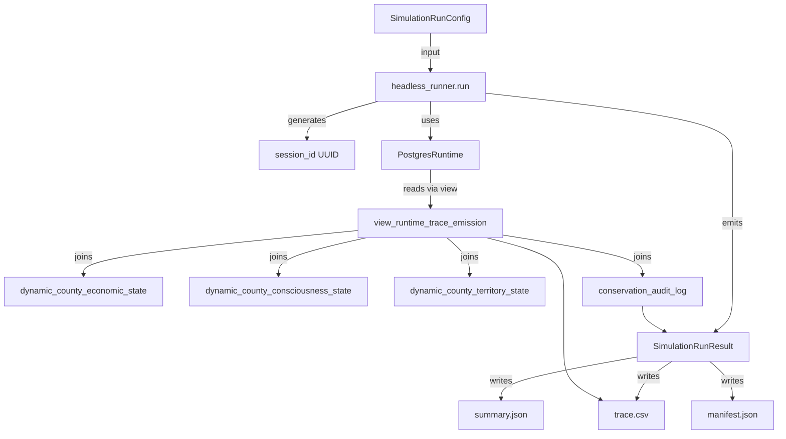
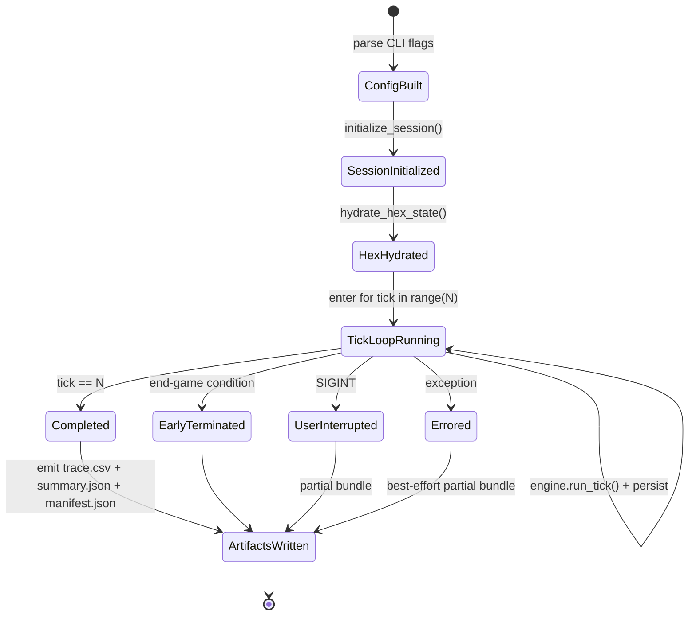

# Phase 1: Data Model — Headless Postgres-Backed Simulation Runner

**Feature**: 064-headless-sim-runner
**Date**: 2026-05-14

This document defines the in-Python Pydantic models the runner manipulates,
the artifact-file schemas (canonicalized in `contracts/`), and the
Postgres view used for trace emission. All Python entities are frozen
Pydantic 2.x models per project standard.

---

## 1. Python entities (in-process)

### 1.1 `SimulationRunConfig`

The full description of a single run, constructed from CLI flags +
defaults, persisted into the manifest's `deterministic_inputs` section.

```python
class SimulationRunConfig(BaseModel):
    model_config = ConfigDict(frozen=True)

    # Tick + time
    ticks: int = Field(default=1000, ge=1, le=100_000)
    start_year: int = Field(default=2010, ge=1900, le=2100)
    random_seed: int = Field(default=2010)

    # Scope
    scope_name: str = Field(default="michigan-canada")
    scope_fips: frozenset[str] = Field(...)  # resolved from scope_name OR --fips
    external_node_ids: frozenset[str] = Field(default=frozenset({"canada"}))

    # Persistence + artifacts
    sqlite_reference_path: Path = Field(
        default=Path("data/sqlite/marxist-data-3NF.sqlite")
    )
    output_dir: Path = Field(...)  # resolved at runtime; default has timestamp
    defines_overlay_path: Path | None = Field(default=None)

    # Behavior
    dry_run: bool = Field(default=False)
    verbose: Literal["DEBUG", "INFO", "WARNING", "ERROR"] = Field(default="INFO")
```

**Validation rules**:
- `ticks ≥ 1`. Hard upper bound 100,000 to fend off accidental 6-zero typos.
- `scope_fips` non-empty AND every element is a 5-digit FIPS string.
- `output_dir` is created if missing; if it exists, contents are deleted
  (FR-007).
- `defines_overlay_path` if provided MUST exist + parse as TOML.

**Identity & uniqueness**: A run is identified by `session_id` (UUID,
generated per-run, distinct from config). The config itself is hashable
via canonical JSON serialization → `input_hash` in the manifest.

**State transitions**: Immutable. A run has one config, never mutated.

---

### 1.2 `SimulationRunResult`

Returned by `headless_runner.run(config) → SimulationRunResult`. The
caller can inspect this or write it as artifacts.

```python
class SimulationRunResult(BaseModel):
    model_config = ConfigDict(frozen=True)

    session_id: UUID
    config: SimulationRunConfig
    ticks_completed: int                    # ≤ config.ticks
    exit_reason: ExitReason                 # enum below
    end_game_tick: int | None               # tick at which end-game condition fired (if any)
    end_game_condition: str | None          # e.g., "IMPERIAL_COLLAPSE"

    wallclock_start: datetime
    wallclock_end: datetime
    performance: PerformanceBreakdown       # nested model

    conservation_audit: list[AuditEntry]    # from spec-062 audit log

    # Bulk data — heavy, lazily loaded for in-process consumers
    trace_rows: Iterator[TraceRow] | None = None  # streaming, not in-memory list
    artifact_dir: Path | None = None        # populated after artifacts are written
```

**Identity**: `session_id`. Globally unique per run.

**Lifecycle**:
- `PENDING` (config built, not yet run) → not represented as state; this
  is just `config` without `session_id`
- `RUNNING` → not surfaced (private to the runner)
- `COMPLETED` / `EARLY_TERMINATED` / `USER_INTERRUPTED` / `ERRORED` →
  `exit_reason` enum below

---

### 1.3 `ExitReason` enum

```python
class ExitReason(StrEnum):
    COMPLETED = "completed"             # full N ticks
    EARLY_TERMINATED = "early_terminated"  # end-game condition fired
    USER_INTERRUPTED = "user_interrupted"  # SIGINT (exit code 130)
    ERRORED = "errored"                 # engine exception
```

Mapped to CLI exit codes per `contracts/cli_contract.yaml`.

---

### 1.4 `PerformanceBreakdown`

```python
class PerformanceBreakdown(BaseModel):
    model_config = ConfigDict(frozen=True)

    total_wallclock_sec: float
    session_init_sec: float
    hex_hydration_sec: float
    tick_loop_sec: float
    artifact_emission_sec: float
    per_tick_median_ms: float
    per_tick_p99_ms: float
    per_tick_max_ms: float
```

All fields seconds OR milliseconds, ≥ 0. Used in `summary.json.performance`.

---

### 1.5 `AuditEntry`

Pure projection of one row from spec-062's `conservation_audit_log` table.

```python
class AuditEntry(BaseModel):
    model_config = ConfigDict(frozen=True)

    tick: int
    invariant_name: str
    severity: Literal["info", "warning", "error", "critical"]
    details: dict[str, Any]  # arbitrary JSON; rendered as-is into summary.json
```

---

### 1.6 `TraceRow`

One row of `trace.csv`. The canonical column ordering matches the SQL
view (R7) and is documented in `contracts/trace_csv_schema.yaml`.

```python
class TraceRow(BaseModel):
    model_config = ConfigDict(frozen=True)

    # Identity
    tick: int
    simulated_year: float                   # tick / 52.0 + start_year
    entity_id: str
    entity_kind: Literal["county", "external", "national", "hex_aggregate"]

    # Marx primitives
    v: float | None = None
    c: float | None = None
    s: float | None = None
    k: float | None = None

    # Consciousness
    p_acquiescence: float | None = None
    p_revolution: float | None = None
    ideology_r: float | None = None
    ideology_l: float | None = None
    ideology_f: float | None = None

    # Territory
    surveillance_coupling: float | None = None
    internet_access_pct: float | None = None
    biocapacity_stock: float | None = None
    energy_stock: float | None = None
    raw_material_stock: float | None = None

    # Derived rates
    profit_rate: float | None = None
    exploitation_rate: float | None = None

    # Demographics
    population: int | None = None
    employment_proxy: float | None = None
```

**Validation**: All numeric fields nullable; the entity_kind determines
which fields apply (e.g., `population` is None for external nodes).
CSV writer emits `""` for None per spec clarification.

---

### 1.7 `ArtifactBundle`

Filesystem-resident object — not a Pydantic model, but a documented
directory layout.

```text
<output_dir>/
├── trace.csv         # one header row + N×T data rows
├── summary.json      # schema-validated; see summary_json_schema.yaml
├── manifest.json     # schema-validated; see manifest_json_schema.yaml
└── profile.prof      # OPTIONAL — only when invoked via tools/profiler.py
```

The directory may also accumulate `monte-carlo-N/` subdirectories when
invoked under Monte Carlo (one full bundle per replicate sample).

---

## 2. Artifact file schemas

The canonical machine-readable schemas live in `contracts/`. Summary:

| File | Schema |
|---|---|
| `trace.csv` | `contracts/trace_csv_schema.yaml` — 22-column dictionary with name, type, units, semantics |
| `summary.json` | `contracts/summary_json_schema.yaml` — JSON Schema for top-level keys |
| `manifest.json` | `contracts/manifest_json_schema.yaml` — JSON Schema for files, reproducibility, column_dictionaries |
| CLI | `contracts/cli_contract.yaml` — flags + exit codes + scope predefined-names registry |

---

## 3. Postgres-side data (NEW or MODIFIED)

### 3.1 New migration: `0019_trace_emission_view.sql`

A read-only Postgres view that JOINs per-tick state across subsystems for
trace emission. Owned by THIS feature (064-headless-sim-runner); subsystem
tables retain their owners per II.11.

```sql
-- migrations/0019_trace_emission_view.sql
CREATE OR REPLACE VIEW view_runtime_trace_emission AS
SELECT
    ce.session_id,
    ce.tick,
    ce.fips                  AS entity_id,
    'county'::text           AS entity_kind,
    ce.v, ce.c, ce.s, ce.k,
    cc.p_acquiescence, cc.p_revolution,
    cc.r AS ideology_r, cc.l AS ideology_l, cc.f AS ideology_f,
    ct.surveillance_coupling, ct.internet_access_pct,
    ct.biocapacity_stock, ct.energy_stock, ct.raw_material_stock,
    /* Derived rates — computed in view to avoid Python compute: */
    CASE WHEN (ce.c + ce.v) > 0 THEN ce.s / (ce.c + ce.v) ELSE NULL END AS profit_rate,
    CASE WHEN ce.v > 0          THEN ce.s / ce.v          ELSE NULL END AS exploitation_rate,
    pop.population,
    emp.employment_proxy
FROM dynamic_county_economic_state ce
LEFT JOIN dynamic_county_consciousness_state cc
       USING (session_id, tick, fips)
LEFT JOIN dynamic_county_territory_state ct
       USING (session_id, tick, fips)
LEFT JOIN dynamic_county_population_state pop
       USING (session_id, tick, fips)
LEFT JOIN dynamic_county_employment_state emp
       USING (session_id, tick, fips);

GRANT SELECT ON view_runtime_trace_emission TO PUBLIC;
COMMENT ON VIEW view_runtime_trace_emission IS
    'spec-064 trace emission contract. Owned by headless_runner feature. '
    'Per II.11: cross-subsystem read via declared interface. '
    'Subsystem table changes require coordinated view update.';
```

**Important**: The actual column names in subsystem tables may differ
slightly from what's shown above. Implementation will match real table
schemas; this snippet is the design contract.

**Schema drift detection**: A new unit test
`tests/unit/persistence/test_trace_view_columns.py` queries the view's
column list and asserts it matches the 22 trace-csv columns. If a
subsystem table drops or renames a column, this test fails immediately —
giving us the II.11 interface-discipline tripwire.

---

## 4. Entity relationships



---

## 5. State transitions

The runner has a simple linear lifecycle:



Each state transition is a single atomic operation; no rollback between
states. The only retry/rollback is at the Postgres-transaction level
(spec-062's `persist_tick_atomic`), which is unchanged here.
