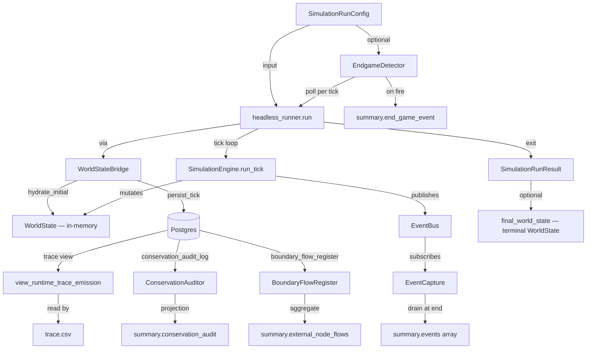
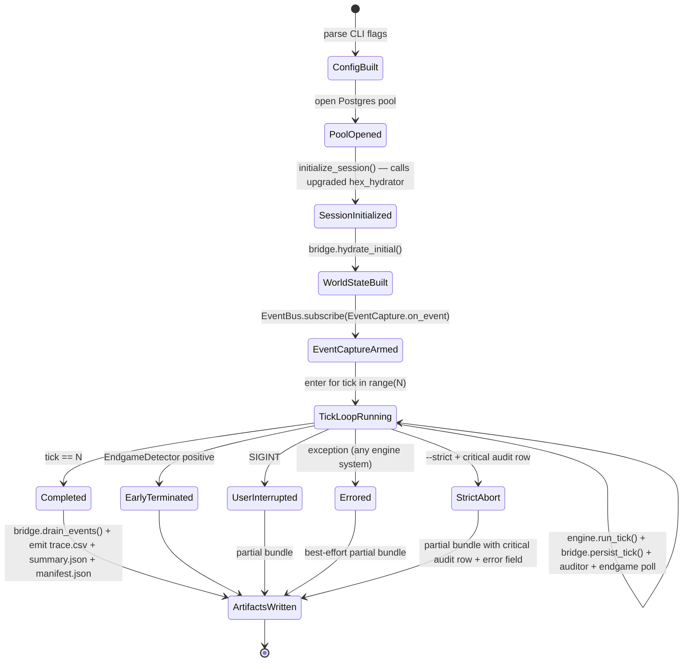

# Phase 1: Data Model — Engine-Bridging

**Feature**: 065-engine-bridging
**Date**: 2026-05-15

This document defines:

1. The in-Python Pydantic entities the bridge manipulates
2. The three new Postgres per-tick subsystem tables (consciousness,
   demographics, employment)
3. The recreated `view_runtime_trace_emission` view that JOINs all
   subsystem tables
4. The extended `summary.json` payload with `events[]`

All Python entities are frozen Pydantic 2.x per project standard.

---

## 1. Python entities

### 1.1 `WorldStateBridge` (new — `babylon/engine/headless_runner/bridge.py`)

A protocol-implementing object responsible for moving state between
in-memory `WorldState` and Postgres per-tick subsystem tables. The
bridge does NOT serialize WorldState field-for-field — it
**derives/aggregates** the spec-065 subsystem columns from existing
engine state at persist time, using helpers in
`babylon.persistence.county_aggregation`. See research.md R10 for the
rationale; the bridge is a derivation adapter, not a flat serializer.

```python
class WorldStateBridge:
    """Adapts the in-memory WorldState to Postgres per-tick persistence.

    Lifecycle within a single run:
      1. ``hydrate_initial(session_id, scope_fips)`` — one-shot at
         session init. Builds the initial WorldState from the
         tick-0 hex_state, then creates one SocialClass entity per
         (county_fips × role) tagged with the FIPS code.
      2. Each tick the runner mutates the WorldState in place via
         ``engine.run_tick(graph, services, context)``.
      3. ``persist_tick(world, tick)`` — for each county in scope_fips:
         calls the four ``county_aggregation`` helpers, assembles the
         envelope (including the three new spec-065 row-lists), and
         writes via ``runtime.persist_tick_atomic``.

    The bridge owns no engine logic; engine systems mutate WorldState
    in place. The bridge owns the WorldState↔Postgres derivation
    boundary (II.6 State is Data / Engine is Transformation; derived
    rollups belong on the trace view, not on WorldState).
    """

    def __init__(self, runtime: PostgresRuntime, defines: GameDefines) -> None: ...
    def hydrate_initial(
        self, session_id: UUID, scope_fips: frozenset[str]
    ) -> WorldState: ...
    def persist_tick(
        self, world: WorldState, tick: int, determinism_hash: str
    ) -> None: ...
```

**Identity**: The bridge instance is bound to a single
`(session_id, scope_fips)` pair for the lifetime of one run.

**State transitions**: Stateless between method calls; thread-unsafe.

### 1.2 `EngineEvent` (new — `babylon/engine/headless_runner/event_capture.py`)

In-memory representation of one fired engine event, awaiting
serialization into `summary.events`.

```python
class EngineEvent(BaseModel):
    model_config = ConfigDict(frozen=True)

    tick: int = Field(ge=0)
    event_type: str
    entity_ids: tuple[str, ...] = Field(default_factory=tuple)
    severity: Literal["info", "warning", "error", "critical"] = "info"
    details: dict[str, Any] = Field(default_factory=dict)
```

**Identity**: `(tick, event_type, entity_ids)` is not unique — an
engine system can fire multiple events of the same type for the same
entities. Capture preserves insertion order.

### 1.3 `EventCapture` (new — same module)

```python
class EventCapture:
    """EventBus subscriber that buffers fired events for summary.json."""

    def __init__(self) -> None: ...
    def set_tick(self, tick: int) -> None: ...
    def on_event(self, event: BaseEvent) -> None: ...
    def drain(self) -> tuple[EngineEvent, ...]: ...
```

### 1.4 Modified `SimulationRunConfig` (existing — `models.py`)

Adds two new fields for the new CLI flags:

```python
class SimulationRunConfig(BaseModel):
    # ... existing fields from spec-064 ...

    # NEW (spec-065):
    strict: bool = Field(
        default=False,
        description="When True, exit 1 on first severity='critical' "
                    "conservation_audit_log row.",
    )
    endgame_detector: str | None = Field(
        default=None,
        description="Optional dotted import path to an EndgameDetector "
                    "implementation (e.g., "
                    "'babylon.engine.observer.ImperialCollapseDetector').",
    )
```

### 1.5 Modified `SimulationRunResult` (existing — `models.py`)

Adds `events` and `final_world_state` to the in-process result:

```python
class SimulationRunResult(BaseModel):
    # ... existing fields from spec-064 ...

    # NEW (spec-065):
    events: tuple[EngineEvent, ...] = Field(default_factory=tuple)
    final_world_state: WorldState | None = Field(default=None)
```

The `final_world_state` is set to the terminal-tick `WorldState` for
`tools/shared.run_simulation` consumers (SC-011); arbitrary types
allowed so we can store the existing `WorldState` Pydantic model.

### 1.6 County aggregation helpers (NEW — `babylon/persistence/county_aggregation.py`)

Module containing pure functions that derive the spec-065 per-county
subsystem columns from existing engine state and reference data. Used
by `WorldStateBridge.persist_tick` to assemble the three new
envelope row-lists. See research.md R10 for the design rationale.

```python
def aggregate_survival_for_county(
    world: WorldState,
    county_fips: str,
) -> tuple[float, float, int]:
    """Population-weighted means of (p_acquiescence, p_revolution).

    Iterates ``world.entities.values()`` filtered by
    ``entity.county_fips == county_fips``. Returns a tuple of
    (p_acq, p_rev, total_population). If no entities match the FIPS,
    returns (0.0, 0.0, 0) (an audit row with severity='warning'
    should be emitted by the caller).
    """

def aggregate_consciousness_for_county(
    world: WorldState,
    county_fips: str,
) -> TernaryConsciousness:
    """Population-weighted (r, l, f) over entities in the county.

    For each entity with entity.county_fips == county_fips:
        cc = entity.ideology.class_consciousness
        ni = entity.ideology.national_identity
        r_i = cc * (1 - ni)
        f_i = ni * (1 - cc)
        l_i = max(0.0, 1.0 - r_i - f_i)
    Then weighted mean of (r_i, l_i, f_i) by entity.population.
    Returns a TernaryConsciousness; simplex invariant
    abs(r + l + f - 1.0) < 1e-9 is asserted before returning.

    Bridge mapping rationale: research.md R10.
    """

def fetch_population_for_county_at_tick(
    sqlite_path: Path,
    county_fips: str,
    tick: int,
    start_year: int,
) -> int:
    """Census population for (county_fips, year_at_tick) from SQLite.

    Year at tick = start_year + tick // 52 (weekly cadence). Primary:
    SUM(fact_census_income.household_count) for the (county, year)
    — the per-bracket Census rolls up to the ACS county-population
    total when summed across all (race, source, bracket) buckets
    (verified for Wayne 2010: 1.77M vs ACS 1.82M). Fallback:
    SUM(fact_qcew_annual.employment) × 0.33 when Census has no row.
    Raises ReferenceDataMissingError if both miss.
    """

def fetch_employment_proxy_for_county_at_tick(
    sqlite_path: Path,
    county_fips: str,
    tick: int,
    start_year: int,
) -> float:
    """SUM(fact_qcew_annual.employment) / 52 for (county_fips, year).

    Returns a float (FTE-equivalent weekly employment). Same data
    source as hex v (QCEW table; QCEW.total_wages → v, QCEW.employment
    → employment_proxy). Raises ReferenceDataMissingError if the
    county-year is outside the QCEW data window (handled by FR-022
    preflight, not here).
    """
```

**Signature note (2026-05-15 reconciliation)**: The two SQLite
fetchers take ``sqlite_path: Path``, not ``runtime: PostgresRuntime``
as the original §1.6 draft prescribed. The data is in SQLite (not
Postgres) and the existing convention from
``babylon.engine.headless_runner.scopes`` is to accept a path
parameter and open ``with sqlite3.connect(sqlite_path) as conn``.
The bridge will pass ``self._defines.sqlite_path`` (or equivalent)
when calling these helpers. The two engine-state aggregators
(``aggregate_survival_for_county``, ``aggregate_consciousness_for_county``)
need no SQLite access — they read purely from the in-memory WorldState.

**Module is import-cycle-safe**: depends on `babylon.models` (for
`WorldState` and `TernaryConsciousness`) and `babylon.persistence`
(for `PostgresRuntime`). Does NOT import from
`babylon.engine.headless_runner.*` — the bridge imports the module,
not the other way around.

**Why a separate module**: the helpers are reusable from non-bridge
contexts (notebook analysis, ad-hoc auditing, future spec-066 if
the engine wants to consume aggregated rollups). Co-locating them on
the bridge would couple them to the bridge's session lifecycle.

### 1.7 Modified `SocialClass` (existing — `babylon/models/entities/social_class.py`)

The only WorldState schema change for spec-065. Adds an optional
`county_fips` field for per-county attribution.

```python
class SocialClass(BaseModel):
    # ... existing fields ...

    # NEW (spec-065): optional per-county attribution.
    county_fips: str | None = Field(
        default=None,
        pattern=r"^\d{5}$|^$",  # 5-digit FIPS or empty string
        description=(
            "Optional 5-digit FIPS code attributing this class entity "
            "to a county. spec-065 introduces per-county entity sets "
            "for full-fidelity county aggregation; spec-064 callers "
            "that don't set this field continue to work (entities "
            "without county_fips are excluded from county aggregates "
            "but participate in non-county engine logic)."
        ),
    )
```

**Factories**: `create_proletariat(...)` and `create_bourgeoisie(...)`
gain an optional `county_fips: str | None = None` keyword. Spec-064
callers that don't pass it remain compatible; spec-065 hydrate_initial
threads the FIPS through.

**Default behavior**: `None` means "not attributed to any county" —
the entity participates in non-spatial engine logic (Phase Engine math)
but is invisible to the county aggregation helpers. Engine systems
already operate on entities by id; none read `county_fips` (it's a
bridge-only field).

**Backward compatibility test**: every spec-064 unit test that does
not set `county_fips` MUST continue to pass without modification.
This is gated by T086 (quickstart walkthrough) and T087 (lint sweep).

---

## 2. Postgres entities (NEW)

### 2.1 Migration 0020 — `dynamic_consciousness_state`

Owner subsystem: **consciousness** (`ConsciousnessSystem` per
spec-034 / 043 ternary simplex). Per II.11, only the consciousness
subsystem writes to this table; the trace view reads it.

```sql
CREATE TABLE IF NOT EXISTS dynamic_consciousness_state (
    session_id      UUID NOT NULL,
    tick            INTEGER NOT NULL CHECK (tick >= 0),
    county_fips     TEXT NOT NULL CHECK (county_fips ~ '^\d{5}$'),
    p_acquiescence  DOUBLE PRECISION NOT NULL
                    CHECK (p_acquiescence BETWEEN 0 AND 1),
    p_revolution    DOUBLE PRECISION NOT NULL
                    CHECK (p_revolution BETWEEN 0 AND 1),
    ideology_r      DOUBLE PRECISION NOT NULL
                    CHECK (ideology_r BETWEEN 0 AND 1),
    ideology_l      DOUBLE PRECISION NOT NULL
                    CHECK (ideology_l BETWEEN 0 AND 1),
    ideology_f      DOUBLE PRECISION NOT NULL
                    CHECK (ideology_f BETWEEN 0 AND 1),
    PRIMARY KEY (session_id, tick, county_fips)
);

CREATE INDEX IF NOT EXISTS ix_consciousness_session_tick
    ON dynamic_consciousness_state (session_id, tick);

REVOKE UPDATE, DELETE ON dynamic_consciousness_state FROM PUBLIC;

COMMENT ON TABLE dynamic_consciousness_state IS
    'spec-065 consciousness subsystem state per tick per county. '
    'Owner: ConsciousnessSystem. r + l + f ≈ 1.0 invariant enforced '
    'by engine, not DB (float drift may exceed CHECK tolerance).';
```

### 2.2 Migration 0021 — `dynamic_demographics_state`

Owner subsystem: **demographics** (new conceptual subsystem; engine
reads from Census interpolated to weekly cadence).

```sql
CREATE TABLE IF NOT EXISTS dynamic_demographics_state (
    session_id    UUID NOT NULL,
    tick          INTEGER NOT NULL CHECK (tick >= 0),
    county_fips   TEXT NOT NULL CHECK (county_fips ~ '^\d{5}$'),
    population    BIGINT NOT NULL CHECK (population >= 0),
    PRIMARY KEY (session_id, tick, county_fips)
);

CREATE INDEX IF NOT EXISTS ix_demographics_session_tick
    ON dynamic_demographics_state (session_id, tick);

REVOKE UPDATE, DELETE ON dynamic_demographics_state FROM PUBLIC;

COMMENT ON TABLE dynamic_demographics_state IS
    'spec-065 demographic state per tick per county. Owner: demographics. '
    'Population values derived from Census ACS interpolated to weekly '
    'cadence per spec-062 year-scoped lookup policy.';
```

### 2.3 Migration 0022 — `dynamic_employment_state`

Owner subsystem: **employment** (read from QCEW; engine systems may
also write modulated values).

```sql
CREATE TABLE IF NOT EXISTS dynamic_employment_state (
    session_id        UUID NOT NULL,
    tick              INTEGER NOT NULL CHECK (tick >= 0),
    county_fips       TEXT NOT NULL CHECK (county_fips ~ '^\d{5}$'),
    employment_proxy  DOUBLE PRECISION NOT NULL
                      CHECK (employment_proxy >= 0),
    PRIMARY KEY (session_id, tick, county_fips)
);

CREATE INDEX IF NOT EXISTS ix_employment_session_tick
    ON dynamic_employment_state (session_id, tick);

REVOKE UPDATE, DELETE ON dynamic_employment_state FROM PUBLIC;

COMMENT ON TABLE dynamic_employment_state IS
    'spec-065 employment state per tick per county. Owner: employment. '
    'Sourced from QCEW annualized employment, interpolated to weekly '
    'cadence; engine systems may modulate via wage-extraction feedback.';
```

### 2.4 Migration 0023 — recreate `view_runtime_trace_emission`

DROP + CREATE (per spec-064's tradition for column-set changes).
Same column ordering and names as
`contracts/trace_csv_schema.yaml`, but the previously-NULL columns
now JOIN to real subsystem tables. NULLs only emit when a subsystem
table lacks rows for a `(session_id, tick, fips)` triple (edge case
E3 in spec.md).

```sql
DROP VIEW IF EXISTS view_runtime_trace_emission;

CREATE VIEW view_runtime_trace_emission AS
SELECT
    h.session_id,
    h.tick,
    h.county_fips                              AS entity_id,
    'county'::TEXT                             AS entity_kind,
    -- Marx primitives (sum hex → county)
    SUM(h.v)                                   AS v,
    SUM(h.c)                                   AS c,
    SUM(h.s)                                   AS s,
    SUM(h.k)                                   AS k,
    -- Consciousness (per-county, from 0020 table)
    cs.p_acquiescence,
    cs.p_revolution,
    cs.ideology_r,
    cs.ideology_l,
    cs.ideology_f,
    -- Territory ratios (avg hex → county)
    AVG(h.surveillance_coupling)               AS surveillance_coupling,
    AVG(h.internet_access_pct)                 AS internet_access_pct,
    -- Substrate stocks (sum hex → county)
    SUM(h.biocapacity_stock)                   AS biocapacity_stock,
    SUM(h.energy_stock)                        AS energy_stock,
    SUM(h.raw_material_stock)                  AS raw_material_stock,
    -- Derived rates
    CASE WHEN SUM(h.c) + SUM(h.v) > 0
         THEN SUM(h.s) / (SUM(h.c) + SUM(h.v))
         ELSE NULL
    END                                        AS profit_rate,
    CASE WHEN SUM(h.v) > 0
         THEN SUM(h.s) / SUM(h.v)
         ELSE NULL
    END                                        AS exploitation_rate,
    -- Demographics & employment (per-county, from 0021/0022 tables)
    dem.population,
    emp.employment_proxy
FROM dynamic_hex_state h
LEFT JOIN dynamic_consciousness_state cs
    ON cs.session_id = h.session_id
   AND cs.tick = h.tick
   AND cs.county_fips = h.county_fips
LEFT JOIN dynamic_demographics_state dem
    ON dem.session_id = h.session_id
   AND dem.tick = h.tick
   AND dem.county_fips = h.county_fips
LEFT JOIN dynamic_employment_state emp
    ON emp.session_id = h.session_id
   AND emp.tick = h.tick
   AND emp.county_fips = h.county_fips
GROUP BY h.session_id, h.tick, h.county_fips,
         cs.p_acquiescence, cs.p_revolution,
         cs.ideology_r, cs.ideology_l, cs.ideology_f,
         dem.population, emp.employment_proxy;

GRANT SELECT ON view_runtime_trace_emission TO PUBLIC;

COMMENT ON VIEW view_runtime_trace_emission IS
    'spec-065 trace emission contract. Owned by headless_runner feature. '
    'Per Constitution II.11: cross-subsystem read via declared interface. '
    'JOINs hex_state (Marx primitives + substrate + territory ratios), '
    'consciousness_state (ternary simplex + survival calculus), '
    'demographics_state (population), employment_state (employment_proxy). '
    'Every column in the 22-column trace_csv_schema.yaml contract is '
    'populated by this view; previous spec-064 NULL columns are now '
    'sourced from the new per-tick subsystem tables.';
```

### 2.5 Extended `PerTickTransactionEnvelope`

The spec-062 envelope (existing) gains three new optional row-list
fields. The runtime's `persist_tick_atomic` method is extended to
write each new field into its corresponding table within the same
transaction.

```python
class PerTickTransactionEnvelope(BaseModel):
    # ... existing fields ...

    # NEW (spec-065)
    consciousness_state_rows: list[DynamicConsciousnessState] = Field(default_factory=list)
    demographics_state_rows: list[DynamicDemographicsState] = Field(default_factory=list)
    employment_state_rows: list[DynamicEmploymentState] = Field(default_factory=list)
```

The corresponding Pydantic row models (`DynamicConsciousnessState`
et al.) live in `src/babylon/persistence/county_state.py` (new
module).

---

## 3. summary.json payload extensions

The spec-064 `summary.json` contract is extended with two top-level
keys; no existing keys are renamed or reshaped (SC-010).

### 3.1 New top-level key: `events`

```yaml
events:
  type: "list[object]"
  description: |
    Engine events fired during the tick loop, in deterministic
    emission order per FR-018. One entry per EventBus.publish() call.
    The list is empty when no engine event fires during the run.
  item_fields:
    tick:           {type: "int", semantics: "Tick at which the event fired."}
    event_type:     {type: "str", semantics: "EventType enum value name."}
    entity_ids:     {type: "list[str]", semantics: "FIPS codes of affected counties (or empty)."}
    severity:       {type: "str", enum: ["info", "warning", "error", "critical"]}
    details:        {type: "object", semantics: "Event-type-specific payload."}
```

### 3.2 Extended `performance` sub-key: `per_system_ms`

```yaml
performance:
  # ... existing fields ...

  per_system_ms:
    type: "object"
    description: |
      Per-engine-system wallclock totals for the tick loop, in
      milliseconds. Keys are the system class names from
      SimulationEngine.systems (e.g., "ImperialRentSystem",
      "ConsciousnessSystem"). Values are the cumulative ms spent in
      that system's step() calls across all ticks.
    example:
      ImperialRentSystem: 12450.7
      ConsciousnessSystem: 3208.3
      SurvivalSystem: 1180.4
```

### 3.3 Extended `terminal_state` semantics (no shape change)

Pre-spec-065 the MVP filled `terminal_state.mean_p_acquiescence` etc.
with `null`. Post-spec-065 these fields are populated from the
terminal-tick aggregate of the consciousness state table. The
`total_population` and ideology means are now real numbers, not null.

The shape stays identical to spec-064's contract; only the values
change from null to real.

---

## 4. manifest.json payload extensions

### 4.1 New `engine_systems_invoked` field under `reproducibility.deterministic_inputs`

```yaml
deterministic_inputs:
  # ... existing fields ...

  engine_systems_invoked:
    type: "list[str]"
    description: |
      Class names of every engine system in SimulationEngine.systems
      at run-time, in execution order. Two runs with identical
      input_hash MUST have identical engine_systems_invoked lists.
      Recorded for diagnostic traceability when an engine math change
      causes determinism drift.
    example:
      - "VitalitySystem"
      - "TerritorySystem"
      - "ProductionSystem"
      - "SolidaritySystem"
      - "ImperialRentSystem"
      - "DecompositionSystem"
      - "ControlRatioSystem"
      - "MetabolismSystem"
      - "SurvivalSystem"
      - "StruggleSystem"
      - "ConsciousnessSystem"
      - "ContradictionSystem"
      - "ContradictionFieldSystem"
      - "FieldDerivativeSystem"
      - "EdgeTransitionSystem"
```

The list participates in `input_hash` computation, so adding/removing
an engine system between runs is captured by hash drift.

---

## 5. Entity relationships



---

## 6. Bridge lifecycle (state diagram)



Each state transition is a single atomic operation. The only retry
point is at the Postgres transaction level (`persist_tick_atomic` —
unchanged from spec-062).
