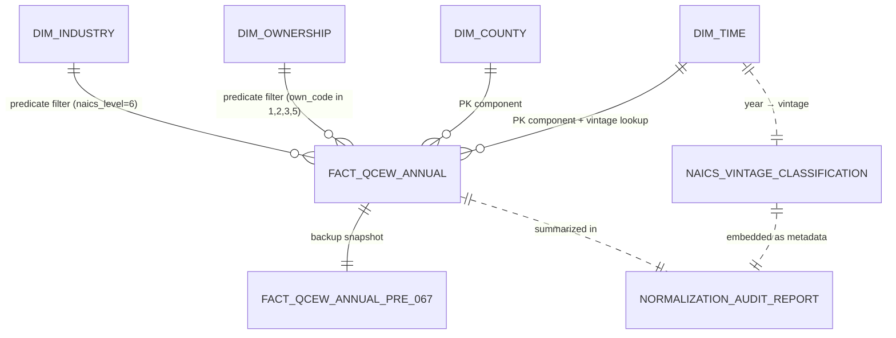

# Phase 1 Data Model: QCEW Ownership and NAICS Hierarchy Normalization

**Branch**: `067-qcew-ownership-normalization` | **Date**: 2026-05-16 | **Plan**: [plan.md](./plan.md)

This document records the entities touched by spec-067 — their pre-067 state, post-067 state, and any new ephemeral structures introduced by the migration. No new persistent tables are introduced. The existing `FactQcewAnnual` schema is unchanged; only its row population is normalized.

---

## Entity inventory

| Entity | Kind | Role in spec-067 |
|---|---|---|
| `FactQcewAnnual` (table) | Existing persistent SQLAlchemy ORM | DELETE target — rollup rows removed in place |
| `DimIndustry` (table) | Existing persistent SQLAlchemy ORM | Read-only predicate source via `naics_level` |
| `DimOwnership` (table) | Existing persistent SQLAlchemy ORM | Read-only predicate source via `own_code` |
| `DimTime` (table) | Existing persistent SQLAlchemy ORM | Read-only join target for per-year NAICS vintage classification |
| `FactQcewAnnual__pre_067` (table) | Ephemeral backup | Created at migration start, retained as recovery surface, dropped after `qa:e2e-regression` passes |
| `NormalizationAuditReport` (file pair) | Ephemeral artifact | Markdown + JSON sidecar emitted per migration run; conforms to `contracts/audit_report.schema.json` |
| `NaicsVintageClassification` (in-memory dict) | Computation | Year→vintage map; embedded in audit report metadata, NOT persisted to database |

---

## 1. `FactQcewAnnual` (table) — modified by population, not by schema

**Definition** (unchanged from `src/babylon/reference/schema.py:1269-1296`):

```python
class FactQcewAnnual(NormalizedBase):
    __tablename__ = "fact_qcew_annual"
    county_id: Mapped[int] = mapped_column(ForeignKey("dim_county.county_id"), primary_key=True)
    industry_id: Mapped[int] = mapped_column(ForeignKey("dim_industry.industry_id"), primary_key=True)
    ownership_id: Mapped[int] = mapped_column(ForeignKey("dim_ownership.ownership_id"), primary_key=True)
    time_id: Mapped[int] = mapped_column(ForeignKey("dim_time.time_id"), primary_key=True)
    establishments: Mapped[int | None]
    employment: Mapped[int | None]
    total_wages_usd: Mapped[Decimal | None] = mapped_column(Numeric(15, 2))
    avg_weekly_wage_usd: Mapped[int | None]
    avg_annual_pay_usd: Mapped[int | None]
    lq_employment: Mapped[Decimal | None] = mapped_column(Numeric(10, 4))
    lq_annual_pay: Mapped[Decimal | None] = mapped_column(Numeric(10, 4))
    disclosure_code: Mapped[str | None] = mapped_column(String(5))
```

**Pre-067 population** (verified 2026-05-16 T001 pre-flight): **43,305,794** rows across all US counties, 2010-2024 (NOT the ~10M originally estimated; the spec under-estimated by 4×). Rows include BOTH BLS-published rollup levels (NAICS 2-5-digit aggregations, "All industries" supersector, "Total covered" ownership, plus BLS special-aggregation codes at `naics_level ∈ {98, 99}`) AND the canonical leaves (6-digit National Industry × Federal/State/Local/Private ownership).

**Post-067 population** (this spec's deliverable, verified via dry-run): **~15,097,464** rows (≈ 35% of pre-067). Only canonical-leaf rows survive:
- `industry_id` references rows in `dim_industry` where `naics_level = 6` (National Industry detail)
- `ownership_id` references rows in `dim_ownership` where `own_code ∈ {'1', '2', '3', '5'}` (Federal / State / Local / Private; NOT '0' Total Covered)

**Pre/post breakdown by rollup class** (Michigan + all US, dry-run measured):

| Class | Pre-067 rows | Action |
|---|---|---|
| naics_level=6 × own_code ∈ {1,2,3,5} | 15,097,464 | **SURVIVE** |
| naics_level ∈ {0,2,3,4,5,98,99} × own_code ∈ {1,2,3,5} | 28,159,281 | DELETE 3a (naics_only) |
| naics_level=6 × own_code='0' | 0 | DELETE 3b (ownership_only) |
| naics_level ∈ {0,2,3,4,5,98,99} × own_code='0' | 49,049 | DELETE 3a-or-3b (both_axes) |
| **TOTAL** | **43,305,794** | — |

Notable: in this DB, **no `(naics_level=6, own_code='0')` rows exist**, so the `ownership_only` subclass is empty. The BLS data only publishes the Total Covered ownership rollup *at the all-industries-rollup level*, not at the 6-digit leaf level. This is structurally consistent with BLS's QCEW publication schema (Total Covered is always paired with All Industries).

**Cardinality estimate** (Michigan scope, 2010-2024):
- Counties: 83
- Years: 15
- Distinct 6-digit NAICS National Industries with QCEW coverage: ~1000–1100
- Canonical ownership levels: 4 (Federal, State, Local, Private)
- Establishment-size codes preserved: ~9 (per BLS QCEW size code dimension)
- Expected post-067 rows for Michigan scope: 83 × 15 × ~1000 × 4 × 9 ≈ 45 M cells max, sparse due to BLS suppression and zero-employment cells → realistic ~3-5 M rows for Michigan scope

**Validation rules**:
- POST-MIGRATION: every row in `fact_qcew_annual` MUST satisfy `(naics_level = 6 AND own_code ≠ '0')` when joined against `dim_industry` and `dim_ownership`. Integrity assertion enforced by a post-migration check that returns zero violating rows.
- COMPOSITE PK preserved: `(county_id, industry_id, ownership_id, time_id)` — no row uniqueness changes.
- FK integrity preserved: every `industry_id` / `ownership_id` / `county_id` / `time_id` resolves to a dimension-table row.

**State transitions**: None. This is reference data, not a stateful entity.

---

## 2. `DimIndustry` (read-only predicate source)

**Definition** (unchanged, `schema.py:377-407`):

```python
class DimIndustry(NormalizedBase):
    __tablename__ = "dim_industry"
    industry_id: Mapped[int] = mapped_column(primary_key=True)
    naics_code: Mapped[str] = mapped_column(String(20), unique=True, nullable=False)
    industry_title: Mapped[str] = mapped_column(String(300), nullable=False)
    naics_level: Mapped[int] = mapped_column(nullable=False)  # 0-6
    parent_naics_code: Mapped[str | None] = mapped_column(String(20))
    sector_code: Mapped[str | None] = mapped_column(String(2))
    class_composition: Mapped[str | None] = mapped_column(String(20))
    has_qcew_data: Mapped[bool] = mapped_column(default=False)
    ...
```

**Spec-067 use**: read-only. The migration's first DELETE statement joins against `dim_industry.naics_level` to identify rollup industries:

```sql
DELETE FROM fact_qcew_annual
WHERE industry_id IN (SELECT industry_id FROM dim_industry WHERE naics_level != 6);
```

**Key field**: `naics_level: int` ∈ {0, 1, 2, 3, 4, 5, 6}
- 0 = "10" supersector "Total, all industries"
- 1 = supersector (BLS aggregations 11–19)
- 2 = sector (2-digit NAICS)
- 3 = subsector (3-digit NAICS)
- 4 = industry-group (4-digit NAICS)
- 5 = industry (5-digit NAICS)
- 6 = **National Industry detail (6-digit NAICS) — the canonical level retained post-067**

**Validation rule**: `naics_level = 6` rows MUST exist for every `industry_id` referenced by post-067 `FactQcewAnnual` rows. (Trivially satisfied: the DELETE explicitly preserves only those references.)

**State transitions**: None. Dimension data is immutable reference.

---

## 3. `DimOwnership` (read-only predicate source)

**Definition** (unchanged, `schema.py:421-430`):

```python
class DimOwnership(NormalizedBase):
    __tablename__ = "dim_ownership"
    ownership_id: Mapped[int] = mapped_column(primary_key=True)
    own_code: Mapped[str] = mapped_column(String(2), unique=True, nullable=False)
    own_title: Mapped[str] = mapped_column(String(50), nullable=False)
    is_government: Mapped[bool] = mapped_column(nullable=False)
    is_private: Mapped[bool] = mapped_column(nullable=False)
```

**Spec-067 use**: read-only. The migration's second DELETE statement joins against `dim_ownership.own_code` to identify the rollup ownership:

```sql
DELETE FROM fact_qcew_annual
WHERE ownership_id IN (SELECT ownership_id FROM dim_ownership WHERE own_code = '0');
```

**BLS-published ownership codes**:

| `own_code` | `own_title` | `is_government` | `is_private` | Post-067 retained? |
|---|---|---|---|---|
| `'0'` | Total Covered | False | False | **NO — this is the rollup** |
| `'1'` | Federal Government | True | False | Yes |
| `'2'` | State Government | True | False | Yes |
| `'3'` | Local Government | True | False | Yes |
| `'5'` | Private | False | True | Yes |

**Validation rule**: every post-067 `FactQcewAnnual.ownership_id` references a `DimOwnership` row where `own_code ≠ '0'`.

---

## 4. `DimTime` (read-only join target for vintage classification)

**Definition** (unchanged; existing time dimension table in `schema.py`).

**Spec-067 use**: read-only. The audit report joins `FactQcewAnnual` against `DimTime` to extract the year of each row and classify the NAICS vintage governing that year (R3).

---

## 5. `FactQcewAnnual__pre_067` (ephemeral backup table)

**Definition** (introduced by `tools/normalize_qcew_rollups.py` at migration start):

```sql
CREATE TABLE fact_qcew_annual__pre_067 AS
SELECT * FROM fact_qcew_annual;
```

**Lifetime**: created at the start of the migration; persists in the SQLite file until the operator explicitly drops it after `qa:e2e-regression` validates the post-067 state. The migration script accepts a `--keep-backup` flag (default: keep) and a separate `--drop-backup` invocation for cleanup.

**Schema**: identical to `FactQcewAnnual` (the migration uses `CREATE TABLE AS SELECT` which copies the schema).

**Validation rules**:
- After the DELETE statements, `COUNT(fact_qcew_annual__pre_067) - COUNT(fact_qcew_annual) == sum(rows_excluded)` from the audit report. This integrity check is asserted before COMMIT and rolls back on mismatch.

**State transitions**:
- **Created** at migration start.
- **Stable** while operator validates.
- **Dropped** by operator-invoked cleanup (NOT automatic — defensive default).

---

## 6. `NormalizationAuditReport` (ephemeral file artifact pair)

**Definition**: two files emitted per migration run to `reports/ingest/`:

- `qcew_normalization_YYYYMMDD-HHMMSS.md` — human-readable Markdown summary
- `qcew_normalization_YYYYMMDD-HHMMSS.json` — machine-readable JSON sidecar conforming to `contracts/audit_report.schema.json`

**JSON sidecar shape** (full schema in `contracts/audit_report.schema.json`):

```jsonc
{
  "schema_version": "1.0.0",
  "run_metadata": {
    "timestamp_utc": "2026-XX-XXTHH:MM:SSZ",
    "migration_version": "spec-067-v1.0",
    "database_path": "data/sqlite/marxist-data-3NF.sqlite",
    "database_sha256_pre": "...",
    "database_sha256_post": "...",
    "migration_duration_seconds": 287.4,
    "operator": "<user>",
    "git_branch": "067-qcew-ownership-normalization",
    "git_sha": "<commit sha>"
  },
  "row_counts": {
    "fact_qcew_annual_pre": 10234567,
    "fact_qcew_annual_post": 7158902,
    "rows_excluded": {
      "naics_only": 2856321,
      "ownership_only": 198444,
      "both_axes": 20900,
      "total": 3075665
    },
    "integrity_check_passed": true
  },
  "naics_vintages": {
    "2010": "2007", "2011": "2007",
    "2012": "2012", "2013": "2012", "2014": "2012", "2015": "2012", "2016": "2012",
    "2017": "2017", "2018": "2017", "2019": "2017", "2020": "2017", "2021": "2017",
    "2022": "2022", "2023": "2022", "2024": "2022"
  },
  "bls_suppressed_county_years": [
    {"county_fips": "26083", "year": 2018, "reason": "low-establishment-count"},
    ...
  ],
  "per_county_deltas": {
    "michigan_scope_only": true,
    "summary_stats": {
      "counties_within_5pct_band": 1234,
      "counties_within_5pct_band_pct": 99.12,
      "counties_with_delta_gt_10pct": 1,
      "max_abs_delta_pct": 12.4
    },
    "outliers": [
      {"county_fips": "26083", "year": 2018, "pre_sum": 1234, "post_sum": 5678, "delta_pct": 12.4, "reason": "BLS-suppressed; only sector-level rows present pre-migration"}
    ]
  }
}
```

**Validation rules** (per `contracts/audit_report.schema.json`):
- `schema_version` MUST be present and match a published schema version
- `row_counts.rows_excluded.naics_only + ownership_only + both_axes == total` (FR-002 / SC-008)
- `row_counts.fact_qcew_annual_pre - fact_qcew_annual_post == row_counts.rows_excluded.total` (sanity check)
- `naics_vintages` MUST cover every year present in the data
- `database_sha256_pre` MUST differ from `database_sha256_post` IFF `rows_excluded.total > 0` (idempotent re-run produces matching hashes)

---

## 7. `NaicsVintageClassification` (in-memory computation)

**Definition**: Python `dict[int, Literal["2007", "2012", "2017", "2022"]]` declared in `tools/normalize_qcew_rollups.py` per R3:

```python
NAICS_VINTAGE_BY_YEAR: dict[int, Literal["2007", "2012", "2017", "2022"]] = {
    2010: "2007", 2011: "2007",
    2012: "2012", 2013: "2012", 2014: "2012", 2015: "2012", 2016: "2012",
    2017: "2017", 2018: "2017", 2019: "2017", 2020: "2017", 2021: "2017",
    2022: "2022", 2023: "2022", 2024: "2022",
}
```

**Use**: lookup-only. Each row's year (joined from `DimTime`) maps to its NAICS vintage for the audit-report metadata. Not persisted; embedded in the audit-report JSON.

**Validation rules**:
- Every year present in `DimTime` with corresponding `FactQcewAnnual` data MUST have an entry in this dict, else the migration halts with a clear error (one-time spec-067 update required when BLS adopts NAICS 2027 — explicit fail-fast per R3 design intent).

---

## Relationships diagram



---

## Migration timeline

| Step | State | Duration estimate | Reversible? |
|---|---|---|---|
| 0 | Pre-migration: 10 M rows w/ rollups + leaves | — | — |
| 1 | Backup `__pre_067` table created | ~2 min (~3 GB I/O) | Yes (drop backup) |
| 2 | Audit report dry-run row counts collected | ~30 sec | Yes |
| 3 | BEGIN transaction | instantaneous | Yes (ROLLBACK) |
| 4 | DELETE NAICS rollups (~2.9 M rows) | ~90 sec | Yes (ROLLBACK) |
| 5 | DELETE ownership rollups (~200 K rows) | ~30 sec | Yes (ROLLBACK) |
| 6 | Integrity check: pre - post == excluded total | <1 sec | Yes (ROLLBACK) |
| 7 | COMMIT | instantaneous | NO — at this point only backup table recovery works |
| 8 | Audit report written (Markdown + JSON) | ~30 sec | N/A (file write) |
| 9 | Database VACUUM (optional, reclaims disk) | ~3 min | NO (irreversible) |
| 10 | Backup table retention period (operator decides when to drop) | indefinite | (drop is irreversible) |

**Total wallclock**: ~5–7 min for the migration; +3 min for VACUUM if requested. Well within the ≤ 90 min spec-066 wallclock budget.
