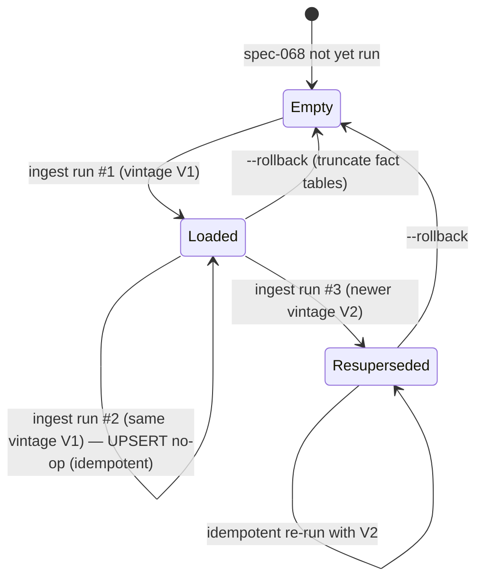
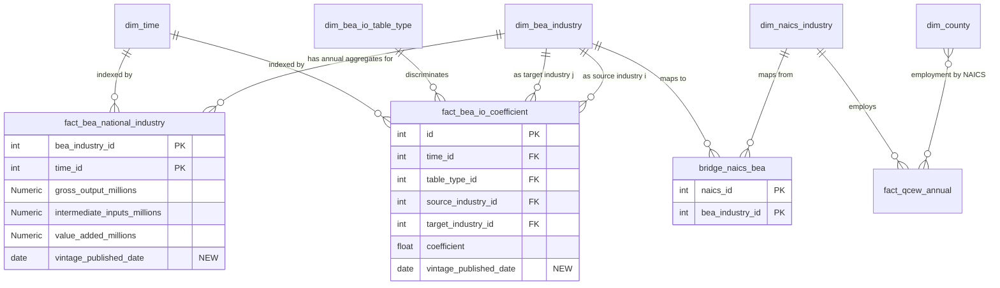

# Phase 1: Data Model — BEA National Industry I-O Ingest

**Spec**: [spec.md](./spec.md) · **Plan**: [plan.md](./plan.md) · **Research**: [research.md](./research.md)

## Constitutional gate reminder

- **II.2 Primitives vs Derived**: Shares (`intermediate_inputs_share`,
  `value_added_share`) and `c/v` ratios are **derived**, never stored
  as columns. The fact tables store only the three BEA primitives.
- **II.11 Subsystem Table Ownership**: All entities below belong to the
  BEA / national-economic-accounts subsystem. Cross-subsystem reads MUST
  go through `BEAShareLookupService` (see [contracts/bea_share_lookup_service.md](./contracts/bea_share_lookup_service.md)).
- **III.7 Determinism Hash**: Every row is reproducible from its
  (industry, year, vintage) primary key plus the BEA source XLSX bytes.

---

## Entity 1: `fact_bea_national_industry` (existing schema — column added)

| Column | Type | Constraint | Source | Notes |
|---|---|---|---|---|
| `bea_industry_id` | `INTEGER` | PK part 1, FK `dim_bea_industry.bea_industry_id` | existing | BEA-summary industry, ~70 distinct values |
| `time_id` | `INTEGER` | PK part 2, FK `dim_time.time_id` | existing | Year-keyed, 2010-2024 in scope |
| `gross_output_millions` | `Numeric(15,2)` | nullable | **Supply-Use industry output** (producer side, per Clarification Q4) | Millions of current $; nominal |
| `intermediate_inputs_millions` | `Numeric(15,2)` | nullable | Use-table column total | Millions of current $; nominal |
| `value_added_millions` | `Numeric(15,2)` | nullable | Supply-Use VA = GO − II | Millions of current $; nominal |
| **`vintage_published_date`** | `DATE` | nullable, **NEW** | BEA XLSX header "Release Date" | When BEA published this vintage |

**Primary key**: `(bea_industry_id, time_id)` — composite.
**Cardinality**: ~840-1500 rows after full ingest (2010-2024 × ~70 industries).

**Validation rules** (enforced at ingest time, NOT as DB constraints):

- `gross_output_millions ≥ intermediate_inputs_millions + value_added_millions − 1 % * gross_output_millions`
  (FR-002 BEA accounting identity, ±1 % tolerance).
- All three primitive columns: `NULL` permitted only if BEA published no
  value for that (industry, year) — typically a suppression marker
  `(D)` in the source XLSX.

**Derived (NEVER stored)**:

- `intermediate_inputs_share := intermediate_inputs_millions / gross_output_millions`
- `value_added_share := value_added_millions / gross_output_millions`

Computed by `BEAShareLookupService.lookup_industry_share()`.

---

## Entity 2: `fact_bea_io_coefficient` (existing schema — column added)

| Column | Type | Constraint | Source | Notes |
|---|---|---|---|---|
| `id` | `INTEGER` | PK (surrogate) | autoincrement | Existing surrogate key |
| `time_id` | `INTEGER` | FK `dim_time.time_id`, not null | existing | Year |
| `table_type_id` | `INTEGER` | FK `dim_bea_io_table_type.id`, not null | existing | Discriminator: USE/MAKE/SUPPLY/TOTAL_REQ/IMPORT_USE |
| `source_industry_id` | `INTEGER` | FK `dim_bea_industry.bea_industry_id`, not null | existing | Industry `i` (input) |
| `target_industry_id` | `INTEGER` | FK `dim_bea_industry.bea_industry_id`, not null | existing | Industry `j` (output) |
| `coefficient` | `FLOAT` | not null | Make+Use IOUse_Before_Redefinitions_PRO_Summary | `a_ij` — dollars of input `i` per dollar of output `j` |
| **`vintage_published_date`** | `DATE` | nullable, **NEW** | BEA XLSX header "Release Date" | When BEA published this vintage |

**Unique constraint**: `(time_id, table_type_id, source_industry_id, target_industry_id)` (existing `uq_bea_io_coeff`).
**Cardinality**: ~50K-100K rows after full ingest (sparse 70² × 12-21 years × 1 dominant table_type).

**Validation rules** (FR-004):

- `coefficient ∈ [0.0, 1.5]` — direct-requirements coefficients can
  exceed 1.0 in rare cases (e.g., recycled-input industries); the upper
  bound is generous to admit BEA's actual numerics.
- Column-sum identity: for every `(time_id, table_type_id, target_industry_id)`,
  `SUM(coefficient) ≈ intermediate_inputs_share[target_industry_id]
  within ±0.1 %` (FR-004).

**Sparsity policy**: rows where BEA publishes a zero are **omitted**
from the table; the lookup service interprets missing rows as `0.0`.
This is the natural SQL representation of a sparse matrix and matches
the spec's SC-002 wording ("allow zero-coefficient cells to be omitted").

---

## Entity 3: `bridge_naics_bea` (existing schema — NO changes)

| Column | Type | Constraint | Notes |
|---|---|---|---|
| `naics_id` | `INTEGER` | FK `dim_naics_industry.naics_id`, part of PK | NAICS-6-digit |
| `bea_industry_id` | `INTEGER` | FK `dim_bea_industry.bea_industry_id`, part of PK | BEA-summary (~70 industries) |
| (other existing cols from spec-025) | — | — | preserved |

**Spec-068 work on this table**: populate the BEA-summary mappings
from the BEA-published NAICS↔BEA concordance file
(`data/bea/MAKE-USE-IMPORTS (BEFORE REDEFINITIONS).zip` →
extracted concordance sheet). If rows already exist from spec-025,
UPSERT on `(naics_id, bea_industry_id)` keeps the table consistent.

**Cardinality after spec-068**: ~1100-1500 NAICS-6-digit → ~70
BEA-summary many-to-one mappings.

---

## Entity 4: `dim_bea_io_table_type` (existing schema — NO changes)

Existing CHECK constraint:
```sql
CHECK (table_type IN ('USE', 'MAKE', 'SUPPLY', 'TOTAL_REQ', 'IMPORT_USE'))
```

| Row | `table_type` | Source path | Spec-068 ingest? |
|---|---|---|---|
| Existing | `USE` | `make-use/IOUse_Before_Redefinitions_PRO_Summary.xlsx` | YES — canonical for `a_ij` |
| Existing | `MAKE` | `make-use/IOMake_Before_Redefinitions_PRO_Summary.xlsx` | NO — Use table is canonical (R1) |
| Existing | `SUPPLY` | `supply-use/Supply_Summary.xlsx` | YES — canonical for industry GO |
| Existing | `TOTAL_REQ` | `total-domestic-requirements/IxI_TR_Summary.xlsx` | YES — validation-only |
| Existing | `IMPORT_USE` | `make-use/ImportMatrices_Before_Redefinitions_Summary.xlsx` | NO — deferred to follow-up spec |

Spec-068 writes rows for `USE`, `SUPPLY`, and `TOTAL_REQ` only.

---

## Entity 5: Pydantic models for ingest pipeline (in-memory, not persisted)

### `BEAIndustryAnnualRecord` (frozen Pydantic)

```python
class BEAIndustryAnnualRecord(BaseModel):
    model_config = ConfigDict(frozen=True)

    bea_industry_id: int
    year: int
    gross_output_millions: Decimal | None
    intermediate_inputs_millions: Decimal | None
    value_added_millions: Decimal | None
    vintage_published_date: date | None
```

Maps 1-to-1 to a `fact_bea_national_industry` row. Constructed inside
the loader from BEA XLSX cells.

### `BEAIOCoefficientRecord` (frozen Pydantic)

```python
class BEAIOCoefficientRecord(BaseModel):
    model_config = ConfigDict(frozen=True)

    source_industry_id: int
    target_industry_id: int
    table_type: Literal["USE", "MAKE", "SUPPLY", "TOTAL_REQ", "IMPORT_USE"]
    year: int
    coefficient: float
    vintage_published_date: date | None
```

### `IndustryShareLookupResult` (frozen Pydantic — service return)

```python
class IndustryShareLookupResult(BaseModel):
    model_config = ConfigDict(frozen=True)

    intermediate_inputs_share: float  # [0, 1]
    value_added_share: float          # [0, 1]
    vintage_published_date: date | None
    used_fallback: bool               # True if forward-fill or global default
    fallback_reason: Literal["none", "forward_fill", "global_default"]
```

### `CountyShareLookupResult` (frozen Pydantic — service return)

```python
class CountyShareLookupResult(BaseModel):
    model_config = ConfigDict(frozen=True)

    intermediate_inputs_share: float
    value_added_share: float
    fallback_employment_fraction: float  # fraction of county employment
                                         # that fell back to NAICS-2-digit
                                         # or global default
    per_industry_breakdown: dict[int, float]  # bea_industry_id → weight in county
```

---

## Entity 6: Audit-report Pydantic models (written to `reports/ingest/`)

### `BEAIngestAuditReport` (top-level)

```python
class BEAIngestAuditReport(BaseModel):
    schema_version: Literal["1.0"]
    timestamp: datetime
    duration_seconds: float
    sim_years_in_scope: tuple[int, ...]

    rows_inserted: dict[str, int]
    rows_superseded: dict[str, int]
    rows_unchanged: dict[str, int]

    accounting_identity_violations: list[AccountingViolation]
    column_sum_identity_violations: list[ColumnSumViolation]

    intermediate_inputs_share_top10: list[IndustrySnapshot]
    intermediate_inputs_share_bottom10: list[IndustrySnapshot]

    naics_bea_concordance_coverage: ConcordanceCoverageReport
    stale_share_fallback_summary: StaleShareFallbackSummary
    vintage_supersessions: list[VintageSupersession]

    sc_007_wallclock_seconds: float
    sc_007_pass: bool  # < 15 * 60 seconds
```

### Supporting types

```python
class AccountingViolation(BaseModel):
    bea_industry_id: int
    year: int
    gross_output: Decimal
    intermediate_inputs: Decimal
    value_added: Decimal
    residual_fraction: float  # (GO - II - VA) / GO; |this| > 0.01 fails

class ColumnSumViolation(BaseModel):
    target_industry_id: int
    year: int
    column_sum: float
    expected_share: float
    residual_fraction: float  # |this| > 0.001 fails

class IndustrySnapshot(BaseModel):
    bea_industry_id: int
    bea_industry_name: str
    year: int
    intermediate_inputs_share: float

class ConcordanceCoverageReport(BaseModel):
    total_naics_codes_in_qcew: int
    covered_by_direct_concordance: int
    covered_by_naics_2_digit_fallback: int
    uncovered: int
    coverage_fraction_full: float       # direct / total
    coverage_fraction_with_fallback: float  # (direct + fallback) / total

class StaleShareFallbackSummary(BaseModel):
    total_county_year_lookups: int
    forward_filled_lookups: int
    global_default_lookups: int
    affected_employment_fraction: float  # SC-008 gate: < 0.01

class VintageSupersession(BaseModel):
    table_name: str
    bea_industry_id: int
    year: int
    old_vintage: date
    new_vintage: date
```

---

## State transitions

The fact tables are **append-only with vintage UPSERT**:



**Invariants across all transitions**:

1. **Epsilon-determinism**: two consecutive runs against the same source
   XLSX and same DB produce numeric float columns equal within
   `10⁻¹²` relative error.
2. **Vintage monotonicity**: `vintage_published_date` is
   non-decreasing per (bea_industry_id, time_id). UPSERTs with
   strictly older vintages are skipped.
3. **Accounting identity**: 100 % of post-ingest rows satisfy FR-002
   within ±1 %, or appear in `accounting_identity_violations`.
4. **Column-sum identity**: 100 % of (target_industry, year) pairs
   satisfy FR-004 within ±0.1 %, or appear in
   `column_sum_identity_violations`.

---

## Relationship diagram



The hex_hydrator's per-county c/v computation walks:
`dim_county → fact_qcew_annual → dim_naics_industry → bridge_naics_bea → dim_bea_industry → fact_bea_national_industry`,
weighted by QCEW employment, returning a `CountyShareLookupResult`.
That entire walk happens inside `BEAShareLookupService.lookup_county_share()`
to satisfy the II.11 boundary discipline.
