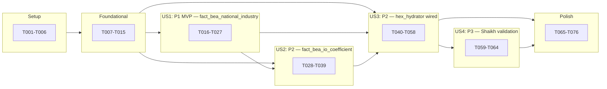

# Tasks: BEA National Industry I-O Ingest

**Input**: Design documents from `/specs/068-bea-national-io-ingest/`
**Prerequisites**: [spec.md](./spec.md), [plan.md](./plan.md), [research.md](./research.md), [data-model.md](./data-model.md), [contracts/bea_share_lookup_service.md](./contracts/bea_share_lookup_service.md), [quickstart.md](./quickstart.md)

**Tests**: Included — project uses TDD per `CLAUDE.md` ("Testing philosophy: Red Phase → Green Phase → Refactor Phase").

**Organization**: Tasks grouped by user story to enable independent implementation and testing.

**Format**: `- [ ] TaskID [P?] [Story?] Description with file path`

- **[P]**: parallel-safe (different file, no in-phase dependency)
- **[US1/US2/US3/US4]**: user-story phase tasks
- **Path convention**: single project (`src/babylon/`, `tests/`, `tools/`, `data/bea/`)

---

## Phase 1: Setup (Shared Infrastructure)

**Purpose**: Project scaffolding — new BEA subsystem package, test directories, CLI entrypoint shell.

- [ ] T001 Create the new BEA subsystem package skeleton at `src/babylon/reference/bea/__init__.py` with empty `__all__: list[str] = []`
- [ ] T002 [P] Create `src/babylon/reference/bea/ingest/__init__.py` (empty package init)
- [ ] T003 [P] Create test directory skeleton: `tests/unit/reference/bea/__init__.py` and `tests/integration/reference/bea/__init__.py` and `tests/contract/reference/bea/__init__.py`
- [ ] T004 [P] Create CLI entrypoint shell at `tools/load_bea_io.py` with `argparse` skeleton accepting `--years RANGE`, `--rollback`, `--dry-run`, `--reload-concordance` (no logic yet; raises `NotImplementedError`)
- [ ] T005 Verify `openpyxl` is already in `pyproject.toml` dev or main deps via `poetry show openpyxl`; if absent, add it via `poetry add openpyxl` (BEA XLSX parsing depends on it per research.md R5)
- [ ] T006 Register a `mise` task alias `data:bea-load` mapping to `poetry run python tools/load_bea_io.py` in `.mise.toml` (look up existing `data:*` namespace for convention)

**Checkpoint**: Setup complete — packages exist, CLI shell parses args but does nothing.

---

## Phase 2: Foundational (Blocking Prerequisites)

**Purpose**: Schema migration, shared Pydantic models, audit-report types — every user story depends on these.

**⚠️ CRITICAL**: No user story work can begin until this phase is complete.

- [ ] T007 Add `vintage_published_date: Mapped[date | None]` column to `FactBEANationalIndustry` in `src/babylon/reference/schema.py` (research.md R3; nullable `DATE`)
- [ ] T008 Add `vintage_published_date: Mapped[date | None]` column to `FactBEAIOCoefficient` in `src/babylon/reference/schema.py` (research.md R3)
- [ ] T009 Implement schema migration helper at `src/babylon/reference/bea/ingest/schema_migration.py` — function `ensure_vintage_columns(engine)` issues `ALTER TABLE … ADD COLUMN vintage_published_date DATE` only if `PRAGMA table_info` shows the column missing; idempotent; wrapped in `BEGIN IMMEDIATE` (research.md R10)
- [ ] T010 [P] Define shared Pydantic models at `src/babylon/reference/bea/models.py`: `BEAIndustryAnnualRecord`, `BEAIOCoefficientRecord`, `BEAConcordanceRecord` per data-model.md §Entity 5; all frozen via `ConfigDict(frozen=True)`
- [ ] T011 [P] Define lookup-result Pydantic models at `src/babylon/reference/bea/lookup_results.py`: `IndustryShareLookupResult`, `CountyShareLookupResult` per contracts/bea_share_lookup_service.md
- [ ] T012 [P] Define audit-report Pydantic models at `src/babylon/reference/bea/ingest/audit_report.py`: `BEAIngestAuditReport`, `AccountingViolation`, `ColumnSumViolation`, `IndustrySnapshot`, `ConcordanceCoverageReport`, `StaleShareFallbackSummary`, `VintageSupersession` per data-model.md §Entity 6
- [ ] T013 Implement `BEAIngestAuditReport.write_to_disk(report_dir: Path) -> tuple[Path, Path]` returning the JSON and Markdown paths; pattern matches spec-067 reports (`reports/ingest/bea_io_<timestamp>.{json,md}`)
- [ ] T014 [P] Unit test the audit-report serialization round-trip at `tests/unit/reference/bea/test_audit_report.py`: build a report, write, read back, assert equality
- [ ] T015 Wire the CLI entrypoint at `tools/load_bea_io.py` to: parse args → load `GameDefines` → open session → call `ensure_vintage_columns()` → dispatch to ingest stages → write audit report. Use placeholder no-op stages for US1/US2/US3/US4 work (filled in their respective phases).

**Checkpoint**: Foundation ready — schema migration is idempotent, CLI dispatches, audit-report scaffolding lives. User story phases can now begin in parallel.

---

## Phase 3: User Story 1 — Populate `fact_bea_national_industry` (Priority: P1) 🎯 MVP

**Goal**: Ingest the per-(BEA-industry, year) aggregate I-O metrics from BEA Supply-Use XLSX into `fact_bea_national_industry`, with the FR-002 BEA accounting identity (`II_share + VA_share = 1 ± 1 %`) enforced at validation time.

**Independent test**: After `poetry run python tools/load_bea_io.py --years 2010-2024 --skip-us2 --skip-us3 --skip-us4`:
- `SELECT COUNT(*) FROM fact_bea_national_industry` returns ≥ 800 rows (SC-001)
- 100 % of rows pass FR-002 accounting identity within ±1 % (SC-003)
- Audit report `bea_io_<ts>.md` lists `rows_inserted.fact_bea_national_industry` ≥ 800

### Tests for User Story 1

> Write these FIRST, ensure they FAIL before implementation (Red phase).

- [ ] T016 [P] [US1] Contract test for Supply-Use XLSX parser fixture in `tests/contract/reference/bea/test_supply_use_parser_contract.py` — given a 3-row fixture XLSX, the parser yields three `BEAIndustryAnnualRecord` with correctly-typed Decimal columns
- [ ] T017 [P] [US1] Unit test FR-002 accounting identity validator at `tests/unit/reference/bea/test_accounting_identity.py` — `validate_accounting_identity(record)` returns `None` when `|GO − II − VA| / GO ≤ 0.01`, else returns an `AccountingViolation`
- [ ] T018 [P] [US1] Unit test the Supply-Use one-sheet-per-year iterator at `tests/unit/reference/bea/test_supply_use_iterator.py` — fixture XLSX with sheets `2010` and `2011`; iterator yields records for both years; year is read from sheet name AND cross-validated against cell A4
- [ ] T019 [P] [US1] Unit test the UPSERT writer at `tests/unit/reference/bea/test_national_writer_upsert.py` — write same record twice; second write is a no-op (idempotent); second write with newer `vintage_published_date` updates the row
- [ ] T020 [P] [US1] Property test (Hypothesis) for FR-002 invariance at `tests/unit/reference/bea/test_accounting_identity_hypothesis.py` — generated records satisfying `II + VA == GO` always pass; records violating it always produce a violation
- [ ] T021 [P] [US1] Integration test full US1 happy path at `tests/integration/reference/bea/test_us1_end_to_end.py` — fixture: 2-year mini supply-use XLSX → run ingest → assert ≥ 2 × 70 rows + audit report present + identity-violation list empty

### Implementation for User Story 1

- [ ] T022 [US1] Implement Supply-Use XLSX parser at `src/babylon/reference/bea/ingest/supply_use_parser.py` — function `parse_use_summary(xlsx_path: Path, years: range) -> Iterator[BEAIndustryAnnualRecord]`; reads `data/input-output/supply-use/Use_Summary.xlsx`; iterates by sheet name; emits one record per BEA industry row per year; uses Supply-Use industry output for `gross_output_millions` (research.md R1, Clarification Q4)
- [ ] T023 [US1] Implement vintage extractor at `src/babylon/reference/bea/ingest/vintage_extractor.py` — function `extract_vintage_date(workbook_metadata) -> date | None`; reads the XLSX file's "Release Date" header cell (per research.md R10) or falls back to `xlsx_path.stat().st_mtime` if the cell is absent
- [ ] T024 [US1] Implement accounting-identity validator at `src/babylon/reference/bea/ingest/validators.py` — function `validate_accounting_identity(record: BEAIndustryAnnualRecord, tolerance: float = 0.01) -> AccountingViolation | None`
- [ ] T025 [US1] Implement UPSERT writer at `src/babylon/reference/bea/ingest/national_writer.py` — function `upsert_national_records(session: Session, records: Iterable[BEAIndustryAnnualRecord]) -> WriterStats` using SQLAlchemy `Insert.on_conflict_do_update()` keyed on `(bea_industry_id, time_id)`; skip UPDATE if existing `vintage_published_date >= incoming` (research.md R7)
- [ ] T026 [US1] Wire US1 ingest stage into `tools/load_bea_io.py` — `_run_us1_stage(session, years, dry_run, audit_report)` calls parse → validate → write → records stats into `audit_report.rows_inserted["fact_bea_national_industry"]` and `accounting_identity_violations`
- [ ] T027 [US1] Populate audit-report SC-001 / SC-003 gate fields in `_finalize_audit_report()` — `audit_report.sc_001_pass = rows_inserted >= 800`; `audit_report.sc_003_pass = len(accounting_identity_violations) == 0`

**Checkpoint**: US1 is fully functional — running the CLI populates the national-aggregate table; audit report shows pass/fail; SC-001 and SC-003 measurable. **MVP boundary**: spec-068 could ship at this checkpoint with hex_hydrator unchanged (continues using `_INTERMEDIATE_INPUTS_FRACTION = 0.5`), unlocking spec-024 Vol III work that needs per-industry aggregate ratios.

---

## Phase 4: User Story 2 — Populate `fact_bea_io_coefficient` (Priority: P2)

**Goal**: Ingest the full Leontief direct-requirements matrix `a_ij` from BEA Make+Use Use_Summary XLSX into `fact_bea_io_coefficient`, plus Total Domestic Requirements as a `TOTAL_REQ` cross-validation set. Enforce the FR-004 column-sum identity (`sum_i a_ij ≈ II_share[j] ± 0.1 %`).

**Independent test**: After running ingest with US1 already populated:
- `SELECT COUNT(*) FROM fact_bea_io_coefficient WHERE table_type_id = (USE)` returns ≥ 50,000 rows (SC-002)
- 100 % of (target_industry, year) pairs satisfy FR-004 within ±0.1 % (SC-004)
- Audit report's `column_sum_identity_violations` list is empty

### Tests for User Story 2

- [ ] T028 [P] [US2] Contract test for Use_Summary matrix parser fixture in `tests/contract/reference/bea/test_use_matrix_parser_contract.py` — 3-industry × 3-industry fixture; parser yields 9 records per year; `(source, target)` pairs match cell positions
- [ ] T029 [P] [US2] Unit test FR-004 column-sum identity validator at `tests/unit/reference/bea/test_column_sum_identity.py` — given matrix records + national-industry records for a year, `validate_column_sums()` returns one `ColumnSumViolation` per failing target industry
- [ ] T030 [P] [US2] Unit test the sparsity policy at `tests/unit/reference/bea/test_io_sparsity.py` — coefficient values of exactly 0.0 (or the `...` BEA suppression marker) are OMITTED from records (not stored as zero rows) per data-model.md §Entity 2
- [ ] T031 [P] [US2] Unit test the Total Domestic Requirements loader at `tests/unit/reference/bea/test_total_req_loader.py` — parser correctly tags rows with `table_type='TOTAL_REQ'`; TR coefficients can exceed 1.0 (Leontief inverse) without triggering a parse error
- [ ] T032 [P] [US2] Property test (Hypothesis) at `tests/unit/reference/bea/test_column_sum_identity_hypothesis.py` — for a randomly-generated matrix with controlled column sums, the validator detects violations exactly when `|sum − expected| > 0.001`
- [ ] T033 [P] [US2] Integration test full US2 happy path at `tests/integration/reference/bea/test_us2_end_to_end.py` — fixture: 2-year × 3-industry mini Use matrix → ingest → assert 9 × 2 = 18 USE rows + audit identity-violation list empty

### Implementation for User Story 2

- [ ] T034 [US2] Implement Use-matrix XLSX parser at `src/babylon/reference/bea/ingest/io_matrix_parser.py` — function `parse_use_matrix(xlsx_path: Path, years: range) -> Iterator[BEAIOCoefficientRecord]`; reads `data/input-output/make-use/IOUse_Before_Redefinitions_PRO_Summary.xlsx`; emits records with `table_type='USE'`; skips zero-coefficient cells per sparsity policy
- [ ] T035 [P] [US2] Implement Total-Domestic-Requirements parser at `src/babylon/reference/bea/ingest/total_req_parser.py` — function `parse_total_req(xlsx_path: Path, years: range) -> Iterator[BEAIOCoefficientRecord]`; reads `data/input-output/total-domestic-requirements/IxI_TR_Summary.xlsx`; emits records with `table_type='TOTAL_REQ'`
- [ ] T036 [US2] Implement column-sum validator at `src/babylon/reference/bea/ingest/validators.py` — function `validate_column_sum_identity(coeff_records, national_records, tolerance=0.001) -> list[ColumnSumViolation]`; depends on US1's writer having populated `fact_bea_national_industry`
- [ ] T037 [US2] Implement IO-coefficient UPSERT writer at `src/babylon/reference/bea/ingest/io_coefficient_writer.py` — function `upsert_io_coefficient_records(session, records) -> WriterStats` keyed on the existing `uq_bea_io_coeff` unique constraint; vintage-supersession-aware (research.md R7); 10K-row batched bulk insert (research.md R6)
- [ ] T038 [US2] Wire US2 ingest stage into `tools/load_bea_io.py` — `_run_us2_stage(...)` runs after US1 succeeds; parses Use_Summary + TR, validates column sums against US1's written national records, UPSERTs into `fact_bea_io_coefficient`
- [ ] T039 [US2] Populate audit-report SC-002 / SC-004 gate fields — `sc_002_pass = rows_inserted >= 50000`; `sc_004_pass = len(column_sum_identity_violations) == 0`

**Checkpoint**: US2 is functional — the full Leontief matrix is queryable; SC-002 and SC-004 measurable. hex_hydrator is still unchanged; this checkpoint is the prerequisite for US3.

---

## Phase 5: User Story 3 — Wire `hex_hydrator` to consume BEA shares (Priority: P2)

**Goal**: Replace `_INTERMEDIATE_INPUTS_FRACTION = 0.5` in `src/babylon/persistence/hex_hydrator.py:107` with a per-(county, BEA-industry) lookup against the BEA tables. Populate `bridge_naics_bea` from the BEA concordance bundle. Introduce the `BEAShareLookupService` Protocol as the constitutional II.11 cross-subsystem interface.

**Independent test**: After running ingest with US1 + US2 + US3 enabled, then running `mise run sim:e2e-michigan`:
- per-county `c/v` standard deviation across the 83 Michigan counties ≥ 0.2 (SC-005, directional threshold)
- `tests/integration/reference/bea/test_hex_hydrator_wired.py::test_county_c_v_stddev_post_wiring` passes
- pre-spec-068 baseline (every county at uniform `c/v`) is no longer reproducible

### Tests for User Story 3

- [ ] T040 [P] [US3] Contract test that `DefaultBEAShareLookupService` is a structural subtype of `BEAShareLookupService` at `tests/contract/reference/bea/test_protocol_compliance.py` — pytest parametrized over the three Protocol methods
- [ ] T041 [P] [US3] Unit test `lookup_industry_share` happy path at `tests/unit/reference/bea/test_share_lookup_industry.py` — present year returns `used_fallback=False, fallback_reason="none"`
- [ ] T042 [P] [US3] Unit test forward-fill at `tests/unit/reference/bea/test_share_lookup_forward_fill.py` — gap-of-1, gap-of-3, gap-of-5 all forward-fill correctly with `fallback_reason="forward_fill"`
- [ ] T043 [P] [US3] Unit test global-default fallback at `tests/unit/reference/bea/test_share_lookup_global_default.py` — when no data exists within 5 years, returns `GLOBAL_FALLBACK_SHARE = 0.5` with `fallback_reason="global_default"`
- [ ] T044 [P] [US3] Unit test `lookup_county_share` accounting identity at `tests/unit/reference/bea/test_share_lookup_county.py` — `ii_share + va_share == 1.0 ± 0.01`; `sum(per_industry_breakdown.values()) == 1.0 ± 1e-9`
- [ ] T045 [P] [US3] Unit test concordance loader at `tests/unit/reference/bea/test_concordance_loader.py` — given a fixture concordance XLSX, UPSERTs into `bridge_naics_bea` are idempotent on `(naics_id, bea_industry_id)`
- [ ] T046 [P] [US3] Unit test that `lookup_county_share` sums only over post-067 canonical-leaf QCEW rows at `tests/unit/reference/bea/test_county_share_no_rollup_rows.py` — fixture with both rollup row and leaves; service must not double-count
- [ ] T047 [US3] Integration test SC-005 wiring at `tests/integration/reference/bea/test_hex_hydrator_wired.py::test_county_c_v_stddev_post_wiring` — runs the full Michigan-83 e2e and asserts terminal-tick stddev(c/v) ≥ 0.2

### Implementation for User Story 3

- [ ] T048 [US3] Define `BEAShareLookupService` Protocol at `src/babylon/reference/bea/share_lookup_service.py` — matches the signature in `contracts/bea_share_lookup_service.md` exactly; include the protocol class + the two result models (re-exported from `lookup_results.py`)
- [ ] T049 [US3] Implement `DefaultBEAShareLookupService` concrete class in `src/babylon/reference/bea/share_lookup_service.py` — constructor takes `(session: Session, max_forward_fill_years: int = 5)`; in-process LRU cache for `lookup_industry_share` results; `GLOBAL_FALLBACK_SHARE: ClassVar[float] = 0.5`
- [ ] T050 [US3] Implement `DefaultBEAShareLookupService.lookup_industry_share()` with the forward-fill walk-back loop (max 5 years) and global-default fallback
- [ ] T051 [US3] Implement `DefaultBEAShareLookupService.lookup_county_share()` — joins `dim_county → fact_qcew_annual → bridge_naics_bea → fact_bea_national_industry`, weighted average of `intermediate_inputs_share` by QCEW employment; emits `per_industry_breakdown` for audit
- [ ] T052 [US3] Implement `DefaultBEAShareLookupService.lookup_io_coefficient()` — queries `fact_bea_io_coefficient` for the (source, target, year, table_type) tuple; forward-fills up to 5 years; returns `None` when sparsity-omitted
- [ ] T053 [US3] Implement concordance loader at `src/babylon/reference/bea/ingest/concordance_loader.py` — function `load_concordance(session, concordance_zip_path) -> WriterStats`; unzips `data/bea/MAKE-USE-IMPORTS (BEFORE REDEFINITIONS).zip` to a temp dir; reads the BEA concordance sheet; UPSERTs into `bridge_naics_bea` keyed on `(naics_id, bea_industry_id)`
- [ ] T054 [US3] Wire concordance loader as a US3 sub-stage in `tools/load_bea_io.py` — `_run_us3_stage()` first calls `load_concordance()`, then verifies coverage and writes `ConcordanceCoverageReport` into the audit report
- [ ] T055 [US3] Update public exports — `src/babylon/reference/bea/__init__.py` re-exports `BEAShareLookupService`, `DefaultBEAShareLookupService`, `IndustryShareLookupResult`, `CountyShareLookupResult`; update `__all__`
- [ ] T056 [US3] Refactor `src/babylon/persistence/hex_hydrator.py` — inject `BEAShareLookupService` into the hydrator constructor (DI); replace `_INTERMEDIATE_INPUTS_FRACTION = 0.5` at line ~107 with `result = self._bea_share_service.lookup_county_share(county_fips, year)`; preserve the 0.5 fallback path for `result.fallback_reason == "global_default"` (FR-010)
- [ ] T057 [US3] Update every `HexHydrator(...)` construction site in the codebase to pass the lookup service — at minimum `src/babylon/engine/factories.py`, `tests/conftest.py`, and any direct test instantiations; grep for `HexHydrator(` to find them
- [ ] T058 [US3] Update SC-005 / SC-008 gate fields in audit report — `sc_005_pass` is post-hoc (set after running an e2e), but `sc_008_pass = stale_share_fallback_summary.affected_employment_fraction < 0.01`

**Checkpoint**: US3 complete — hex_hydrator consumes the per-county BEA shares through the constitutional II.11 interface; the SC-005 stddev metric is measurable on the next Michigan e2e regen; spec-068's load-bearing value (heterogeneous county c/v) is realized.

---

## Phase 6: User Story 4 — Shaikh empirical validation (Priority: P3)

**Goal**: Validate the per-industry `c/v` distribution from a post-US3 canonical Michigan e2e run against Shaikh (2016) empirical bands.

**Independent test**: After running a canonical post-068 Michigan e2e:
- `poetry run python tools/validate_bea_io_against_shaikh.py --run reports/sim-runs/<latest>` exits 0
- 100 % of BEA-summary industries land within ±50 % of their Shaikh band (SC-006)

### Tests for User Story 4

- [ ] T059 [P] [US4] Unit test the Shaikh band-lookup table at `tests/unit/reference/bea/test_shaikh_bands.py` — `lookup_shaikh_band(bea_industry_id) -> ShaikhBand` returns the manufacturing band `[1.5, 3.0]` for industry 33DG; returns the economy-wide median band for unlisted industries
- [ ] T060 [P] [US4] Unit test the validator at `tests/unit/reference/bea/test_shaikh_validator.py` — given a synthetic per-industry c/v dict and the band table, `validate_against_shaikh()` returns one violation per out-of-band industry
- [ ] T061 [P] [US4] Integration test SC-006 at `tests/integration/reference/bea/test_shaikh_validation_e2e.py` — runs the validator against a canonical run fixture; asserts ≥ 95 % of industries pass

### Implementation for User Story 4

- [ ] T062 [P] [US4] Define Shaikh band reference data at `src/babylon/reference/bea/shaikh_bands.py` — `SHAIKH_BANDS: dict[int, ShaikhBand]` per research.md R4 table; include source citation as a module docstring referencing Shaikh (2016) Tables 6.1, 6.3, App 6.6
- [ ] T063 [US4] Implement validator at `src/babylon/reference/bea/shaikh_validator.py` — function `validate_per_industry_c_v(c_v_by_industry: dict[int, float], tolerance_fraction: float = 0.5) -> list[ShaikhBandViolation]`
- [ ] T064 [US4] Create the operator-facing CLI tool at `tools/validate_bea_io_against_shaikh.py` — reads `reports/sim-runs/<run>/trace.csv` (or similar), groups by dominant BEA industry, computes per-industry mean c/v, runs the validator, prints Markdown report; exit code 0 iff all industries pass

**Checkpoint**: US4 complete — operators can verify that spec-068's output matches modern-Marxian empirical calibration.

---

## Phase 7: Polish & Cross-Cutting Concerns

**Purpose**: CLI completeness, idempotency proofs, performance gate, documentation updates.

- [ ] T065 [P] Implement `--rollback` mode in `tools/load_bea_io.py` — truncates `fact_bea_national_industry` + `fact_bea_io_coefficient` to empty state via `DELETE FROM`; does NOT roll back `bridge_naics_bea` (shared with spec-025); runs `VACUUM` after delete
- [ ] T066 [P] Implement `--dry-run` mode in `tools/load_bea_io.py` — runs parsers + validators but skips all UPSERT writes; emits a `bea_io_dryrun_<ts>.{md,json}` audit report with a `dry_run: true` flag
- [ ] T067 [P] Integration test for `--rollback` at `tests/integration/reference/bea/test_rollback.py` — populate tables, rollback, assert COUNT(*) == 0 on both fact tables and `bridge_naics_bea` is unchanged
- [ ] T068 [P] Idempotency property test at `tests/integration/reference/bea/test_idempotency.py` — run ingest twice against same source XLSX; assert byte-identical integer ID cols; assert max relative error on every float col ≤ 1e-12 (FR-007 epsilon-determinism, Clarification Q1)
- [ ] T069 SC-007 performance gate at `tests/integration/reference/bea/test_sc_007_wallclock.py` — run full ingest on the 2010-2024 scope; assert wallclock < 15 minutes; gated under `mise run test:int` (slow test marker)
- [ ] T070 [P] Update `data/bea/io_loader.py` legacy stub to delegate to the new `src/babylon/reference/bea/ingest/io_matrix_parser.py` (preserve any imports the rest of `babylon_data` makes; the stub becomes a thin re-export)
- [ ] T071 [P] Update `data/bea/loader_national.py` legacy stub similarly to delegate to `supply_use_parser.py` + `national_writer.py`
- [ ] T072 [P] Update `data/bea/loader_concordance.py` legacy stub to delegate to `concordance_loader.py`
- [ ] T073 [P] Add a `# constitutional gate: II.11` comment block at the top of `src/babylon/persistence/hex_hydrator.py` noting that ALL BEA reads go through `BEAShareLookupService`; raw imports of `FactBEANationalIndustry` / `FactBEAIOCoefficient` / `BridgeNAICSBEA` are prohibited from this file
- [ ] T074 Update `ai-docs/state.yaml` — mark spec-068 status as `IN PROGRESS` → `COMPLETE` when all checkpoints pass; bump test counts to reflect the new unit + integration tests added
- [ ] T075 Add ADR046 to `ai-docs/decisions/` for the BEA ingest + II.11 BEAShareLookupService contract — references this spec, the Clarifications session, and the constitutional gates passed
- [ ] T076 Update `ai-docs/decisions/index.yaml` to register ADR046

**Checkpoint**: Spec-068 is feature-complete. All SCs measurable. Rollback path proven. CI gate (`mise run check`) green.

---

## Dependencies

**Critical-path notes**:

- US2 column-sum validation (T036) reads from `fact_bea_national_industry`, so US1 writes must land before US2 validates. Both can be developed in parallel (parser + writer code), but the integration test for US2 must wait for US1's writer.
- US3 (lookup service) depends on both US1 (industry table) and US2 (coefficient matrix). US3 can develop the Protocol + tests in parallel with US1/US2, but the integration test (T047 SC-005) requires the data.
- US4 (Shaikh validation) is the natural last story — only meaningful after US3 has produced per-county c/v heterogeneity.

---

## Parallel Execution Opportunities

### Within Phase 2 (Foundational)

T010, T011, T012 can run concurrently — three independent Pydantic-models files in `src/babylon/reference/bea/`. T014 (audit-report round-trip test) is also parallel-safe.

### Within Phase 3 (US1) Tests

T016-T021 — six test files in three different `tests/` subdirectories. All parallel.

### Within Phase 4 (US2) Tests

T028-T033 — six test files. All parallel.

### Within Phase 5 (US3) Tests

T040-T046 — seven unit/contract test files. All parallel. T047 (integration) waits for implementation.

### Within Phase 6 (US4)

T059, T060, T061, T062 are all parallel-safe — they touch different files.

### Within Phase 7 (Polish)

T065-T072 are all parallel-safe — distinct files, no in-phase dependencies. T074-T076 (ai-docs updates) can run in parallel.

---

## Implementation Strategy

**MVP scope** = Phases 1-3 (Setup + Foundational + US1). This delivers:

- `fact_bea_national_industry` populated for 2010-2024.
- BEA accounting identity validated.
- Audit report + rollback usable.
- hex_hydrator unchanged (continues with `0.5` fallback).
- Unblocks downstream specs needing per-industry aggregate ratios (spec-024 Vol III).

**Incremental delivery**:

1. **Ship MVP after US1** — spec-068 partial, hex_hydrator unchanged. Unblocks spec-024 work.
2. **Ship US2** — full Leontief matrix queryable; unblocks Vol III TRPF transformation procedure.
3. **Ship US3** — production payoff. hex_hydrator wired. SC-005 stddev gate measurable. Spec-068 functionally complete.
4. **Ship US4** — empirical validation against Shaikh; closes SC-006.
5. **Polish** — rollback, dry-run, idempotency proof, performance gate, documentation.

Each story checkpoint is independently committable per CLAUDE.md "Commit after each unit of work."

---

## Format validation

Every task in this document follows the required checklist format:

- ✅ Starts with `- [ ]` (markdown checkbox)
- ✅ Has sequential Task ID (T001-T076)
- ✅ Has `[P]` marker on parallel-safe tasks; absent on sequential ones
- ✅ Has `[US1]` / `[US2]` / `[US3]` / `[US4]` label on user-story phase tasks; absent on Setup / Foundational / Polish tasks
- ✅ Description includes exact file path

**Total task count**: 76
**Per-story breakdown**:
- Setup (T001-T006): 6 tasks
- Foundational (T007-T015): 9 tasks
- US1 (T016-T027): 12 tasks
- US2 (T028-T039): 12 tasks
- US3 (T040-T058): 19 tasks
- US4 (T059-T064): 6 tasks
- Polish (T065-T076): 12 tasks
