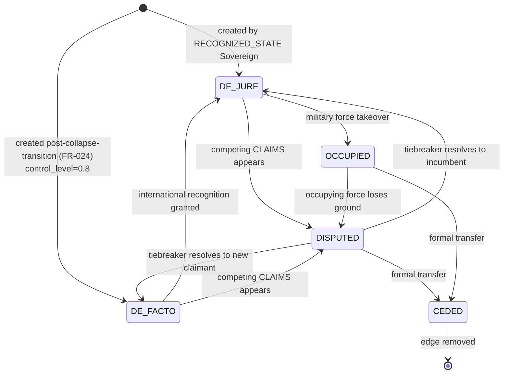
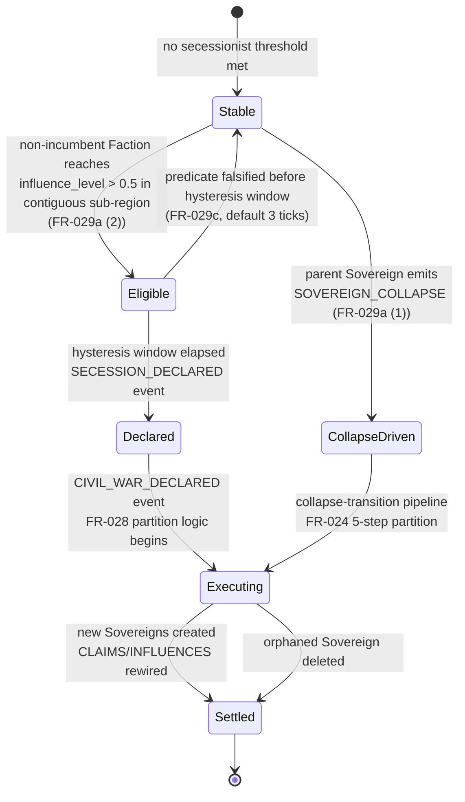

# Phase 1 Data Model: Sovereign Topology + Faction Influence + Balkanization

**Branch**: `070-balkanization` | **Date**: 2026-05-18 | **Spec**: [spec.md](./spec.md) | **Plan**: [plan.md](./plan.md) | **Research**: [research.md](./research.md)

All entities are Pydantic 2.x `BaseModel` subclasses with
`model_config = ConfigDict(frozen=True)` per Constitution II.6.
All enums are Python `StrEnum` subclasses per the existing project
convention (`src/babylon/models/enums/`).

Constitutional cross-references throughout: principles cited as
`[II.6]`, `[I.20]`, etc. Determinism guarantees are baseline
(III.7).

## 1. Enums

### 1.1 `ColonialStance` [I.1, I.20]

```python
class ColonialStance(StrEnum):
    """The fundamental political axis (balkanization-spec.yaml v1.2.0).

    Cross-reference: Constitution I.1 (Settler-Colonial Frame),
    I.20 (Spatial Substrate / Political Claims as Overlay).
    """
    UPHOLD = "uphold"   # Defend settler sovereignty, intensify extraction
    IGNORE = "ignore"   # Focus on class; ignore land (THE TRAP)
    ABOLISH = "abolish" # Dismantle settler relationship, cease extraction
```

### 1.2 `ExtractionPolicy`

```python
class ExtractionPolicy(StrEnum):
    """Sovereign's per-tick relationship to extractive production.

    Derived deterministically from `ruling_faction.colonial_stance`
    via FactionStanceMapping (§3.1).
    """
    INTENSIFY = "intensify"   # From UPHOLD → metabolic_impact = -0.02
    CONTINUE = "continue"     # From IGNORE → metabolic_impact = -0.005
    CEASE = "cease"           # From ABOLISH → metabolic_impact = +0.01
```

### 1.3 `SovereigntyType`

```python
class SovereigntyType(StrEnum):
    """Classification of the sovereign claim.

    Exhaustive per FR-002. Used by FR-032a's FRAGMENTED_COLLAPSE
    predicate (which requires ≥1 sovereign with
    INSURGENT / OCCUPATION / EMERGENCY type).
    """
    RECOGNIZED_STATE = "recognized_state"  # Internationally recognized
    PROVISIONAL = "provisional"            # Transitional / revolutionary government
    INSURGENT = "insurgent"                # Armed revolutionary movement
    OCCUPATION = "occupation"              # Military occupation authority
    SECESSIONIST = "secessionist"          # Breakaway state seeking recognition
    EMERGENCY = "emergency"                # Emergency / martial law authority
```

### 1.4 `FiscalStatus`

```python
class FiscalStatus(StrEnum):
    """Revenue relationship on a CLAIMS edge."""
    TAXED = "taxed"           # Normal revenue extraction
    REVOLT = "revolt"         # Tax resistance, reduced revenue
    BLOCKADE = "blockade"     # External forces preventing revenue
    LIBERATED = "liberated"   # No taxation (revolutionary zone)
    OCCUPIED = "occupied"     # Extraction by military force
```

### 1.5 `LegalStatus`

```python
class LegalStatus(StrEnum):
    """Legal nature of a CLAIMS edge."""
    DE_JURE = "de_jure"       # Internationally recognized claim
    DE_FACTO = "de_facto"     # Actual control without recognition
    DISPUTED = "disputed"     # Multiple claimants, no clear winner
    OCCUPIED = "occupied"     # Military occupation, original sovereignty suspended
    CEDED = "ceded"           # Formerly held, formally transferred
```

### 1.6 `SupportType`

```python
class SupportType(StrEnum):
    """Primary form of support provided by a Faction on an INFLUENCES edge."""
    MATERIAL = "material"         # Money, weapons, supplies
    IDEOLOGICAL = "ideological"   # Propaganda, education, media
    MILITARY = "military"         # Armed cadre, militias
    ELECTORAL = "electoral"       # Voter base, candidates
    LABOR = "labor"               # Union presence, strike capability
```

### 1.7 `PlayerMode`

```python
class PlayerMode(StrEnum):
    """Player interaction mode for a run (FR-047)."""
    CAMPAIGN = "campaign"   # Player picks ONE Faction; verbs route through spec-072 economy
    OBSERVER = "observer"   # God-mode; direct INFLUENCES/CLAIMS manipulation
```

### 1.8 `EdgeType` Extensions [II.9]

Three new values added to existing `babylon.models.enums.topology.EdgeType`:

```python
class EdgeType(StrEnum):
    # ... existing 18+ values ...
    CLAIMS = "claims"           # Sovereign → Territory (FR-009)
    INFLUENCES = "influences"   # Faction → Territory (FR-014)
    ADMINISTERS = "administers" # Sovereign → Sovereign (FR-018)
```

### 1.9 `GameOutcome` Extensions

Two new values added to existing `babylon.models.enums.events.GameOutcome`
(per spec §"Relationship to Existing GameOutcome"):

```python
class GameOutcome(StrEnum):
    # ... existing 4 values ...
    RED_OGV = "red_ogv"
    FRAGMENTED_COLLAPSE = "fragmented_collapse"
```

`REVOLUTIONARY_VICTORY` and `FASCIST_CONSOLIDATION` enum values
are PRESERVED; their predicates in EndgameDetector are augmented
per FR-031.

### 1.10 `EventType` Extensions

Nine new event types added to existing `babylon.models.enums.events.EventType`:

```python
class EventType(StrEnum):
    # ... existing 70+ values ...
    SOVEREIGN_COLLAPSE = "sovereign_collapse"           # FR-023
    TERRITORY_TRANSITION = "territory_transition"       # FR-022
    FACTION_VICTORY = "faction_victory"                 # FR-026
    SECESSION_DECLARED = "secession_declared"           # FR-029a (2)
    CIVIL_WAR_DECLARED = "civil_war_declared"           # FR-028
    RED_SETTLER_TRAP_DETECTED = "red_settler_trap_detected"  # FR-034
    DUAL_POWER_ACTIVE = "dual_power_active"             # FR-035
    RED_OGV_ENDGAME = "red_ogv_endgame"                 # FR-031
    FRAGMENTED_COLLAPSE_ENDGAME = "fragmented_collapse_endgame"  # FR-031
```

## 2. Entities

### 2.1 `PoliticalFaction` [I.16 Organization-side]

A voluntary coalition that contests sovereignty. Closer to
Organization than Institution per I.16 — Factions can dissolve.

```python
class PoliticalFaction(BaseModel):
    """Political coalition contesting sovereignty.

    Disambiguates from existing FactionBalance / StateFaction
    (state-internal ruling-class factionalism, spec-039).
    Per FR-045, this is a SEPARATE concept.

    Constitutional cross-reference:
    - I.1 Settler-Colonial Frame: colonial_stance is the principal axis
    - I.16 Organization vs Institution: Faction is organization-side
    - I.20 Political Claims as Overlay: INFLUENCES edges (Faction → Territory)
      are overlays on the immutable substrate
    """
    model_config = ConfigDict(frozen=True)

    # Identity
    id: str = Field(pattern=r"^FAC_[A-Z][A-Z0-9_]*$")
    name: str = Field(min_length=1, max_length=128)
    ideology: str = Field(min_length=1, max_length=64)

    # Principal axis (qualitative — I.7)
    colonial_stance: ColonialStance
    is_settler_formation: bool

    # Mechanical multipliers (default-from-colonial_stance, overridable)
    # See FactionStanceMapping in §3.1 for canonical defaults.
    extraction_modifier: float = Field(ge=0.0)
    violence_modifier: float = Field(ge=0.0)
    class_reduction: Probability   # constrained type, [0, 1]
    metabolic_reduction: float = Field(ge=-1.0, le=1.0)

    # UI / display
    color_hex: str = Field(pattern=r"^#[0-9A-Fa-f]{6}$")

    # Lifecycle
    founded_tick: int = Field(ge=0)
    dissolved_tick: int | None = None

    @model_validator(mode="after")
    def validate_multipliers_consistent_with_stance(self) -> Self:
        """If multipliers are not explicitly overridden, ensure they
        match the canonical default for the colonial_stance.

        Raises ValueError on inconsistency (helps catch typos in
        seed JSON without silently accepting wrong defaults).
        Override path: pass `_override_validation=True` (private
        kwarg) to suppress for empirically-calibrated factions.
        """
        # Implementation in Phase 2.
        return self
```

### 2.2 `Sovereign` [I.16 Institution-side]

An authority that CLAIMS Territories and applies a per-tick
`metabolic_impact`. Closer to Institution than Organization per
I.16 — Sovereigns survive ruling-Faction change (the CLAIMS
edges persist; only `ruling_faction_id` updates).

```python
class Sovereign(BaseModel):
    """Authority that claims Territory.

    Per I.20, Sovereigns are political claims overlaid on the
    immutable spatial substrate. Per I.16, Sovereigns are
    institutions — crystallized authority that survives
    ruling-faction-change.

    Constitutional cross-reference:
    - I.16 Organization vs Institution: Sovereign is institution-side
    - I.20 Political Claims as Overlay: CLAIMS edges are overlays
    - II.9 Morphism Dyadic: CLAIMS / ADMINISTERS edges are dyadic
    - III.7 Determinism Hash: state mutations are deterministic-by-seed
    """
    model_config = ConfigDict(frozen=True)

    # Identity
    id: str = Field(pattern=r"^SOV_[A-Z][A-Z0-9_]*$")
    name: str = Field(min_length=1, max_length=128)
    sovereignty_type: SovereigntyType

    # State (quantitative — I.7)
    legitimacy: Probability                  # [0, 1]; FR-023 collapse predicate
    color_hex: str = Field(pattern=r"^#[0-9A-Fa-f]{6}$")
    capital_territory_id: str | None = None

    # Ruling-Faction relationship (FR-001)
    ruling_faction_id: str | None = Field(default=None, pattern=r"^FAC_[A-Z][A-Z0-9_]*$")
    extraction_policy: ExtractionPolicy      # Derived from ruling_faction.colonial_stance

    # Lifecycle
    founded_tick: int = Field(ge=0)
    dissolved_tick: int | None = None

    @computed_field
    @property
    def metabolic_impact(self) -> float:
        """Per-tick habitability change applied to claimed Territories.

        Derived deterministically from extraction_policy per FR-004:
        - INTENSIFY → -0.02
        - CONTINUE → -0.005
        - CEASE → +0.01

        Values are theoretical defaults from balkanization-spec.yaml
        v1.2.0; overridable via BalkanizationDefines (FR-007).
        """
        return calculate_metabolic_impact(self.extraction_policy)

    @model_validator(mode="after")
    def validate_extraction_policy_matches_ruling_faction(self) -> Self:
        """If ruling_faction_id is set, extraction_policy MUST be
        derived from that faction's colonial_stance per FR-003.

        Raises ValueError if inconsistent.
        """
        # Implementation in Phase 2.
        return self
```

## 3. Derivation Tables

### 3.1 `FactionStanceMapping`

Canonical default mapping from `ColonialStance` to mechanical
multipliers (from balkanization-spec.yaml v1.2.0; treated as
theoretical defaults per R-001, overridable via
`BalkanizationDefines` and per-Faction seed JSON):

| Stance  | extraction_modifier | violence_modifier | class_reduction | metabolic_reduction |
|---------|--------------------:|------------------:|----------------:|--------------------:|
| UPHOLD  |                1.5 |               2.0 |             0.0 |               -0.5 |
| IGNORE  |                0.8 |               0.5 |             0.7 |                0.0 |
| ABOLISH |                0.0 |               0.3 |             0.5 |               +0.8 |

### 3.2 `StanceToPolicyMapping`

Canonical mapping from `ColonialStance` to `ExtractionPolicy` to
`metabolic_impact` (FR-003 + FR-004):

| Stance  | Policy    | metabolic_impact (per tick) |
|---------|-----------|----------------------------:|
| UPHOLD  | INTENSIFY |                       -0.02 |
| IGNORE  | CONTINUE  |                      -0.005 |
| ABOLISH | CEASE     |                       +0.01 |

This mapping is deterministic and required; no Sovereign may have
a `(ruling_faction.colonial_stance, extraction_policy)` pair that
diverges from this table.

## 4. Edge Schemas

### 4.1 `CLAIMS` (Sovereign → Territory) [II.9, I.20]

```yaml
edge_type: claims
from_node: Sovereign
to_node: Territory

attributes:
  control_level:        Probability  # [0, 1]; semantics in spec FR-009
  fiscal_status:        FiscalStatus
  legal_status:         LegalStatus
  claimed_since_tick:   int >= 0
  recognition_level:    Probability  # [0, 1]

constraints:
  - no_self_claim: Sovereign MUST NOT CLAIMS itself (FR-013).
  - control_sum_limit_soft:
      Sum of control_levels across a Territory's incoming CLAIMS
      edges SHOULD NOT exceed 1.0. Temporary violations emit
      `DUAL_POWER_ACTIVE` (FR-035) but do NOT fail the tick.
```

### 4.2 `INFLUENCES` (Faction → Territory) [II.9, I.18]

```yaml
edge_type: influences
from_node: PoliticalFaction
to_node: Territory

attributes:
  influence_level:      Probability  # [0, 1]; semantics in spec FR-014
  support_type:         SupportType
  cadre_count:          int >= 0
  sympathizer_count:    int64 >= 0
  established_tick:     int >= 0

constraints:
  - no_self_influence:  Faction MUST NOT INFLUENCES itself (FR-017).
  - sum_not_capped:
      Sum of influence_levels across a Territory's incoming
      INFLUENCES edges IS NOT capped at 1.0 (FR-016) — this is
      a key distinction from CLAIMS.

material_ideological_distinction:
  - I.18 [TRANSITION STATE]: INFLUENCES is the MATERIAL dimension
    (objective influence carrying); ColonialStance on the
    PoliticalFaction node is the IDEOLOGICAL dimension. The gap
    between high influence + UPHOLD stance is the Red Settler Trap
    (FR-034).
```

### 4.3 `ADMINISTERS` (Sovereign → Sovereign) [II.9]

```yaml
edge_type: administers
from_node: Sovereign  # Higher-tier
to_node: Sovereign    # Lower-tier

attributes:
  delegation_scope:  str  # Free-text description of what's delegated
  granted_tick:      int >= 0

constraints:
  - acyclic: ADMINISTERS edges MUST form a DAG (no cycles); the
    set of ADMINISTERS edges + their nodes forms an organizational
    hierarchy.
```

## 5. State Machines

### 5.1 Sovereign Lifecycle

```mermaid
stateDiagram-v2
    [*] --> Founded: SOVEREIGN_FOUNDED event<br/>(founded_tick set)
    Founded --> Ruling: ruling_faction_id assigned<br/>at least 1 CLAIMS edge
    Ruling --> Contested: legitimacy decline begins<br/>OR competing CLAIMS appears
    Contested --> Ruling: legitimacy recovers<br/>OR competing CLAIMS resolved
    Contested --> Collapsed: legitimacy <= 0.0<br/>SOVEREIGN_COLLAPSE event (FR-023)
    Ruling --> Collapsed: legitimacy <= 0.0<br/>(direct path; rare)
    Collapsed --> Dissolved: cleanup pass removes node<br/>+ outbound CLAIMS/ADMINISTERS
    Dissolved --> [*]
```



### 5.2 CLAIMS Legal-Status Transitions



### 5.3 Fracture (FR-029a) State Machine



## 6. Cross-Subsystem Interfaces (II.11)

The `balkanization` subsystem reads from but does not write to
the following subsystems:

| Read from | Via interface | Why |
|---|---|---|
| Territory (spec-062 subsystem) | `GraphProtocol.query_nodes(_node_type="territory")` | Habitability application (FR-019); contiguity check via ADJACENCY (FR-029b) |
| Solidarity (existing) | `GraphProtocol.query_edges(edge_type=SOLIDARITY)` | RED_OGV class-tension predicate (FR-032) |
| Consciousness (existing) | `GraphProtocol.query_nodes(_node_type="social_class")` for `class_consciousness` | REVOLUTIONARY_VICTORY existing predicate (FR-031 augmentation) |
| Metabolism (existing) | EventBus subscription to `ECOLOGICAL_OVERSHOOT` | FR-023 collapse trigger |

The `balkanization` subsystem writes:

| Writes | What |
|---|---|
| Faction nodes (new) | PoliticalFaction state |
| Sovereign nodes (new) | Sovereign state |
| CLAIMS / INFLUENCES / ADMINISTERS edges (new) | Per FR-009/14/18 |
| `territory.habitability` | Via MetabolismSystem extension (FR-043) |
| Audit tables (new) | `balkanization_claims_audit`, `balkanization_influences_audit` (R-005) |
| Events (new) | All 9 new EventType values (§1.10) |

No direct reads from other subsystems' Postgres tables (II.11).

## 7. Anti-Pattern Notes (VIII)

| Pattern | Recipe in this spec |
|---|---|
| VIII.1 Solidarity as Scalar | `INFLUENCES.influence_level` is *political pull*, NOT solidarity. Solidarity is `EdgeType.SOLIDARITY` (separate, qualitative `EdgeMode`-typed). |
| VIII.2 Union Density as Revolutionary | Workers' Congress is seeded by union density precisely because it's the **IGNORE** trap faction. The anti-pattern is the *theoretical point*, not something to avoid in seeding. See `data-model.md` §"Seeding Notes" (Phase 2). |
| VIII.6 Constants Without Data Sources | All multipliers and rates live in `BalkanizationDefines` (Pydantic) with theoretical-default-from-v1.2.0 + override path. R-001 documents the provenance trace. |
| VIII.9 Community as Pairwise Edge | PoliticalFaction is a first-class node, NOT a pairwise edge or XGI hyperedge. Disambiguated from XGI Community (existing, spec-022) and from FactionBalance / StateFaction (existing, spec-039). |
| VIII.10 Oppressor Hyperedge | UPHOLD is an enum value on the PoliticalFaction node + `is_settler_formation: bool`. Both settler and anti-settler poles are first-class concepts (Category 1 modelling). No hyperedge needed. |

## 8. Initial Seed Summary

Per R-002:

**4 canonical PoliticalFactions** in `seed_factions.json`:

| ID | Stance | is_settler | Initial role |
|---|---|---|---|
| FAC_RESTORATIONIST | UPHOLD | true | Rules SOV_USA_FED at game start |
| FAC_WORKERS_CONGRESS | IGNORE | true | Seeded via union density; RED_OGV trap faction |
| FAC_DECOLONIAL | ABOLISH | false | Seeded via AIANNH; the abolitionist coalition |
| FAC_LIBERAL_IMPERIAL | IGNORE | true | Rules SOV_CAN_FED; soft-imperial pole (also exists in US at lower influence) |

**3 starting Sovereigns** in `seed_sovereigns.json` (per FR-040 /
FR-040a / FR-040b):

| ID | Type | Legitimacy | Ruling Faction | Initial CLAIMS |
|---|---|---|---|---|
| SOV_USA_FED | RECOGNIZED_STATE | 1.0 | FAC_RESTORATIONIST | All in-scope US Territories (Wayne + Oakland + Macomb hexes), DE_JURE, control_level=1.0 |
| SOV_CAN_FED | RECOGNIZED_STATE | 0.85 | FAC_LIBERAL_IMPERIAL | Canadian boundary node (`canada` per spec-062 R4); cross-border DE_JURE claims on US Territories with LODES-Canada workplace_dest edges (representing Canadian-firm operations in Detroit) |
| SOV_EXTERIOR_NULL | PROVISIONAL | 0.0 | *NULL* (extraction_policy=CONTINUE — special-cased combination per FR-040b) | Existing `rest_of_usa` Territory boundary node (per spec-062 R4), DE_JURE, control_level=1.0. Mid-game: fallback sink for any orphaned in-scope Territory (unclaimed Territory edge case + all-zero-influence edge case). |

**Initial INFLUENCES seeding** (FR-039 — produced as
`seed_influences.json` by the foundational seeding pipeline; schema
in `contracts/seed_influences.schema.json`):

The seeding pipeline computes one INFLUENCES edge per
`(faction_id, territory_id)` pair with non-zero proxy value:

- FAC_RESTORATIONIST: Republican vote share per county from the
  most-recent presidential election (MIT Election Lab if catalog
  amendment landed, else Census Bureau fixture), prorated to res-7
  hexes via LODES residential density; `support_type=ELECTORAL`.
- FAC_WORKERS_CONGRESS: QCEW union-employment-share per county-year
  (proxy: `own_code='3'` + historically-unionized NAICS filter),
  prorated to res-7 hexes via LODES residential density;
  `support_type=LABOR`.
- FAC_DECOLONIAL: Natural Earth AIANNH polygon intersection area
  per res-7 hex, normalized to [0, 1] (no major AIANNH in Detroit
  tri-county MVP — initial Decolonial influence is low, reflecting
  empirical reality); `support_type=IDEOLOGICAL`.
- FAC_LIBERAL_IMPERIAL: complement of (Restorationist + Workers'
  Congress) per hex, clamped to
  `[0, liberal_imperial_influence_cap]` (default cap 0.4 in
  BalkanizationDefines); `support_type=IDEOLOGICAL`.

The pipeline's output is persisted (a) to
`src/babylon/data/game/balkanization/seed_influences.json` as a
debug/audit artifact and (b) to `runtime_influences_edges` in
Postgres at db-init via `postgres_initialization.py`.

All initial INFLUENCES values are deterministic given the proxy
data inputs and seed RNG (III.7).

**Initial-state coverage invariant (SC-017)**: After seeding
completes, for every in-scope Territory `t`, the following MUST
hold:

```
exists((f, t) in INFLUENCES with influence_level > 0)
  OR
exists((SOV_EXTERIOR_NULL, t) in CLAIMS)
```

No in-scope Territory may be both un-influenced AND un-claimed at
the start of tick 1. The foundational seeding tasks enforce this
invariant via an integration test (tasks Phase 2).
