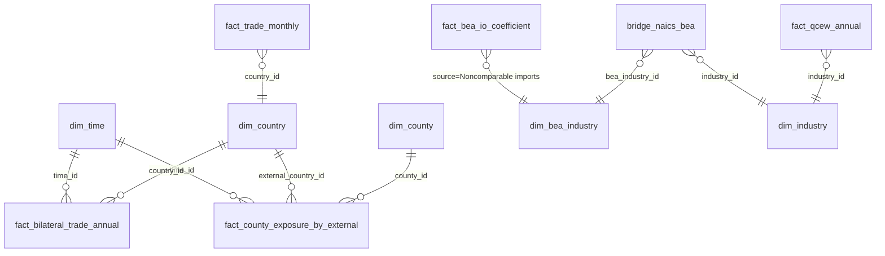

# Phase 1 Data Model — spec-100

## New reference tables (additive to `src/babylon/reference/schema.py`)

### `fact_county_exposure_by_external`

The materialized `county_exposure_by_external` map. Grain: annual year × external
bloc × county.

| Column | Type | Notes |
|--------|------|-------|
| `time_id` | int, PK, FK `dim_time.time_id` | annual time_id (is_annual=1) |
| `external_country_id` | int, PK, FK `dim_country.country_id` | one of the 8 `is_region=1` blocs |
| `county_id` | int, PK, FK `dim_county.county_id` | US county |
| `weight` | float, NOT NULL | in [0,1]; per-(time_id, external_country_id) vector sums to 1.0 |

Indexes: `(time_id, external_country_id)` for per-bloc-year reads.
Only counties with `weight > 0` are stored (a zero-exposure county is absent;
the consumer treats an absent county as weight 0). Per-(bloc,year) present weights
sum to 1.0 within 1e-9.

### `fact_bilateral_trade_annual`

Bloc-year aggregation of `fact_trade_monthly`. Grain: annual year × country.

| Column | Type | Notes |
|--------|------|-------|
| `time_id` | int, PK, FK `dim_time.time_id` | annual time_id |
| `country_id` | int, PK, FK `dim_country.country_id` | the 8 `is_region=1` blocs |
| `imports_usd_millions` | Numeric(18,2), nullable | Σ of the year's monthly imports |
| `exports_usd_millions` | Numeric(18,2), nullable | Σ of the year's monthly exports |
| `total_trade_usd_millions` | Numeric(18,2), nullable | imports + exports |

Feeds the engine's `ExternalNode.bilateral_trade_value` (USD). Not tonnage
(`bilateral_trade_tons` needs FAF freight — out of scope; see research R8).

## Compute formula (pure function in `exposure/compute.py`)

Inputs (per year Y, resolved from the reference DB):
- `import_coeff: dict[bea_id, float]` — USE table, source = Noncomparable imports.
- `bridge: list[(naics_industry_id, bea_id, split_weight)]` — from `bridge_naics_bea`.
- `county_naics_emp: dict[(county_id, naics_industry_id), float]` — QCEW Σ owns {1,2,3,5}.

Steps:
1. `county_bea_emp[(C,b)] = Σ_{(n→b, w)∈bridge} county_naics_emp[(C,n)] · w`
2. `nat_bea_emp[b] = Σ_C county_bea_emp[(C,b)]`
3. `covered = {b : b∈import_coeff and nat_bea_emp[b] > 0}`
4. `raw[C] = Σ_{b∈covered} import_coeff[b] · (county_bea_emp[(C,b)] / nat_bea_emp[b])`
5. `total = Σ_C raw[C]`; `weight[C] = raw[C] / total` (skip counties with raw 0)

Invariants:
- `Σ_C weight[C] = 1.0 ± 1e-9` (FR-004; consumer contract).
- Reconciliation: `total ≈ Σ_{b∈covered} import_coeff[b]` within ±2% (FR-011).
- `concordance_coverage = Σ_{b∈covered} import_coeff[b] / Σ_{b∈import_coeff} import_coeff[b]` (FR-012).

Determinism: iterate counties/blocs/industries in sorted-id order; the writer
inserts rows sorted by PK so `logical_table_hash` reproduces (FR-008).

## Trade aggregation (pure function in `trade/bilateral.py`)

For each `(country_id, year)` over the 8 `is_region=1` blocs:
`imports = Σ months imports_usd_millions` (present months only),
`exports = Σ months exports_usd_millions`, `total = imports + exports`.
Absent months contribute nothing (research R8 / FR-009).

## Entity relationships

