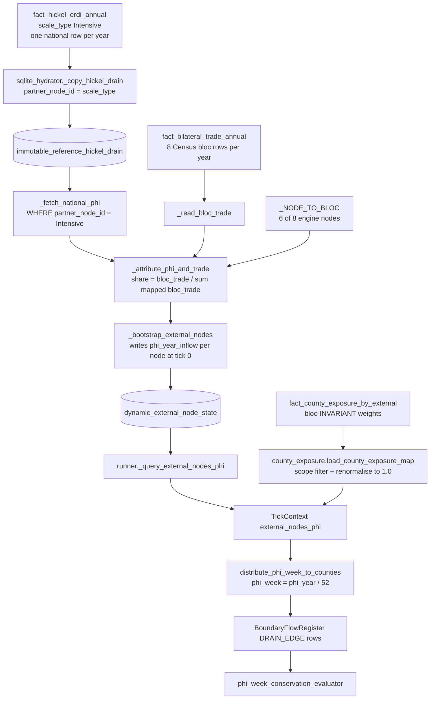

# U4 — Φ-attribution model v2: options paper (Director ruling required)

**Program**: 26 International Trade, Unit U4 (`project/programs/26-international-trade.md` §4).
**Status**: PACKAGING ONLY — no code, no ruling taken. Prepared for the Director.
**Predecessors**: ADR055 (spec-101, 2026-07-04) — the model being reconsidered; ADR160
(P26 charter); ADR161 (U1, spec-107 σ-gradient authored).
**Authored against**: worktree `trade-activation`, branch `101-trade-activation`.
Every data claim in this paper was re-verified on 2026-07-27 with read-only queries
against `data/sqlite/marxist-data-3NF.sqlite` and `rg`/`Read` over the tree; queries
are reproduced inline so the Director can re-run any of them.

______________________________________________________________________

## 1. The decision being asked

Babylon models imperial rent Φ as a single national aggregate — Hickel's drain,
`$8,625B` for 2010 — and must decide **how much of that drain each of the eight
external bloc nodes is credited with sourcing**. spec-101 answered "in proportion to
US bilateral trade volume with a containing Census bloc," and ADR055 itself recorded
that answer as *"THIS IS THE #1 OWNER-REVIEW ITEM"*
(`ai/decisions/ADR055_spec101_trade_activation.yaml:45`). It has been unruled for
23 days across two program charters. The question is not an implementation detail: the
split *is* a claim about where the value drained into the United States comes from, and
therefore a claim about the structure of the imperialist world-system. Under
Constitution §IX.5 (Amendment AD, ADR151) the ideological/theoretical line is the
Director's sole authority, and Program 26 §2 constraint 4 states it explicitly: *"How
imperial rent attributes across blocs is an ideological/theoretical modeling choice —
under IX.5 that is the Director's, not an agent's. U4 packages the decision; agents do
not improvise it."* This paper packages it. Sections 2–4 establish the code and data
reality; §5–§7 lay out three options; §11 is the enumerated ruling request. §10 offers
an engineering recommendation that is **explicitly subordinate** to whatever the theory
ruling says.

______________________________________________________________________

## 2. Status quo: exactly how trade-share attribution works today

### 2.1 The dataflow

### 2.2 Receipts

| Step | Location | What it does |
|---|---|---|
| National Φ source | `data/sqlite/marxist-data-3NF.sqlite` → `fact_hickel_erdi_annual` | One row per (year, `scale_type`). Verified: `scale_type` ∈ {`Extensive` 1960–1979 (20 rows), `Intensive` 1980–2017 (37 rows), `Intensive_China_Inflection` 2005 (1 row)}. 2010: `erdi = 7.6`, `annual_drain_usd_billions = 8625.0`. **No partner/bloc column exists.** |
| Hydration | `src/babylon/persistence/sqlite_hydrator.py:316-350` `_copy_hickel_drain` | Writes `partner_node_id = scale_type` — i.e. the literal string `'Intensive'`, never a country. |
| Coverage preflight | `src/babylon/persistence/postgres_initialization.py:259-291` | Hard-fails when `start_year` ∉ [1980, 2017] so a silent zero-Φ run is impossible (ADR055 review fix #2). |
| National Φ read | `postgres_initialization.py:467-483` `_fetch_national_phi` | `WHERE partner_node_id = 'Intensive'`; falls back to `0.0`. |
| Bloc trade read | `postgres_initialization.py:382-415` `_read_bloc_trade` | `SELECT country_id, total_trade_usd_millions FROM fact_bilateral_trade_annual WHERE time_id = <annual time_id>`. |
| The crosswalk | `postgres_initialization.py:371-379` `_NODE_TO_BLOC` | `eu→1 (European Union)`, `canada→7 (North America)`, `russia_csi→8 (Europe)`, `sub_saharan_africa→9 (Africa)`, `southeast_asia→10 (Pacific Rim)`, `china→12 (Asia)`. `india`, `latin_america` absent → Φ = 0. |
| The split | `postgres_initialization.py:418-464` `_attribute_phi_and_trade` | `share = bloc_trade / Σ(mapped bloc_trade)`; `phi = national_phi × share`; hard-fails (`PhiAttributionUnavailableError`) if the denominator is ≤ 0. |
| Node write | `postgres_initialization.py:522-613` `_bootstrap_external_nodes` | One `ExternalNode` row per node at tick 0; unmapped nodes get `(0.0, 0.0)`; also returns the raw `national_phi` as the auditor's independent ground truth. |
| County split | `src/babylon/engine/systems/phi_distribution.py:36-106` | `phi_week = phi_year_inflow / 52`; `amount = phi_week × weight`; rejects a non-unit weight sum (III.1, no silent renormalisation). |
| Exposure weights | `src/babylon/domain/economics/county_exposure.py:72-152` | Reads ONE bloc's map (`MIN(external_country_id)`), filters to scope, **renormalises to 1.0** at line 152. |
| Conservation | `src/babylon/persistence/conservation_audit.py:126-234` | Per-bloc ratio `Σ DRAIN / (phi_year/52)` vs `1.0`, plus one aggregate row comparing `Σ DRAIN across all blocs` against `national_phi_reference / 52`. `grade_severity` (`:51-67`): ALARM above 1e-6 residual. |

### 2.3 What the model actually produces (2010, national Φ = $8,625B)

Recomputed directly from the reference DB using `_attribute_phi_and_trade`'s formula:

| Engine node | Mapped bloc | 2010 trade (USD M) | Share | Attributed Φ (USD B) |
|---|---|---:|---:|---:|
| `china` | Asia | 1,183,488.19 | 0.267514 | 2,307.3 |
| `southeast_asia` | Pacific Rim | 980,305.14 | 0.221587 | 1,911.2 |
| `canada` | North America | 920,543.46 | 0.208079 | 1,794.7 |
| `russia_csi` | Europe | 667,476.29 | 0.150876 | 1,301.3 |
| `eu` | European Union | 558,854.78 | 0.126323 | 1,089.5 |
| `sub_saharan_africa` | Africa | 113,348.02 | 0.025621 | 221.0 |
| `india` | — | — | 0 | 0.0 |
| `latin_america` | — | — | 0 | 0.0 |
| **Σ** | | **4,424,015.9** | **1.000000** | **8,625.0** |

### 2.4 Precisely where it is lossy

Five distinct defects, in descending order of theoretical consequence.

**L1 — Nearly half the drain is booked to the imperialist core.** `eu` + `canada` +
`russia_csi`(→"Europe") together take **0.485278 of the national Φ = $4,185.5B of
$8,625B**. Hickel–Sullivan–Zoomkawala's drain is by construction a *Global-South → North*
transfer; the model currently asserts that 48.5% of the value drained *into* the United
States is drained *out of* Western Europe and Canada. Under the MLM-TW framing (Amin's
imperial rent; Program 10 §1) this is not a rounding error, it is a sign error in the
world-system geography. It is also self-contradictory against the repo's own
classification: `dim_country.world_system_tier` labels Canada `core` and the Ricci EMU /
Western Europe rows `core` (verified query below), while the CSV that carries real UE
transfer directions records North America and Western Europe exclusively as **INFLOW**
regions (`src/babylon/data/reference/babylon_ricci_final.csv`).

**L2 — The "injective" crosswalk is injective over bloc *ids*, not over disjoint trade.**
ADR055's conservation argument is *"injective crosswalk → no bloc double-counted"*
(`ADR055:36`). The bloc ids are distinct; the underlying Census aggregates are not.
Arithmetic proof from the data: the six mapped blocs sum to **$4,424,016M**, while the
same table's world total for 2010 (`dim_country.country_id = 11`, `cty_code = 15`,
"World, Not Seasonally Adjusted") is **$3,192,351M**. The denominator is therefore
**138.6% of all US goods trade** — the shares are computed over a set that overlaps
itself. Structurally: "Europe" ($667,476M) contains the "European Union" ($558,855M);
"Asia" ($1,183,488M) and "Pacific Rim" ($980,305M) both contain China ($456,864M as an
individual country row). So `russia_csi`'s share is largely EU trade, and
`southeast_asia`'s share is largely Chinese and Japanese trade.

**L3 — Containing-bloc granularity, already disclosed.** `sub_saharan_africa` is credited
with all of Africa; `southeast_asia` with all of the Pacific Rim; `russia_csi→Europe` was
flagged "weak" in the source comment (`postgres_initialization.py:374`). Note that a
finer, better-matching row **already exists in the same table family**: `dim_country`
row 15 (`cty_code 19`, "Sub Saharan Africa", `world_system_tier = periphery`) carries
$82,136M for 2010 in `fact_trade_monthly` — a genuine Sub-Saharan aggregate, versus the
$113,348M "Africa" bloc currently used.

**L4 — Two nodes are structurally invisible.** `india` and `latin_america` receive Φ = 0
and are pinned that way by test
(`tests/unit/persistence/test_phi_attribution.py:32-33`). See §9.

**L5 — There is no bloc × county structure anywhere.** The county side is bloc-invariant
*by construction*, not by coincidence: spec-100 FR-001
(`specs/100-county-exposure/spec.md:126-134`) defines
`raw[C] = Σ_bea import_coeff[bea] · (county_emp[C,bea] / national_emp[bea])`, where
`import_coeff` comes from a single BEA "Noncomparable imports and rest-of-the-world
adjustment" row (FR-002) — a formula with **no bloc index at all**. The loader therefore
writes 8 identical weight vectors, and `load_county_exposure_map` reads one and
broadcasts it (`county_exposure.py:108-119`). Consequence: *which* bloc a dollar of Φ is
attributed to changes only the `source_node_id` label on the DRAIN_EDGE row; every
county receives the same fraction of the national total regardless of the attribution
model. **Attribution today is a labelling of an already-fixed county distribution.**
Any option whose theoretical payoff depends on different blocs hitting different counties
requires a bloc-resolved exposure map, which does not exist.

______________________________________________________________________

## 3. The sub-national inflation finding, restated precisely

**Mechanism.** `distribute_phi_week_to_counties` refuses a non-unit weight sum
(`phi_distribution.py:84-89`), so the loader renormalises whatever counties are in scope
to sum to 1.0 (`county_exposure.py:141-152`). At national scope this is a near-no-op
(the stored weights already sum to 1.0 over ~3,108 counties, spec-101 R3). At sub-national
scope it is a *study-area projection*: the 83 Michigan counties hold 3.94% of national
exposure (spec-101 R3), but after renormalisation they absorb **100% of every bloc's
Φ_week** — a ~25× amplification for Michigan, larger for the 3-county Detroit scope.
This is deliberate and documented (spec-101 D2, `county_exposure.py:14-22`), not a bug.

**Magnitude.** Measured on the 520-tick michigan-canada canonical run
(`specs/101-trade-activation/proof.md:101-122`): county 26001, per-tick drain ≈ $71.4M
against terminal `total_v` ≈ $0.85M (**≈84×**); county 26005, ≈$3.44B against ≈$24.5M
(**≈141×**). Roughly two orders of magnitude, consistent across sampled counties.

**Why the invariant does not catch it.** The auditor compares Σ recorded DRAIN against
the *intended* Φ_week slice. Renormalisation makes that identity true by construction —
`Σ DRAIN ≡ Φ_week` is tautologically satisfiable at any scope. The invariant validates
plumbing, never economics.

**Why national scope resolves it.** Amendment R (Constitution §IV, `CONSTITUTION.md:464`,
ratified 2026-07-14) makes the United States nationwide — all ~3,100 counties, 2010–2025 —
the canonical test case, with Michigan-83 and tri-county demoted to coarse-graining
backward-compat criteria. At national scope the renormalisation denominator → 1.0 and the
projection vanishes; drain magnitudes become the real Hickel figures spread over the real
exposure map. **Caveat (verified):** Amendment R's scope mandate is still marked
`[RATIFIED · PENDING CODE]` at `CONSTITUTION.md:466` — *"the shipped e2e canon is still
wayne_county."* So the resolution is scheduled, not delivered.

**Live consequence for this program.** U2 (interactive parity) wires the four Φ keys into
`game/session.py` for the Wayne-County campaign
(`specs/101-trade-activation/u2-interactive-parity-contracts.md:74-92`) — a 1–3 county
scope, i.e. the maximum-inflation case. Once U2 lands, the ~84–141× figure stops being a
batch-path curiosity and becomes **a number the player sees**. Whether that is acceptable
pending the nationwide cutover is Ruling Question 5.

______________________________________________________________________

## 4. Constraints every option must satisfy

1. **Conservation, hard.** `phi_week_conservation_evaluator` emits an aggregate row
   comparing `Σ DRAIN across all blocs` to `national_phi_reference / 52` and expects the
   ratio `1.0` (`conservation_audit.py:222-233`); residual > 1e-6 = ALARM
   (`:51-67`), and `qa:e2e-regression` runs `--strict`. **Therefore any option must
   attribute 100% of the national Φ across the nodes** (shares renormalised to 1.0),
   or the auditor and its ADR must change in the same motion. An option that says "core
   blocs source no drain" does not reduce total Φ; it *concentrates* the whole $8,625B
   onto the remaining nodes. That redistribution is itself a theory claim.
2. **Determinism III.7.** Attribution runs once at `initialize_session`, before tick 1,
   and feeds no RNG; all iteration is sorted (`postgres_initialization.py:460`). Any
   option must keep that shape: no per-tick recomputation, no unsorted iteration, no
   float accumulation whose order varies.
3. **III.8 no fabricated specificity.** ADR055 chose disclosed Φ = 0 over an invented
   number for india/latin_america. Any replacement must be traceable to a named on-disk
   source (Aleksandrov Test, Program 26 §2 constraint 2).
4. **P25 non-overlap covenant** (Program 26 §3). Until the P25 lane merges: no
   tick-pipeline mutation, and `engine/systems/*`, `tests/baselines/*.json`,
   `tools/regression_scenarios.py`, `defines.yaml` regeneration are off-limits.
   `postgres_initialization.py`, `sqlite_hydrator.py` and `domain/economics/**` are clear.

______________________________________________________________________

## 5. OPTION A — Keep trade-share attribution (status quo)

**Mechanism.** Unchanged: `share = bloc_trade / Σ(mapped bloc_trade)`.

**What it gets right.**

- Conservation is exact and cheap: shares sum to 1.0 by construction, so both the
  per-bloc and aggregate audit rows read ≈1.0 (residual ≈1e-15, spec-101 R6).
- It is grounded in an audited, in-DB table with full year coverage
  (`fact_bilateral_trade_annual`, 120 rows, 2010–2024 — verified) and needs no new
  ingest, no new artifact, no drive access.
- It has a real theoretical warrant, recorded at `ADR055:35`: unequal-exchange rent
  scales with trade volume (Amin, Hickel, Cope). Volume is a genuine transmission
  channel — value cannot be transferred through a trade relation that does not exist.
- It is shipped, tested (`tests/unit/persistence/test_phi_attribution.py`, 148 lines,
  green) and byte-stable.

**What stays broken.** All five defects in §2.4: 48.5% of the drain booked to the core
(L1); a denominator that is 138.6% of world trade because the aggregates overlap (L2);
containing-bloc granularity while a finer Sub-Saharan row sits unused (L3); two silent
nodes (L4); and the fact that attribution currently changes nothing but a row label (L5).
Choosing A is legitimate — the honest version is *"volume is the channel; the theory-line
refinement waits for U5/data"* — but it should be chosen as a ruling with those five
disclosures re-affirmed in an ADR, not inherited by default. A "**A′**" sub-variant is
available at trivial cost: keep trade-share but fix L2/L3 by switching the denominator to
non-overlapping rows (e.g. `Sub Saharan Africa` id 15, individual-country rows from
`fact_trade_monthly`, which are accurate — Canada $526,893M, China $456,864M, Mexico
$393,650M for 2010, each matching published Census totals). That is a data-fidelity fix
inside the same theory; it does not resolve L1.

______________________________________________________________________

## 6. OPTION B — ERDI-weighted attribution

**Mechanism.** Weight each node's share by an unequal-exchange intensity term, not by
volume alone: `share_i ∝ trade_i × ERDI_i` (or, in the pure form,
`share_i ∝ drain_i` where `drain_i` is a directly measured per-region transfer). The
theory claim is Emmanuel's: a dollar of trade with a low-wage, low-price-level partner
transfers far more value than a dollar of trade with a peer economy. ERDI (the
exchange-rate deviation index — the ratio by which market exchange rates understate
Southern output relative to PPP) is exactly that multiplier, and it is the quantity
Hickel's own drain construction uses.

**Data requirements — what exists vs. what must be built.**

*Exists:*

- `fact_hickel_erdi_annual.erdi` — **but national-aggregate only**: 2010 = 7.6, keyed by
  `scale_type`, no partner dimension (verified; identical finding in spec-101 R2 and
  spec-107 D2).
- `src/babylon/data/reference/babylon_ricci_final.csv` — 51 data rows, genuine Ricci
  (2019) GVC unequal-exchange transfers, region-resolved with CORE/SEMI_PERIPHERY/
  PERIPHERY tiers and signed INFLOW/OUTFLOW values. Verified OUTFLOW (i.e. drained)
  regions by year: **1995** {India, China, South Asia, Southeast Asia, Sub-Saharan
  Africa, Russia and CSI, Emerging & Developing}; **2000** {India, China, South Asia,
  Sub-Saharan Africa, E&D}; **2007** {India, China, South Asia, Sub-Saharan Africa,
  Non-OECD, E&D}; **2009** {Non-OECD}. Years are {1995, 2000, 2007, 2009} — **2010, the
  canonical start year, is absent.**
- `dim_country` rows 264–273 with `cty_code` RIC01–RIC10 — the Ricci region taxonomy is
  *already a dimension in the reference DB*, carrying `world_system_tier`: EMU/Western
  Europe/OECD/Advanced Economies = `core`; Russia and CSI / E&D = `semi_periphery`;
  South Asia / Southeast Asia / Sub-Saharan Africa / Non-OECD = `periphery`. Verified.
- `fact_trade_monthly` — 254 partner rows, 2010–2024, per-country and accurate at the
  country level (spot-checked against published Census totals).

*Must be built:*

- **A per-bloc ERDI does not exist anywhere on disk.** No table, no CSV, no FRED series
  (verified: `dim_fred_series` is 41 rows, all US-domestic except a US PPP pair — no
  foreign exchange-rate or PPP series). It must either be (i) *derived* from the Ricci
  transfers as a revealed intensity `drain_i / trade_i`, (ii) *proxied* by
  `world_system_tier` with Director-supplied tier multipliers, or (iii) *ingested* from
  a new external source. (i) and (ii) use only in-repo data; (iii) is a new data lane.
- The Ricci sqlite table `fact_ricci_unequal_exchange` (29 rows) was **amputated**
  2026-07-17 (ADR076 R2; `reports/amputation_demotion_20260717_011045.md`) — the CSV is
  canonical but is not queryable from the reference DB. Re-ingestion is already
  spec-107's Director-ruling item #3 (`specs/107-sigma-gradient/spec.md:159-165`).
- **Trap:** the runtime table named `immutable_reference_ricci_unequal` is NOT Ricci
  data — `sqlite_hydrator.py:353-394` populates it from Census `fact_trade_monthly`
  bilateral trade under a legacy label. Any B implementation must not mistake it for the
  UE series.
- Also note `_fetch_node_erdi` (`postgres_initialization.py:486-519`) currently returns
  **1.0 for every node, always**: it looks up `immutable_reference_erdi.partner_node_id`
  against keys like `"Canada"`/`"China"`, but `_copy_erdi` (`sqlite_hydrator.py:280-313`)
  writes `partner_node_id = scale_type`, i.e. `'Intensive'`. The per-node ERDI field on
  `ExternalNode` is therefore live-but-inert. Option B is the motion that would make it
  real; it is also a defect worth an ADR line whichever option is ruled.

**Determinism / conservation implications.** Same shape as A — a one-shot init-time
computation over sorted keys — provided the ERDI weights are *data*, not a per-tick
computation. Conservation holds iff the weighted shares are renormalised to sum to 1.0;
that renormalisation is exactly what makes the aggregate audit row read 1.0. The
theoretical price is stated plainly: **if core blocs' ERDI ≈ 1 and periphery blocs'
ERDI ≫ 1, then after renormalisation the periphery nodes absorb essentially the entire
$8,625B.** That is the theoretically coherent outcome under Amin/Hickel, and it is a
large numerical move — per-node Φ for `sub_saharan_africa` could rise by an order of
magnitude from today's $221B.

**Failure modes.**

1. *Year mismatch.* Ricci covers {1995, 2000, 2007, 2009}; the canonical run starts 2010.
   Using 2007 weights for a 2010 run is an interpolation/nearest-year decision that must
   be declared, not defaulted (III.8).
2. *Overlapping regions again.* Ricci's own regions nest — `South Asia ⊃ India`,
   `Non-OECD ⊃` almost everything. A naive Σ over Ricci OUTFLOW rows repeats L2 in a new
   coordinate system. An explicit disjoint subset must be chosen.
3. *No `latin_america` anywhere.* Ricci has no Latin-America region; `dim_country`'s
   "South and Central America" (id 6) is `is_region = 0` with a NULL tier. See §9.
4. *`canada`/`eu` become zero-or-negative sources.* Under Ricci they are CORE **INFLOW**
   regions. If they attribute to 0, `_NODE_TO_BLOC`'s companion invariants and the
   FR-020 "zero-Φ blocs emit no DRAIN rows" path mean those nodes go dark in the ledger —
   a visible behavioural change, and arguably the correct one.
5. *`is_region` is not a trustworthy partition flag.* Verified hazard: summing all
   `is_region = 0` rows for 2010 gives $10.35T against a true world total of $3.19T,
   because groupings like "South and Central America", "NAFTA with Canada (Consump)" and
   the two "World" rows carry `is_region = 0`. Any per-country construction must
   whitelist, never filter on `is_region`.

______________________________________________________________________

## 7. OPTION C — σ-gradient composition (post-U1)

**Mechanism.** U1 shipped spec-107 and `src/babylon/domain/economics/sigma/` (7 modules,
pure functions, no I/O — ADR161). σ is a production-structure coordinate composed from
organic composition of capital (`compute_organic_composition`), capital intensity
(`compute_capital_intensity`) and vertically-integrated labor content
(`compute_vertically_integrated_labor_content`), z-standardised
(`standardize_components`), combined with caller-supplied weights (`compose_sigma`) and
placed on one world axis (`anchor_to_world_scale`). Attribution would then read: a bloc
sources drain in proportion to its **distance down-gradient from the US position** —
`share_i ∝ f(σ_US − σ_i) × trade_i`, the σ-gap standing in for Emmanuel's price-of-
production wedge. This is the most theory-faithful option available: it makes attribution
a *consequence* of production structure rather than a proxy, and it is precisely the
"value transfer up-gradient" coupling Program 10 §3 specifies
(`project/programs/10-spectrum-of-unequal-exchange.md:143-149`).

**Circular-dependency warning (load-bearing).** σ's composition method and its canonical
component weights are **themselves unruled**. spec-107 D1
(`specs/107-sigma-gradient/spec.md:104-117`) records: *"Director ruling required (#1):
confirm or replace the z-score-standardization + linear-weighted-sum composition method,
and supply canonical component weights"*, and ADR161 records that the package shipped
*"with a documented DEFAULT weighting that is explicitly non-canonical until ruled."*
Ruling Option C therefore **requires ruling the σ weights first or in the same sitting**;
ruling C alone would make Φ attribution depend on an unruled coefficient vector, i.e.
would move the theory decision from a visible crosswalk into an invisible default. The
same applies to spec-107's ruling item #2 (what grounds the world-anchor sample) and #3
(whether to re-ingest the Ricci CSV) — C consumes both.

**Data requirements — the hard one.** σ's three ingredients are computed from **US**
sources: BEA fixed assets (K), QCEW wage bill and employment (v, L), and the BEA
Leontief inverse (ℓ). Verified against the reference DB's full table list: **there is no
foreign industrial, capital-stock, employment or I-O data in
`marxist-data-3NF.sqlite` at all.** The only externally-resolved facts are trade
(`fact_trade_monthly`, `fact_bilateral_trade_annual`), the national Hickel series, and
the `dim_country` dimension (including the RIC01–RIC10 Ricci regions). Consequently:

- σ for the 8 **external bloc nodes cannot be computed from loaded data today.** It must
  be *anchored* — i.e. inferred from the Hickel/Ricci world-scale sample, which is
  exactly spec-107's open ruling item #2 (`spec.md:118-134`).
- Even σ for **US counties** is blocked on an input: BEA Fixed Assets `FAAt3.1ESI` is
  **STAGED, not LOADED** — no ORM class exists (spec-107 D4, re-verified 2026-07-27).
  Interim proxies are named (`intermediate_inputs / wage_bill`, or
  `CapitalStockCalculator`'s perpetual-inventory K) but choosing one is itself a
  disclosed modelling decision.
- The σ-index artifact (`src/babylon/data/reference/sigma_index.parquet`) has a pinned
  schema and a declared generator, but is **not generated** — generation is
  environment-blocked because the `babylon-data` drive is absent from this machine, and
  its absence is deliberately pinned red-phase
  (`tests/unit/domain/economics/sigma/test_contracts_red_phase.py`).

**Determinism / conservation.** Identical shape once σ is a precomputed artifact
(hash-stamped, ADR121 pattern) read at init: deterministic by construction. If σ were
ever computed *in-tick* it would violate the "attribution is init-time" property and put
libm transcendentals into the tick hash — the paper flags this as a design red line, not
a live risk. Conservation again requires renormalising σ-derived shares to 1.0.

**Failure modes.**

1. *Two unruled coefficient sets stacked.* σ weights (unruled) × attribution functional
   form (unruled) = an attribution nobody has sanctioned, wearing a rigorous face. This is
   the single largest risk in the option set.
2. *σ for blocs is an inference, not a measurement*, until foreign production data is
   ingested — which is a data program of its own, outside P26's declared units.
3. *Monotonicity is an empirical claim that may fail.* spec-107 D6 keeps `slope > 0`
   deliberately unenforced so that a failure of the σ↔wage alignment is loud. If it fails
   on real data, a σ-derived attribution inherits the failure.
4. *Sequencing.* Program 26 §4 places the σ engine train at **U5, post-P25**. Ruling C now
   commits the attribution to an axis whose consumption seams are declared but untouched
   (`specs/107-sigma-gradient/spec.md:248-266`).

A **C′** staged variant exists and is worth naming: rule B now as the interim
(theory-corrected, in-repo data), and rule C as the *destination* once σ weights, the
world anchor and the σ-index artifact are all ruled and built — with the ADR recording C
as the standing intent so B is explicitly interim rather than another inherited default.

______________________________________________________________________

## 8. Comparison

| Axis | A — trade share | B — ERDI/drain weighted | C — σ-gradient |
|---|---|---|---|
| **Theory fidelity (MLM-TW unequal exchange)** | Low. Volume is a real channel but blind to direction: books 48.5% of the drain to core blocs (L1), and its denominator double-counts (L2). | High. Directly encodes Emmanuel's wedge / Amin's rent; uses the only region-resolved UE dataset on disk; makes core blocs sources of ≈0 drain, matching Hickel's construction. | Highest *in principle* — derives attribution from production structure per Program 10 — but only once σ's own theory choices are ruled. Unruled, its fidelity is unknowable. |
| **Data availability** | Complete. `fact_bilateral_trade_annual`, 2010–2024, in-DB, no new ingest. | Partial. Ricci CSV is in-repo but covers {1995, 2000, 2007, 2009} and lacks Latin America; per-bloc ERDI must be derived or proxied; the backing sqlite table was amputated 2026-07-17. | Blocked. No foreign production data exists in the reference DB; BEA fixed assets STAGED; σ-index artifact not generated (environment-blocked). |
| **Determinism risk** | None (shipped, byte-stable). | Low — same init-time, sorted-iteration shape; risk is confined to a nearest-year rule for the Ricci vintage. | Low *if* σ stays a precomputed hash-stamped artifact; unacceptable if σ is ever computed in-tick. |
| **Implementation cost (tokens; engineering estimate from measured surfaces, not a schedule)** | ~10–20 ktok — ADR + disclosure text only. A′ variant (fix L2/L3 denominators): ~40–80 ktok. | ~120–250 ktok if grounded on the in-repo Ricci CSV / `fact_trade_monthly` (edits to `postgres_initialization.py` ≈978 L, `sqlite_hydrator.py`, `test_phi_attribution.py` ≈148 L, one ADR); **+250–500 ktok** if a re-ingested reference table + `data-artifacts.yaml` registration is required. | ~600 ktok–1.5 Mtok: σ-index generator + hydration adapter + a bloc-σ grounding path that has no data today + attribution + tests — and gated behind ≥2 further Director rulings. Context: issue #274 carries ~8 Mtok for all of P26. |
| **Conservation-invariant impact** | None; `Σ share = 1.0` today. | None *if* weighted shares are renormalised — but the redistribution is large (periphery nodes absorb ~the whole $8,625B). Zero-Φ core nodes emit no DRAIN rows (FR-020), a visible ledger change. | Same; plus a new risk that a σ-derived share can be negative or undefined for a node whose σ exceeds the US σ — the functional form must be range-guaranteed. |
| **Unblocks / blocks other units** | Blocks nothing, unblocks nothing. | Pairs naturally with U3 (bloc grounding); makes `_fetch_node_erdi`'s inert 1.0 real. | Consumes spec-107 ruling items #1–#3; effectively pulls U5 work forward. |

______________________________________________________________________

## 9. What each option implies for `india` / `latin_america` (the U3 coverage hole)

Today both are Φ = 0 and pinned so by `test_phi_attribution.py:32-33`. Their situations
are **not symmetric**, and that asymmetry is verifiable:

- **`india`** has abundant grounding. `fact_trade_monthly` carries India as an individual
  country (id 149, `world_system_tier = semi_periphery`) with $48,782M for 2010; the
  Ricci CSV carries India as a PERIPHERY **OUTFLOW** region in three vintages (1995
  $73.2B, 2000 $117.3B, 2007 $189.3B TOTAL transfer); and `dim_country` id 266 "South
  Asia" (RIC03, `periphery`) is its containing Ricci region. Under **A** it stays 0
  (Asia is taken by `china`); under **A′** it can be grounded on the individual-country
  trade row; under **B** it is one of the best-attested drain sources in the dataset;
  under **C** it would need a σ position it cannot yet be given.
- **`latin_america`** has *no* grounded region under any option. There is no
  Latin-America `is_region = 1` bloc; "South and Central America" (id 6) is
  `is_region = 0` with a **NULL** `world_system_tier`; Ricci has no Latin-America row.
  What exists is per-country trade — Mexico $393,650M, South & Central America aggregate
  $270,002M, Brazil $59,376M, Argentina $11,195M for 2010 — i.e. grounding
  `latin_america` requires **constructing** a bloc from individual country rows and
  declaring its membership. That construction is a modelling decision (which countries
  are "Latin America"? does Mexico sit here or in North America, where it is currently
  swept into `canada`'s bloc?) and belongs to U3 with the Director's assent, not to an
  agent.
- **Under every option, closing the hole moves value away from the currently-mapped
  nodes**, because shares must renormalise to 1.0. Granting `india` and `latin_america`
  positive Φ mechanically reduces `china`'s and `canada`'s. There is no free coverage.

______________________________________________________________________

## 10. Migration and ceremony implications

**qa:regression (`tests/baselines/*.json` + dense CSV goldens) — verified NOT affected.**
The 11 scenarios in `tools/regression_scenarios.py:36-127` are built by
`babylon.engine.scenarios` factories and driven through the engine in-process;
`rg` over `tools/regression_test.py` for `TickContext`, `boundary_flow_register`,
`external_nodes_phi`, `county_exposure_by_external`, `initialize_session` and `postgres`
returns **zero hits**. Attribution lives exclusively in
`postgres_initialization.initialize_session`, which those scenarios never call. **No qa
scenario exercises Φ attribution**, so no option in this paper drifts a qa baseline —
and, symmetrically, the qa gate provides **no protection** against an attribution
regression. (That gap is worth its own sentinel row regardless of the ruling.)

**Golden vault (Amendment W / III.13) — CI leg unaffected; dev leg exercises the code but
should not drift.** `tools/vault_regression.py:49` declares two scenarios:
`single_county` (in-process, no Postgres) and `detroit_tri_county` (full headless runner
→ `initialize_session` → `_attribute_phi_and_trade`). `mise run qa:vault-regression-ci`
runs **`single_county` only** (`.mise.toml:956-958`, "CI has no Postgres"), so CI cannot
see attribution at all. The dev-side `qa:vault-regression` runs the detroit leg, which
*does* execute attribution — but the rendered pages should still be byte-stable, because:
Φ distribution mutates no simulation state (it only calls `register.record`,
`phi_distribution.py:96-105`, proof.md §2); the vault's Φ figures come from
`tick_phi_hour`, written by the Leontief pipeline via
`domain/economics/tick/graph_bridge.py:178` and read at `projection/county.py:183` /
`projection/state.py:354` — **not** from external-node Φ; and `v_global_phi_balance`, the
one view that joins `dynamic_external_node_state` to `boundary_flow_register`
(`projection/registry.py:211-228`), has **no vault renderer** (`rg` finds consumers only
in `postgres_aggregation.py`, tests and a migration). *Uncertainty flagged:* this is a
static-analysis conclusion; it was not confirmed by running the gate (running gates is
outside this unit's remit). Treat "vault stays byte-identical" as **expected, to be
verified in the implementing unit**, and if the detroit leg does drift, that drift is a
declared §6.5 ceremony (`Baselines: blessed(<slug>)` trailer, drift table via
`tools/generate_ceremony_message.py`).

**Test estate that must move with any ruling other than A.**
`tests/unit/persistence/test_phi_attribution.py` pins the crosswalk's injectivity and the
absence of `india`/`latin_america` (`:27-33`) — those assertions are the red phase of any
B or C implementation. `tests/unit/persistence/test_phi_week_conservation.py` and
`tests/integration/test_trade_circuit.py` pin the conservation identity and must stay
green unchanged (they are model-agnostic — a good sign the seam is right).

**ADR / doc obligations.** Any ruling gets an ADR in the 160+ block, and ADR055's
`owner_review` list should be marked resolved in the same motion (append a
`resolved_by: ADR16N` note rather than editing history — Immutability of History).
`ai/decisions/index.yaml` is append-only; expect the zipper conflict with the P25 lane.

______________________________________________________________________

## 11. Engineering recommendation — SUBORDINATE to the theory ruling

*This section is an engineering opinion offered for convenience. It carries no authority
and is void wherever it conflicts with the Director's ruling under §IX.5.*

If the theory line permits it, the sequencing with the best fidelity-per-token is
**B now with the C′ intent recorded**: adopt a drain-weighted attribution grounded on the
in-repo Ricci CSV plus individual-country trade rows (both already on disk, no drive
access, no new ingest), fix L2/L3's overlapping denominators in the same motion, and
record in the ADR that σ-gradient composition (C) is the *destination* once spec-107's
three ruling items are answered and the σ-index artifact exists. Rationale: B removes the
one defect that is a genuine theoretical error (L1 — half the drain booked to the core)
using data that exists today; C is strictly better in principle but currently rests on two
unruled coefficient sets and a data gap that no P26 unit is chartered to close. Option A
remains fully defensible if the Director judges that volume *is* the correct channel and
that the core-bloc share is a real feature rather than an artifact — in which case the
right output is an ADR that re-affirms it deliberately, closing ADR055's review item by
decision rather than by silence.

______________________________________________________________________

## 12. RULING REQUEST — the questions only the Director can answer

> **RULED 2026-07-27 — see `ai/decisions/ADR165_p26_director_rulings_trade_slate.yaml`.**
> Q1 = Option C (σ-gradient composition). Q2 = research directive (Amin/Wallerstein/MIM
> internal colonies ground the core-bloc treatment; the 48.5% core share is NOT re-affirmed).
> Q3 = both grounded, Mexico → `latin_america`. Q4 = disjoint taxonomy. Q5 = accepted,
> disclosed. Q6 = spec-107 D1 delegated (z-score + equal weights in defines), D3 = re-ingest
> Ricci. Q7 = fixed in the U5 train. Plus a same-session directive: tariff/duty/tax
> instruments join the trade system, adjusted via the P25 Policy/Electoral machinery.

**Q1. Which attribution model governs Φ across the external bloc nodes: A (trade share),
B (ERDI/drain weighted), or C (σ-gradient composition)?**
*Consequence:* A = ADR re-affirming five disclosed defects, ~10–20 ktok, nothing else
moves. B = ~120–250 ktok, per-node Φ moves by up to an order of magnitude, core nodes may
go dark in the DRAIN ledger. C = ~600 ktok–1.5 Mtok and is blocked until Q6 is answered.

**Q2. Do imperialist-core blocs (`eu`, `canada`, and `russia_csi`'s "Europe" mapping)
source imperial rent *into* the United States at all?**
*Consequence:* today they are credited with **48.5% of the national Φ ($4,185.5B of
$8,625B)**. If the answer is no, that entire share redistributes onto the periphery nodes
(conservation forces `Σ share = 1.0`), and those nodes' Φ rises accordingly. This is the
single highest-magnitude question in the paper and it is answerable independently of Q1.

**Q3. Should `india` receive a grounded Φ, and should a `latin_america` bloc be
constructed?**
*Consequence:* `india` can be grounded from data on disk today (individual-country trade;
Ricci PERIPHERY OUTFLOW in three vintages). `latin_america` cannot — it requires
**declaring** the bloc's country membership (and ruling whether Mexico belongs there or
stays inside the North America aggregate that currently feeds `canada`). Either grant
reduces the currently-mapped nodes' shares. Declining leaves `test_phi_attribution.py:32-33`
as-is and leaves two of eight nodes permanently dark.

**Q4. Is the Census containing-bloc taxonomy retained, or replaced by a disjoint set?**
*Consequence:* retaining it keeps a denominator equal to **138.6% of all US goods trade**
($4,424,016M of a $3,192,351M world total) because "Europe" ⊃ "European Union" and
"Asia"/"Pacific Rim" both contain China. Replacing it with disjoint rows (e.g. "Sub
Saharan Africa" id 15 at $82,136M instead of "Africa" at $113,348M; individual-country
rows for the rest) is a data-fidelity fix available under any of A/B/C at ~40–80 ktok.

**Q5. Is sub-national Φ magnitude acceptable pending the Amendment R nationwide cutover —
and specifically, may U2 wire the current ~84–141× inflated Φ into the *interactive*
Wayne-County campaign?**
*Consequence:* accept = the player sees drain two orders of magnitude above county output
until the nationwide scenario ships (Amendment R is `[RATIFIED · PENDING CODE]`). Reject =
U2 must either gate Φ behind national scope, or apply an explicit sub-national scaling
factor (itself a modelling decision requiring its own disclosure), or wait for the
nationwide cutover.

**Q6. (Only if C, or C′, is in play) Do you rule spec-107's three open items now — the
σ composition method and canonical component weights (D1), the world-anchor sample (D2),
and whether to re-ingest the amputated Ricci dataset as a reference table (D3)?**
*Consequence:* Option C cannot be implemented without D1 and D2; ruling C without them
would relocate the theory decision from a visible crosswalk into an unruled default
weight vector — the exact failure mode ADR161 called out. D3 is also the cheapest
enabler for Option B, so it is worth answering even if C is declined.

**Q7. Should the `_fetch_node_erdi` inertness be fixed as part of this ruling or booked
separately?**
*Consequence:* `ExternalNode.erdi_ratio` is currently **always 1.0** — `_fetch_node_erdi`
(`postgres_initialization.py:501-519`) queries `partner_node_id` against country names
while `_copy_erdi` (`sqlite_hydrator.py:280-313`) writes `'Intensive'`. The field is
live-but-inert. Option B makes it meaningful; A and C leave a dead field that reads as
grounded. Either way it wants an ADR line.

______________________________________________________________________

## 13. Factual uncertainty register (flagged, not papered over)

1. **Vault byte-stability under an attribution change is inferred, not measured.** The
   reasoning in §10 is static (no vault renderer consumes `v_global_phi_balance` or
   external-node Φ; Φ distribution mutates no state; vault Φ comes from `tick_phi_hour`).
   The dev-side `qa:vault-regression` detroit leg was **not run** (gates are out of this
   unit's remit, and it requires Postgres). The implementing unit must verify.
2. **The overlap of the Census blocs is proven arithmetically, not from a membership
   table.** The 138.6%-of-world-trade figure and the EU ⊂ Europe / China ∈ {Asia, Pacific
   Rim} readings follow from the row values and the standard Census FT-900 exhibit
   definitions; the reference DB contains **no** country→bloc membership table with which
   to confirm the exact composition (`dim_geographic_hierarchy` is US state↔county only).
   The *conclusion* (the mapped-bloc denominator exceeds world trade) is arithmetic and
   certain; the *specific* membership attributions are inference.
3. **The ~84–141× inflation figures are quoted from `proof.md:101-122`**, not re-measured
   — the michigan-canada 520-tick run was not re-executed here.
4. **Cost figures are engineering estimates in tokens** derived from measured file
   surfaces (`postgres_initialization.py` 978 L, `test_phi_attribution.py` 148 L,
   `county_exposure.py` 152 L, `sigma/` 7 modules) and the ADR121 artifact precedent.
   They are order-of-magnitude, not commitments, and deliberately carry no time
   denomination.
5. **`world_system_tier` is NULL for all eight Census trade blocs** (verified) — it is
   populated only for individual countries and the RIC01–RIC10 Ricci regions. Any
   tier-based weighting must therefore route through the Ricci taxonomy or through
   individual countries, not through the blocs currently used.
6. **Whether the Hickel "Intensive" series is the right national Φ at all** is out of this
   paper's scope. It is the only drain series loaded, its 2010 value ($8,625B) is what
   every option divides, and no alternative national aggregate was found on disk. If the
   Director wants the *national* figure re-examined, that is a separate ruling.
