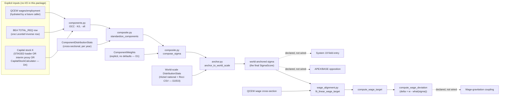

# Plan — spec-107 σ-gradient

## Approach (data flow)

Every solid arrow is a real function call inside
`src/babylon/domain/economics/sigma/`, exercised by
`tests/unit/domain/economics/sigma/`. Every dashed arrow is a declared-not-
inserted consumption seam (spec.md § Consumption seams) — no code on the
right-hand side of a dashed arrow is touched by this unit.

## File changes

| File | Change |
|------|--------|
| `src/babylon/domain/economics/sigma/__init__.py` (new) | Public API re-export (`__all__`). |
| `src/babylon/domain/economics/sigma/types.py` (new) | Frozen Pydantic models: `DistributionStats`, `SigmaComponents`, `ComponentWeights` (validated sum=1.0), `ComponentDistributionStats`, `StandardizedComponents`, `WageTargetModel`; constrained-type aliases `LaborContent`, `SigmaScore`, `SignedCurrency` (reusing `babylon.models.types.{Coefficient,Ratio,SnapToGrid}`). |
| `src/babylon/domain/economics/sigma/statistics.py` (new) | `compute_distribution_stats` (sample mean/std, ddof=1), `z_score` — the one reusable standardization primitive. |
| `src/babylon/domain/economics/sigma/components.py` (new) | `compute_organic_composition` (K/v), `compute_capital_intensity` (K/L), `compute_vertically_integrated_labor_content` (Leontief-row · labor-coefficient dot product). |
| `src/babylon/domain/economics/sigma/composite.py` (new) | `standardize_components`, `compose_sigma` — the Decision-D1 composition step. |
| `src/babylon/domain/economics/sigma/anchor.py` (new) | `anchor_to_world_scale` — the Owner-Ruling-1 world-axis step. |
| `src/babylon/domain/economics/sigma/wage_alignment.py` (new) | `fit_linear_wage_target` (OLS), `compute_wage_target`, `compute_wage_deviation` — coupling 2. |
| `tests/unit/domain/economics/sigma/test_*.py` (new, 6 files) | TDD red→green unit tests for every function above, plus `test_contracts_red_phase.py` (3 red-phase contract tests). |
| `specs/107-sigma-gradient/{spec,plan,tasks,research}.md` (new) | This document set. |

No other file is touched. In particular: no `engine/`, no
`config/defines/`, no `defines.yaml`, no `models/world_state.py`, no
`formulas/__init__.py`, no `ai/decisions/index.yaml`.

## Constitution gate checklist

- **III.1 no-magic-numbers** — PASS. `ComponentWeights` has no default
  values anywhere in this package; every call site must supply explicit
  weights. The one literal tolerance (`1e-4` in `ComponentWeights`'s sum
  validator) is documented as absorbing each `Coefficient`'s own 1e-5
  `SnapToGrid` quantization, not a modeling coefficient.
- **III.4 data provenance** — PASS w/ DISCLOSURE. Every ingredient's current
  LOADED/STAGED/AMPUTATED status is stated in spec.md § Data contract,
  corrected against program-10's 2026-07-08 claims where they have drifted
  (Decisions D2–D4).
- **III.7 determinism / frozen models** — PASS. Every type in `types.py` is
  `ConfigDict(frozen=True)`. Every function in this package is pure: no
  wall-clock, no RNG, no mutable module-level state. `compute_distribution_stats`
  and `fit_linear_wage_target` iterate over caller-supplied sequences in the
  order given (no set/dict iteration non-determinism);
  `compute_vertically_integrated_labor_content` explicitly sorts shared keys
  before summing.
- **III.8 data-grounding / no fabrication** — PASS w/ DISCLOSURE. The σ-index
  artifact is NOT fabricated in place of the absent `babylon-data` drive; its
  generation is marked environment-blocked (spec.md, tasks.md) and pinned by
  a red-phase test rather than stubbed with synthetic numbers.
- **III.10 earn-its-keep** — PASS. Every function here has at least one
  real (non-red-phase) test exercising its actual arithmetic; nothing is
  decorative.
- **III.11 Loud Failure** — PASS. `compute_wage_target` raises rather than
  clamps when a fitted model implies a negative wage;
  `compute_vertically_integrated_labor_content` raises on non-overlapping
  inputs or negative coefficients rather than returning 0.0 silently;
  `ComponentWeights` raises rather than renormalizing a bad weight sum
  (mirroring `county_exposure.py`'s existing no-silent-renormalization
  discipline).
- **II.12 authoring API / Amendment L** — N/A. No graph substrate touched;
  no `networkx` import; this package does not construct or read a
  `BabylonGraph`.
- **Amendment K (Lawverian)** — N/A. No contradiction-layer change (the
  opposition entry is declared, not inserted — spec.md § Consumption seams).
- **Program 26 §3 non-overlap covenant (P25 lane)** — PASS. This unit's
  entire write surface (`specs/107-sigma-gradient/**`,
  `src/babylon/domain/economics/sigma/**`,
  `tests/unit/domain/economics/sigma/**`) is disjoint from every file P25's
  142-file surface or the covenant's explicit forbidden list names.

## Test strategy (TDD)

1. **RED-then-GREEN, per module.** For each of
   `statistics.py`/`components.py`/`composite.py`/`anchor.py`/`wage_alignment.py`:
   write the corresponding `test_*.py` first (asserting the intended
   arithmetic and error contracts), watch it fail on import (module doesn't
   exist yet), then implement to GREEN. Executed in dependency order
   (`statistics` first, since `composite`/`anchor` both call `z_score`).
2. **RED-phase contract tests, once.** `test_contracts_red_phase.py`'s three
   tests are written to PASS today (they assert current absence — the σ-index
   artifact file, the `"spectrum"` field name, the `SpectrumDefines`
   attribute) and are expected to eventually FAIL, which is the intended
   signal that the described contract has been built and this test file
   needs updating (the same "twice-bitten" sentinel discipline as the
   codebase's other inert/seam sentinels).
3. **Verify loop**: `mise run test:q -- tests/unit/domain/economics/sigma`
   (scoped — never the full suite, never `qa:regression`, per this unit's
   machine-safety constraint) → `uv run ruff check
   src/babylon/domain/economics/sigma tests/unit/domain/economics/sigma` →
   `uv run mypy src/babylon/domain/economics/sigma`.

## Proof obligation

No R-PROOF is owed: this unit inserts no system, mutates no engine behavior,
and changes no baseline. The "proof" that this authoring pass is honest is
the gate itself (test/ruff/mypy green, disjoint write surface) plus the
explicit disclosure of every place program-10's 2026-07-08 data claims have
since drifted (Decisions D2–D4) — an R-PROOF-style magnitude statement would
be vacuous here since nothing observable in the running game changes.
