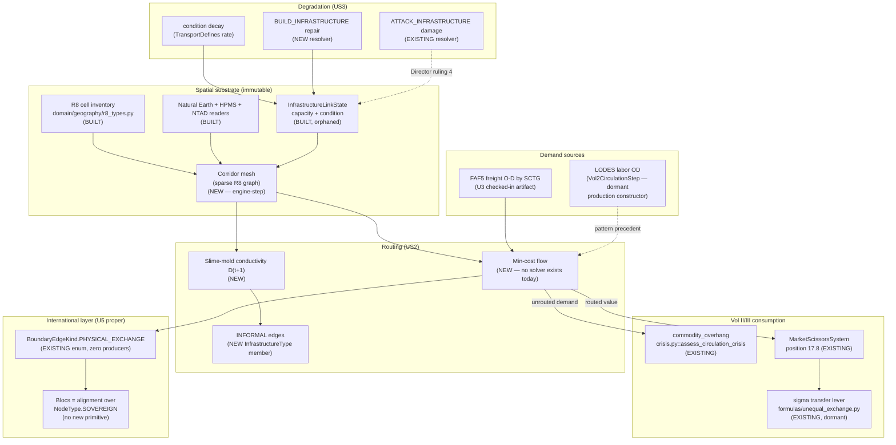
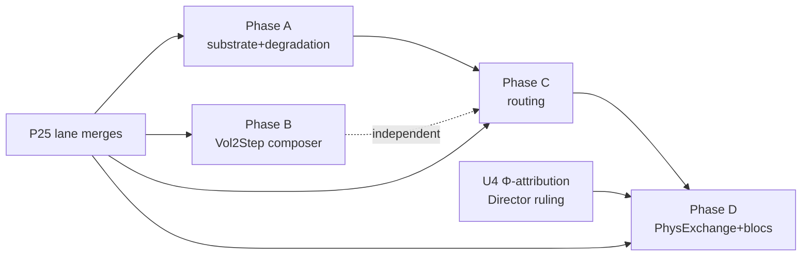

# plan.md — spec-108 Transport Substrate

This plan describes the ENGINE-STEP's implementation shape — how a future
unit would build what spec.md specifies. Nothing in this plan is executed by
this authoring pass; it exists so the engine-step has a coherent phasing
strategy rather than starting from tasks.md's flat list cold.

## Architecture overview

## Phasing (mirrors spec.md's slice-1/slice-2 split)

### Phase A — Substrate + degradation plumbing (no routing yet)

1. Construct `InfrastructureLinkState`/`DefaultEdgeCapacityCalculator` in
   production for the first time, seeded from the existing R8/NE/HPMS
   readers (already-built pipeline, currently only exercised in tests).
2. Add `InfrastructureType.INFORMAL`; name its production stamper (the
   slime-mold overlay from Phase C, sequenced here only as the enum
   addition + sentinel update).
3. Write `engine/actions/build.py::resolve_build`; register in
   `VERB_RESOLVERS`. This alone closes FR-108-5's sharpest gap and is
   independently shippable (BUILD_INFRASTRUCTURE becomes usable even before
   any routing math exists, since Amendment O only requires the verb to
   exist and touch `condition`/capacity, not that routing consume it yet).
4. Resolve Director ruling 4 (community-scoped float vs. per-edge
   condition) — this gates whether Phase A's `resolve_build`/damage path
   targets a Territory or a specific corridor edge id.
5. `TransportDefines` category added to `GameDefines` (tasks.md lists exact
   fields), default-OFF per program-11's constraint
   ("defines-gated... default OFF → baselines byte-identical").

### Phase B — Vol2CirculationStep production composer (data-path only)

Independent of Phase A/C — pure composition of already-existing pieces
(FR-108-10). Ships `build_vol2_circulation_step()` and wires it at
`cli/play.py`'s existing `build_interactive_trade_wiring` call site.
Byte-identical to today when the checked-in LODES artifact's tri-county
scope doesn't intersect the campaign's counties (mirrors
`resolve_lodes_hydration_kwargs`'s existing honest-`None` behavior).

### Phase C — Routing (the actual II.13 mechanics)

1. Design and implement the min-cost-flow solver over the corridor mesh
   (research.md discusses candidate approaches — no existing solver to
   extend). Deterministic, tie-broken, statically-bounded iteration
   (Power-of-10 rule 2 — this repo's non-negotiable loop-bound discipline).
2. Wire FAF5 O-D-by-SCTG demand (U3's artifact) as the flow's source/sink
   specification.
3. Implement slime-mold conductivity EMA per edge; INFORMAL edge minting
   when sustained flux crosses the Director-ruled threshold (ruling 2).
4. Land the unrouted-demand → `commodity_overhang` coupling (D4, Director
   ruling 3 for the coefficient).
5. New System position candidate: **9.5** (immediately after
   `ImperialRentSystem` @9.0, before `DispossessionEventsSystem` @10.0) —
   consumes Production's (@3.0) output and ImperialRent's Φ/TRIBUTE state,
   produces routed-flow + stranded-value signals that
   `CirculationCrisisAssessment`/`MarketScissorsSystem` (both later in the
   order, @17.x) can consume. **Alternative candidate: 17.9** (immediately
   after `MarketScissorsSystem` @17.8, before `ContradictionSystem` @18.0)
   — if the routing math genuinely needs post-price-scissors dollar values
   as its cost function rather than raw physical units. This is an
   engine-step design call (spec.md does not resolve it); both positions
   avoid the P25-shared `engine/systems/*` files this covenant currently
   locks (moot once U5 starts post-P25-merge, per Program 26 §3).

### Phase D — Physical-exchange + bloc-alignment surfacing (U5 proper)

1. Emit `BoundaryEdgeKind.PHYSICAL_EXCHANGE` register rows for freight
   crossing the study-area boundary (first producer).
2. Establish the bloc-alignment label (Director ruling 1 resolves the
   semantics) over `NodeType.SOVEREIGN`/external nodes.
3. Extend the conservation invariant check (FR-108-9) into the qa:regression
   or conservation-auditor estate, mirroring FR-101-5's pattern exactly.

### Deferred to slice 2 (not this engine-step's scope at all)

- `AIR_LINK` / `SHIPPING_LANE` edges (NTAD aviation + marine geodatabases —
  confirmed present on disk, loaders not yet written; Round-2 ruling R2-4).
- Corridor ownership / rent extraction (σ-ownership coupling, Round-2 ruling
  R2-1).

## Sequencing dependencies

Phase A and Phase B have no ordering dependency on each other and could be
parallel engine-step PRs; both are prerequisites for Phase C only in the
sense that Phase C's routing needs SOME per-edge state to route over
(Phase A) and benefits from, but does not strictly require, Phase B's labor
baseline being live in the same campaign. Phase D needs Phase C's routed
flows to have a magnitude to attribute, and needs U4's Director-ruled
attribution model to know how to split that magnitude across blocs.

## Non-plan: what this document does not decide

Consistent with spec.md's Director-ruling-required list, this plan does not
pick: which bloc-alignment semantics (static vs. dynamic), the INFORMAL
stamping threshold, the realization-crisis coupling coefficient, or the
territory-vs-edge attack-targeting resolution. Those gate Phase A/C/D
respectively and must be resolved (by the Director or by an engine-step
design doc) before the corresponding phase starts, not improvised mid-PR.
