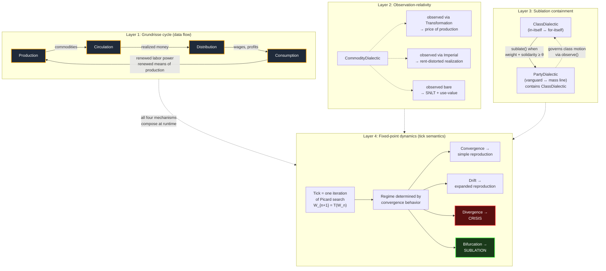

# Cyclical Composition in Babylon v2

An addendum to the v2 architecture document. This focuses specifically on *how* dialectics compose into a genuinely cyclical ontology — the four mechanisms, the Grundrisse backbone, and the fixed-point semantics that unify reproduction, crisis, and sublation.

---

## The four mechanisms, formally

| Mechanism | Where the cycle lives | What it enables |
|---|---|---|
| **Grundrisse cycle** | Morphism graph (data flow) | Production/Circulation/Distribution/Consumption mutually presuppose each other |
| **Observation-relativity** | `observe()` method signatures | A dialectic's measurements depend on which peer you observe it through |
| **Sublation containment** | Successor wraps predecessor | Higher-order dialectic governs the lower-order one that produced it |
| **Fixed-point dynamics** | Tick iteration semantics | Reproduction/crisis/sublation are three regimes of one search |

The first three are *structural* — they're properties of how the type graph is wired. The fourth is *dynamic* — it's a property of how the tick engine interprets that wiring.

---

## The Grundrisse cycle as the backbone

The four primary dialectics, each with their pole structure:

```python
class ProductionDialectic(Dialectic[LaborProcess, Valorization]):
    type_tag = "production"
    # pole_a = labor process (use-value creation)
    # pole_b = valorization (exchange-value creation)

class CirculationDialectic(Dialectic[CommodityForm, MoneyForm]):
    type_tag = "circulation"
    # pole_a = commodity-form (C in motion)
    # pole_b = money-form (M in motion)

class DistributionDialectic(Dialectic[Wages, SurplusShares]):
    type_tag = "distribution"
    # pole_a = wages (variable capital returned to labor)
    # pole_b = surplus shares (profit + interest + rent)

class ConsumptionDialectic(Dialectic[ProductiveConsumption, IndividualConsumption]):
    type_tag = "consumption"
    # pole_a = productive consumption (renewing constant capital)
    # pole_b = individual consumption (renewing labor power)
```

The morphism graph wires them into a 4-cycle:

```
Production --feeds--> Circulation
Circulation --feeds--> Distribution
Distribution --feeds--> Consumption
Consumption --feeds--> Production    ← the cycle closes here
```

In the type system this looks like a circular dependency. It is not. The cycle is in the *runtime data flow*, not in the *static type graph*. Types reference values, not types, of their peers — which means construction is well-founded, but execution is cyclical.

---

## The code pattern for cyclical step

The trick is that `step()` reads peer outputs from the *previous* tick, not the current one. The world snapshot gives every dialectic a frozen view of the prior state, and the tick produces a new world that everyone reads from on the next iteration.

```python
class ProductionDialectic(Dialectic[LaborProcess, Valorization]):
    type_tag = "production"

    def step(self, inputs: TickInputs, world: WorldView) -> "ProductionDialectic":
        # Read the OUTPUT of Consumption from the previous tick.
        # This is how the cycle closes without infinite recursion.
        prior_consumption = world.previous.get_one(ConsumptionDialectic)
        renewed_labor_power = prior_consumption.observe()["labor_power_renewed"]
        renewed_means_of_production = prior_consumption.observe()["mp_renewed"]

        # Read input prices from V3's previous transformation result
        prior_prices = world.previous.get_one(TransformationDialectic).observe()

        # Now apply the actual production motion law (V1 Ch7-9)
        new_labor_process = self.pole_a.consume(
            labor_power=renewed_labor_power,
            means=renewed_means_of_production,
            prices=prior_prices,
        )
        new_valorization = self.pole_b.extract_surplus(
            labor_hours=new_labor_process.hours_worked,
            wage_value=prior_prices.value_of_labor_power,
            rate_of_exploitation=self._compute_s_prime(world),
        )

        new_weight = self._update_weight(new_labor_process, new_valorization)

        return self.model_copy(update={
            "pole_a": new_labor_process,
            "pole_b": new_valorization,
            "weight": new_weight,
            "tick_updated": world.tick,
        })

    def observe(self) -> dict:
        # The value tensor is a PROJECTION of the dialectical state, not state itself.
        return {
            "value_tensor": [
                self.pole_a.snlt,                    # l
                self.pole_a.constant_capital_used,   # c
                self.pole_b.variable_capital,        # v
                self.pole_b.surplus_value,           # s
                0.0,                                  # r — populated only by ImperialDialectic
            ],
            "occ": self.pole_a.constant_capital_used / max(self.pole_b.variable_capital, 1e-9),
            "rate_of_exploitation": self.pole_b.surplus_value / max(self.pole_b.variable_capital, 1e-9),
        }
```

The `world.previous` accessor is what makes this safe. Every tick has access to a frozen snapshot of the prior tick's complete state. There is no live mutation, no half-updated peers, no race conditions on the cycle — the system advances atomically from world N to world N+1 by computing every dialectic's `step()` against the same frozen N.

This is functionally equivalent to fixed-point iteration: each tick takes one step of a Picard iteration toward the self-consistent reproduction state.

---

## Observation-relativity in code

The same dialectic returns different observations depending on which peer is asking. This is implemented by passing an optional `frame` argument to `observe()`:

```python
class CommodityDialectic(Dialectic[UseValue, ExchangeValue]):
    type_tag = "commodity"

    def observe(self, frame: Optional["Dialectic"] = None) -> dict:
        if frame is None:
            # Bare observation: just SNLT and use-value
            return {
                "snlt": self.pole_a.labor_hours_embodied,
                "use_value": self.pole_a.qualitative_description,
                "value": self.pole_a.labor_hours_embodied,  # value = SNLT in isolation
            }
        elif isinstance(frame, TransformationDialectic):
            # Observed through V3 Ch9-10: value transforms to price of production
            return {
                "price_of_production": frame.transform_value(
                    self.pole_a.labor_hours_embodied,
                    sector=self.pole_a.sector,
                ),
            }
        elif isinstance(frame, ImperialDialectic):
            # Observed through trade tensor: distorted by core/periphery exchange
            distorted = frame.apply_unequal_exchange(
                self.pole_a.labor_hours_embodied,
                origin=self.pole_a.region,
            )
            return {
                "realized_value_in_core": distorted.core_realization,
                "imperial_rent_extracted": distorted.r_component,
            }
```

This is the formalization of "value as a tensor whose components are frame-dependent" from your earlier conversations. The dialectic *is* all these projections at once. Which one you see is a function of the basis you project onto. The projection is not a derivation from a more fundamental representation — there *is* no more fundamental representation. The projections are all there is.

This matters for the engine because different downstream dialectics observe the same commodity through different frames in the same tick. The TransformationDialectic sees prices of production; the ImperialDialectic sees imperial-rent-distorted realizations; a ConsumptionDialectic sees use-value. None of these is the "real" commodity — they are the commodity in its different determinations.

---

## Sublation containment

The successor wraps the predecessor by reference, and the predecessor's motion law now reads the successor's output:

```python
class ClassDialectic(Dialectic[InItself, ForItself]):
    type_tag = "class"

    def sublate(self) -> Optional["Dialectic"]:
        # Sublation occurs when for-itself weight crosses a threshold
        # AND the topology has sufficient solidarity edges
        if self.weight < 0.7:
            return None

        topology = self._world.morphisms
        solidarity_density = self._compute_solidarity_density(topology)
        if solidarity_density < 0.4:
            return None

        # Sublate into a PartyDialectic that CONTAINS this class
        return PartyDialectic(
            pole_a=Vanguard(class_basis=self.id),  # references this class by ID
            pole_b=MassLine(class_basis=self.id),
            weight=0.5,
            parent_id=self.id,
            tick_created=self._world.tick,
            tick_updated=self._world.tick,
        )

    def step(self, inputs: TickInputs, world: WorldView) -> "ClassDialectic":
        # CRITICAL: if a successor exists, this dialectic's motion is now governed by it
        successor = world.find_successor(self.id)
        if successor is not None:
            # The party we produced now governs how we evolve
            party_directive = successor.observe()["current_directive"]
            new_weight = self._evolve_under_party(party_directive, inputs)
        else:
            new_weight = self._evolve_under_material_conditions(inputs, world)

        return self.model_copy(update={
            "weight": new_weight,
            "tick_updated": world.tick,
        })
```

The class produces the party. From that point on, the party governs the class. The class did not cease to exist — it became a *moment* of the higher-order dialectic it generated. This is the operationalization of Hegelian Aufhebung as a software pattern: preserved, negated, raised to a higher level, all simultaneously.

Concretely: if you query the world for all `ClassDialectic` instances, the sublated one is still there. Its `weight` is still updating. But its motion is now driven by the party that emerged from it, not by raw material conditions. The cycle from material conditions → consciousness → organization → back to material conditions is now closed *through* the successor.

---

## Fixed-point semantics: what a tick actually is

A tick is one iteration of a Picard fixed-point search. The state of the world is a vector in some high-dimensional space (the concatenation of all dialectic states). A self-consistent reproduction state is a fixed point of the joint motion operator `T = (T₁, T₂, …, Tₙ)` where each `Tᵢ` is one dialectic's `step()`.

```
W_{n+1} = T(W_n)
```

The four regimes:

**Convergence (simple reproduction).** `‖W_{n+1} − W_n‖ → 0`. The system reaches and stays at a fixed point. Marx's V2 Ch20 simple reproduction is this case: `I(v+s) = IIc` and the same physical and value totals reproduce each tick.

**Stable drift (expanded reproduction).** `W_{n+1} − W_n` is non-zero but bounded and consistent in direction. The fixed point is moving but the system tracks it. V2 Ch21 expanded reproduction.

**Divergence (crisis).** No fixed point exists for the current parameters, or the existing one is unstable and the iteration fails to track it. The system enters oscillation or runaway. Disproportionality crisis is "the joint constraint `I(v+s) = IIc` cannot be satisfied." TRPF crisis is "the trajectory of moving fixed points is approaching a degenerate region where `r → 0`."

**Bifurcation (sublation).** The system finds a fixed point of *higher order* than where it started — a state where new dialectics exist that didn't before, and the augmented system has consistency where the original could not. Revolution is bifurcation. So is the rise of monopoly capital. So is the transition from manufacture to large-scale industry.

This is the unification. Three things that were three different code paths in old Babylon — reproduction, crisis, and revolution — are now three behavioral regimes of one mechanism. The engine doesn't have to *decide* "is this a reproduction tick or a crisis tick or a revolution tick." It just iterates the joint motion operator and observes which regime it's in. The mode is emergent.

The thing that makes this Marxist rather than just dynamical-systems-y: capitalism is the analysis of a system whose *internal dynamics undermine the conditions of its own fixed-point convergence*. Rising productivity is necessary for accumulation. Rising productivity raises organic composition. Rising organic composition lowers the rate of profit. Lowered profit undermines the conditions for reproduction. The same loop that produces convergence also produces the divergence. There is no parameter setting at which the system can sustainably reproduce itself — only counter-tendencies that delay the divergence. The whole engine is iterating toward a target that recedes faster than it can be approached.

That is not a bug. That is the theory. And once you build the engine on fixed-point semantics, you don't have to *encode* this insight — it falls out of the math.

---

## Diagram: the layers of cyclicality



---

## Why this is genuinely cyclical and not just feedback

A normal feedback control system has a controller observing a plant and adjusting an input to maintain a setpoint. The controller and plant are distinct. The setpoint is given exogenously. The "cycle" is one of information flow but the *hierarchy* is fixed: controller above plant.

A truly cyclical dialectical ontology has no exogenous setpoint and no hierarchy. There is no controller and no plant. Each dialectic is, simultaneously, controller of and controlled by every other dialectic to which it is wired. The Grundrisse cycle is not "production controls consumption via output, consumption controls production via labor power" — it is *the same act seen from two angles*. Production *is* productive consumption. Individual consumption *is* the production of labor power. Marx hammers this in the Grundrisse Introduction precisely because the bourgeois economists can't see it.

The architectural payoff: when you ask "what causes what" in Babylon v2, the answer is correctly "everything causes everything, mediated by the cycle and resolved by the fixed-point search." This is uncomfortable for software people because it doesn't give you a clean call graph. It's exactly right for dialectical materialism because it doesn't give you a clean causal hierarchy. The form of the code matches the form of the theory.

That is what "dialectic as fundamental primitive" actually buys you. Not a label on a class hierarchy — an ontological commitment that propagates all the way down to the tick semantics.
